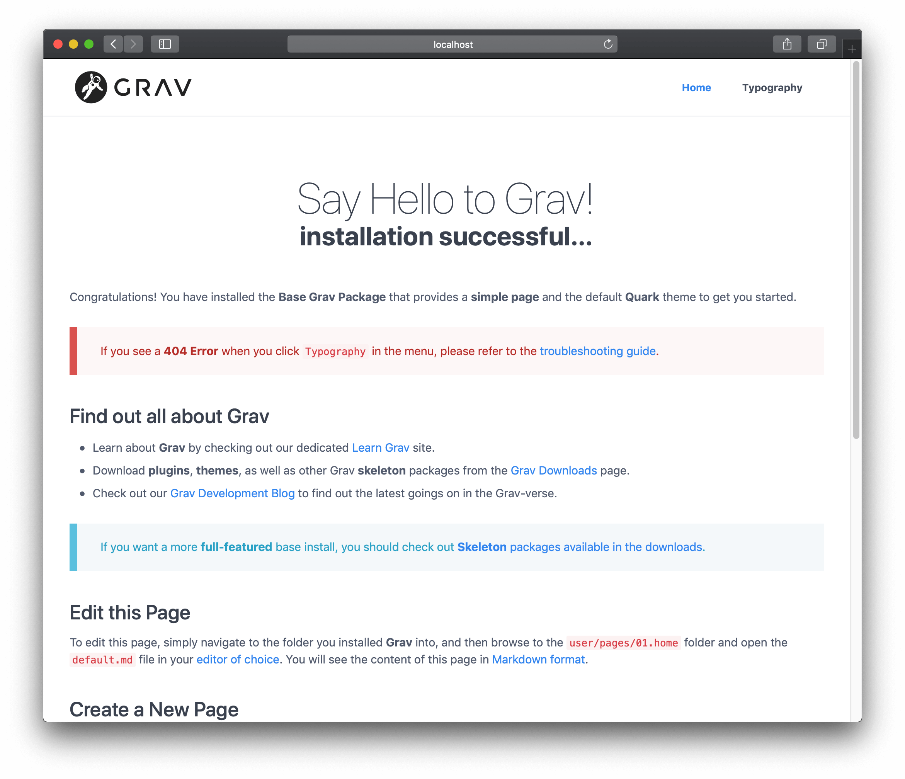
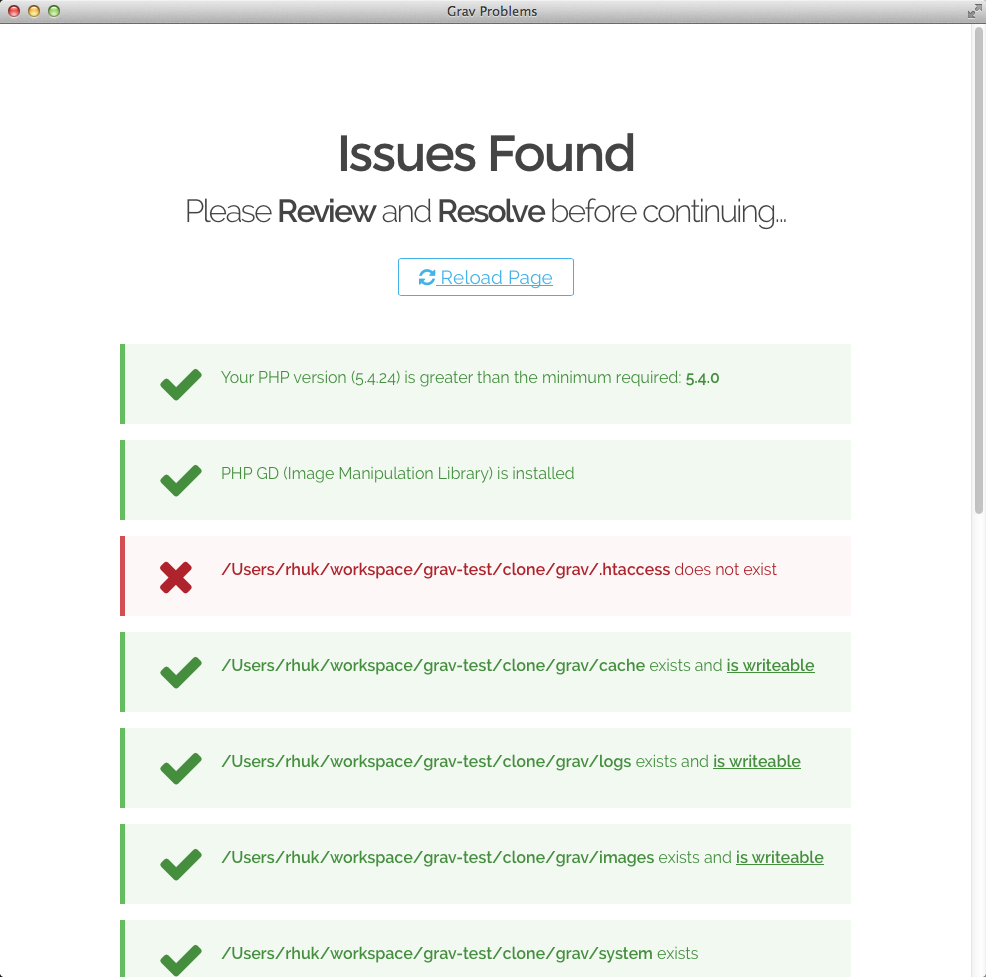

Installation of Grav is a trivial process. In fact, there is no real installation. You have **three** options for installing Grav. The first - and simplest - way is to download the **zip** archive, and extract it. The second way is to install with **Composer**. The third way is to clone the source project directly from **GitHub**, and then run an included script command to install needed dependencies:

## Check for PHP version

Grav is incredibly easy to set up and get running. Be sure you have at least PHP version [version=15]5.6.3+[/version][version=16]7.1.3+[/version] by going to the terminal and typing `php -v`:

[prism classes="language-bash command-line" cl-output="2-10"]
php -v
PHP 7.2.15 (cli) (built: Feb  7 2019 20:10:03) ( NTS )
Copyright (c) 1997-2018 The PHP Group
Zend Engine v3.2.0, Copyright (c) 1998-2018 Zend Technologies
    with Zend OPcache v7.2.15, Copyright (c) 1999-2018, by Zend Technologies
[/prism]

## Option 1: Install from ZIP package

The easiest way to install Grav is to download the ZIP package and extract it:

1. Download the latest-and-greatest **[Grav](https://getgrav.org/download/core/grav/latest)** or **[Grav + Admin](https://getgrav.org/download/core/grav-admin/latest)** package.
2. Extract the ZIP file in the [webroot](https://www.wordnik.com/words/webroot) of your web server, e.g. `~/webroot/grav`

!!! There are [Skeleton](https://getgrav.org/downloads/skeletons)-packages available, which include the core Grav system, sample pages, plugins, and configuration. They are a great way to get started; all you have to do is [download the Skeleton](https://getgrav.org/downloads/skeletons)-package you prefer, and follow the steps above.

!!!! If you downloaded the ZIP file and then plan to move it to your webroot, please move the **ENTIRE FOLDER** because it contains several hidden files (such as .htaccess) that will not be selected by default. The omission of these hidden files can cause problems when running Grav.

## Option 2: Install with composer

The alternative method is to install Grav with [composer](https://getcomposer.org/doc/00-intro.md#installation-linux-unix-osx):

[prism classes="language-bash command-line"]
composer create-project getgrav/grav ~/webroot/grav
[/prism]

If you want to check out the bleeding edge version of Grav, add `1.x-dev` as an additional parameter:

[prism classes="language-bash command-line"]
composer create-project getgrav/grav ~/webroot/grav 1.x-dev
[/prism]

## Option 3: Install from GitHub

Another method is to clone Grav from the GitHub repository, and then run a simple dependency installation script:

1. Clone the Grav repository from [GitHub](https://github.com/getgrav/grav) to a folder in the webroot of your server, e.g. `~/webroot/grav`. Launch a **terminal** or **console** and navigate to the webroot folder:

   [prism classes="language-bash command-line"]
   cd ~/webroot
   git clone -b master https://github.com/getgrav/grav.git
   [/prism]

2. Install **vendor dependencies** via [composer](https://getcomposer.org/doc/00-intro.md#installation-linux-unix-osx):

   [prism classes="language-bash command-line"]
   cd ~/webroot/grav
   composer install --no-dev -o
   [/prism]

3. Install the **plugin** and **theme dependencies** by using the [Grav CLI application](../../advanced/grav-cli) `bin/grav`:

   [prism classes="language-bash command-line"]
   cd ~/webroot/grav
   bin/grav install
   [/prism]

   This will automatically **clone** the required dependencies from GitHub directly into this Grav installation.

## Webservers

#### Apache/IIS/Nginx

Using Grav with a web server such as Apache, IIS, or Nginx is as simple as extracting Grav into a folder under the [webroot](https://www.wordnik.com/words/webroot). All it requires to function is [version=15]PHP 5.6.3[/version][version=16]PHP 7.1.3[/version] or higher, so you should make sure that your server instance meets that requirement. More information about Grav requirements can be found in the [requirements](../requirements) chapter of this guide.

If your web root is, for example, `~/public_html` then you could extract it into this folder and reach it via `http://localhost`. If you extracted it into `~/public_html/grav` you would reach it via `http://localhost/grav`.

!!! Every web server must be configured. Grav ships with .htaccess by default, for Apache, and comes with some [default server configuration files](https://github.com/getgrav/grav/tree/master/webserver-configs), for `nginx`, `caddy server`, `iis`, and `lighttpd`. Use them accordingly when needed.

#### Running Grav with the Built-in PHP Webserver Using `router.php`

You can run Grav using a simple command from Terminal / Command Prompt using the built-in PHP server available to any system with [version=15]PHP 5.6.3+[/version][version=16]PHP 7.1.3+[/version] installed. All you need to do is navigate to the root of your Grav install using the Terminal or Command Prompt and enter `php -S localhost:8000 system/router.php`. You can replace the port number (in our example it's `8000`) with any port you prefer.

Entering this command will present you with output similar to the following:

[prism classes="language-bash command-line" cl-output="2-10"]
php -S localhost:8000 system/router.php
PHP 7.2.15 Development Server started at Sun Feb 17 21:02:14 2019
Listening on http://localhost:8000
Document root is /Users/rhuk/Projects/grav/grav
Press Ctrl-C to quit.
[/prism]

Your terminal will also give you real-time updates of any activity on this ad hoc-style server. You can copy the URL provided in the `Listening on` line and paste that into your browser of choice to access your site, including the administrator.

!!!! This is a useful tool for quick development, and should **not** be used in place of a dedicated web server such as Apache.

## Successful Installation

The first time it loads, Grav pre-compiles some files. If you now refresh your browser, you will get a faster, cached version.

!! In the previous examples, **$** represents the command prompt. This may look different on various platforms.

By default, Grav comes with some sample pages to give you something to get started with. Your site is already fully functional and you can configure it, add content, extend it, or customize it as much as you like.

## Installation & Setup Problems

If any issues are discovered during the initial page load (or after a cache-flush event) you may see an error page:

Please consult the [Troubleshooting](../../troubleshooting) section for help regarding specific issues.

! If you have issues with file permissions, please check the [Permissions Troubleshooting documentation](/troubleshooting/permissions). Also, you could look at the [Hosting Guides documentation](/webservers-hosting) that has specific instructions for various hosting environments

## Grav Updates

### Automatic Updates

The preferred method for updating Grav is to use the **Grav Package Manager (GPM)**. All you need to do  is to navigate to the root of your Grav site and type:

[prism classes="language-bash command-line"]
bin/gpm selfupgrade -f
[/prism]

Full information can be found in the [Grav GPM Documentation](../../advanced/grav-gpm). We also have GPM integrated into our [Admin Panel](../../admin-panel) plugin which will check, prompt, and automatically install any updates.
