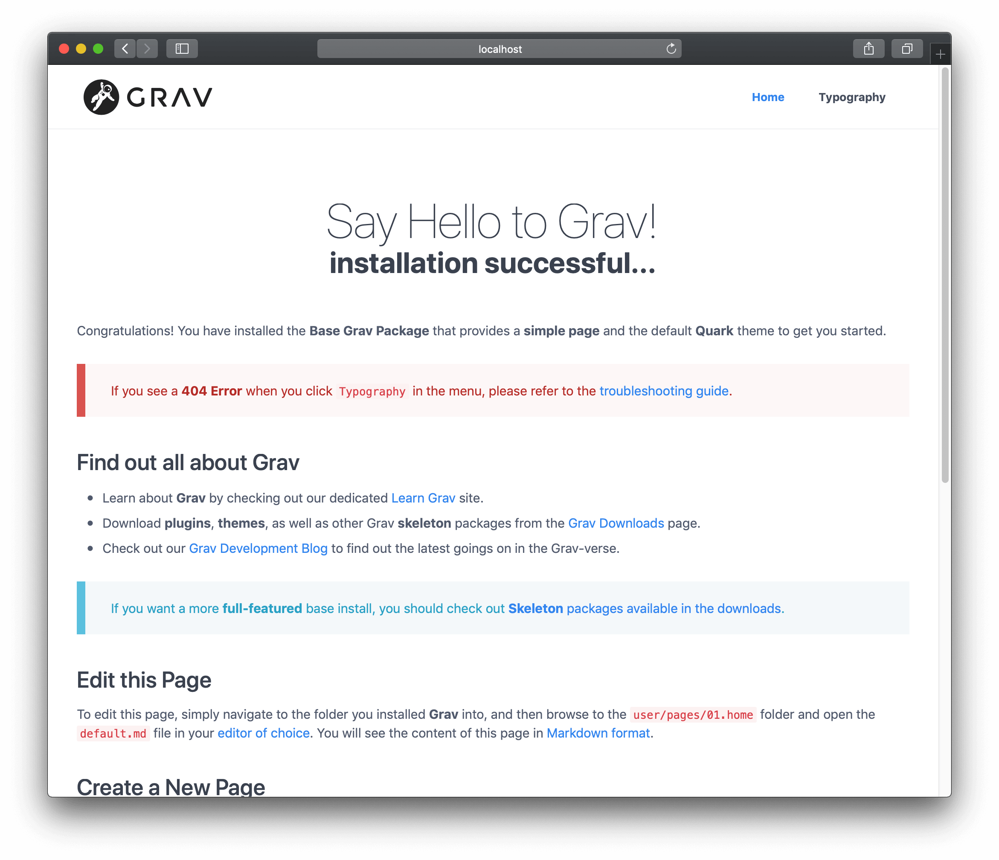
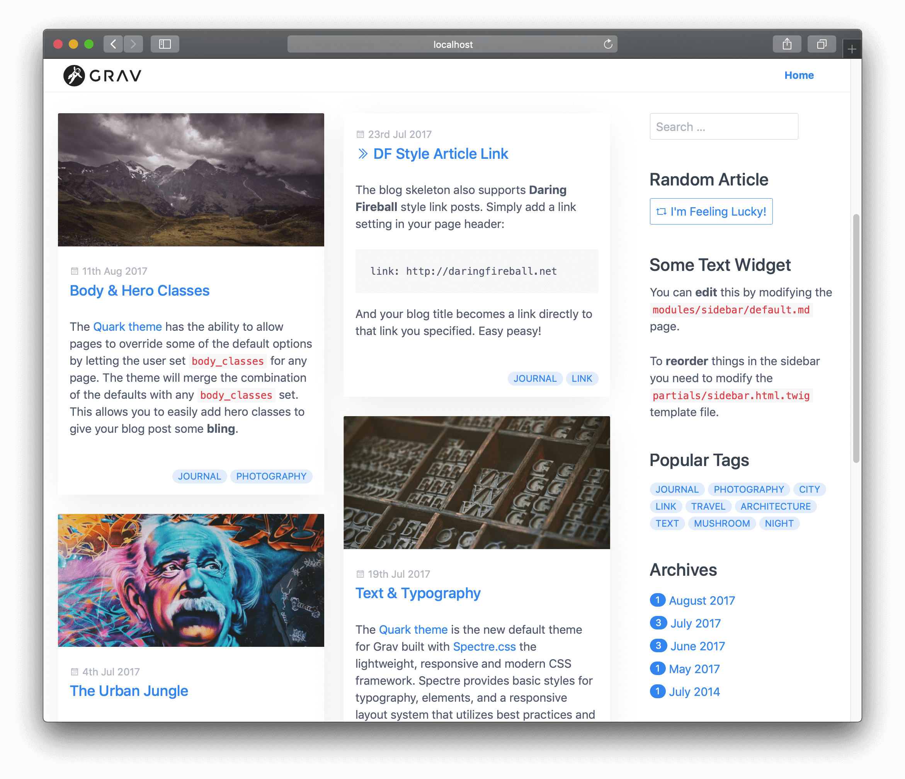
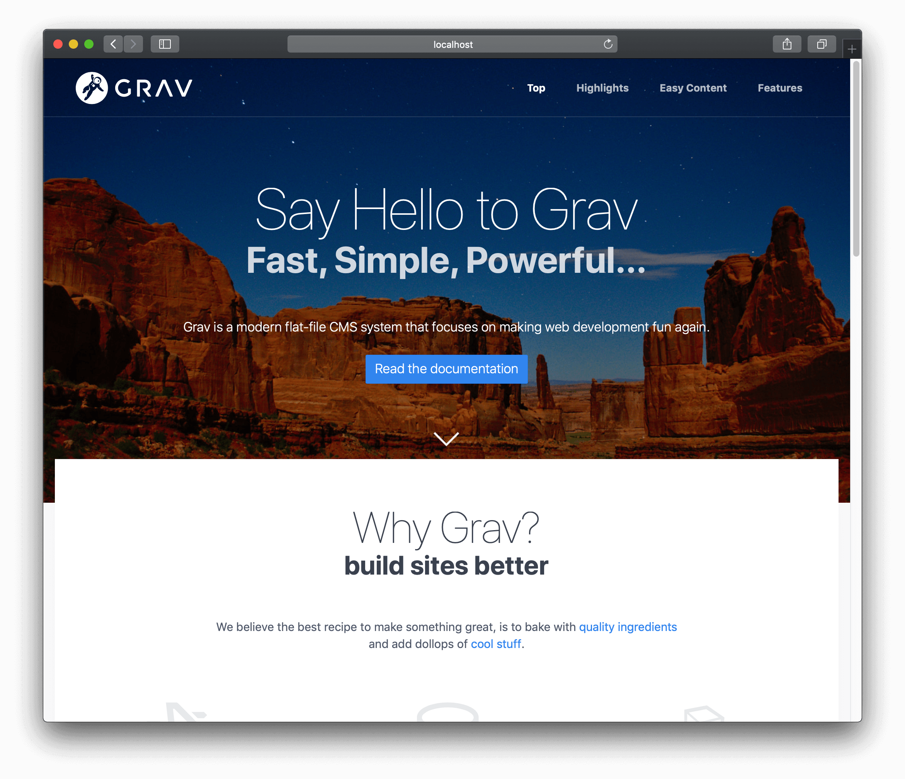

In Grav-speak, **Pages** are the fundamental building blocks of your site. They are how you write content and provide navigation in the Grav system.

Combining content and navigation ensures that the system is intuitive to use for even the most inexperienced of content authors. However, this system, in conjunction with powerful taxonomy capabilities, is still powerful enough to handle complex content requirements.

Grav natively supports **3 types of Pages** that allow you to create a rich selection of web content. Those types are:

#### Regular Page

A regular Page is generally a single page such as a **blog post**, **contact form**, **error page** etc. This is the most common type of page that you will create. By default a Page is considered a regular page unless you tell Grav otherwise.

When you download and install the **Core Grav** package, you are greeted by a standard page. We covered creating a simple regular Page in the [Basic Tutorial](/basics/basic-tutorial).

#### Listing Page

This is an extension of a regular Page. This is a page that has a reference to a collection of pages.

The most straightforward approach to setting this up is to create **child-pages** below the Listing Page. An example of this would be a **blog listing page**, where you would display a summary list of blog posts that exist as child-pages.

There is also some configuration settings to **control the order** of the listing as well as a **limit on the number of items**, and whether or not **pagination** should be enabled.

!! A sample **Blog Skeleton** using a **Listing Page** can be found in the [Grav Downloads](https://getgrav.org/downloads/skeletons).

#### Modular Page

A Modular Page is a special type of listing page because it builds a **single modular page** from its **child modular sub-pages**. This allows for the ability to build very complex **one-page layouts** from Modules. This is accomplished by constructing the **Modular Page** from multiple **Modular sub-page folders** found in the modular page's primary folder.

!! A sample **One-Page Skeleton** using a **Modular Page** can be found in the [Grav Downloads](https://getgrav.org/downloads/skeletons).

Each of these page types follows the same basic structure, so before we can get into the nitty-gritty of each type, we must explain how pages in Grav are constructed.

!! A Module, because it is intended to be part of another page, is inherently not a page you can reach directly via a URL. Because of this, all modular pages are by default set as **non-routable**.

## Folders

All content pages are located in the `/user/pages` folder. Each **Page** should be placed in its own folder.

!! Folder names should also be valid **slugs**. Slugs are entirely lowercase, with accented characters replaced by letters from the Latin alphabet and whitespace characters replaced by a dash or an underscore, to avoid being encoded.

Grav understands that any integer value followed by a period will be solely for ordering, and is removed internally in the system. For example, if you have a folder named `01.home`, Grav will treat this folder as `home`, but will ensure that with default ordering, it comes before `02.blog`.

[prism classes="language-txt line-numbers"]
/user
└── /pages
    ├── /01.home
    │   ├── /_header
    │   ├── /_features
    │   ├── /_body
    ├── /02.blog
    │   ├── /blog-item-1
    │   ├── /blog-item-2
    │   ├── /blog-item-3
    │   ├── /blog-item-4
    │   └── /blog-item-5
    ├── /03.about-us
    └── /error
[/prism]

Your site must have an entry-point so that it knows where to go when you point your browser to the root of your site. For example if you were to enter `http://yoursite.com` in your browser, by default Grav expects an alias `home/`, but you can override the home-location by changing the `home.alias` option in the [Grav configuration file](/basics/grav-configuration).

**Modular sub-pages** are identified by an underscore (`_`) before the folder name. This is a special folder type that is intended to be used only with **modular content**.  These are **not routable** and **not visible** in the navigation. An example of a modular page setup would be a folder such as `user/pages/01.home`. Home is configured as a **modular page** that would contain a collection of child pages, and would be constructed from the `_header`, `_features`, and `_body` modular sub-pages.

The textual name of each folder defaults to the _slug_ that the system uses as part of the URL. For example if you have a folder such as `/user/pages/02.blog`, the slug for this page would default to `blog`, and the full URL would be `http://yoursite.com/blog`. A blog item page, located in `/user/pages/02.blog/blog-item-5` would be accessible via `http://yoursite.com/blog/blog-item-5`.

If no number is provided as a prefix of the folder name, the page is considered to be **invisible**, and will not show up in the navigation. An example of this would be the `error` page in the above folder-structure.

!! This can actually be overridden in the page itself by setting the [visible parameter](/content/headers#visible) in the headers.

## Ordering

When dealing with collections, there are several options available to control how folders are ordered. The most important option is set in the `content.order.by` of the page configuration settings. The options are:

[div class="table-keycol"]
| Property | Description |
| -------- | ----------- |
| **default**  | The order is based on the file system, i.e. `01.home` before `02.advark` |
| **title**    | The order is based on the title as defined in each page |
| **basename** | The order is based on the alphabetic folder without numeric order |
| **date**     | The order is based on the date as defined in each page |
| **modified** | The order is based on the modified timestamp of the page |
| **folder**   | The order is based on the folder name with any numerical prefix, i.e. `01.`, removed |
| **header.x** | The order is based on any page header field. i.e. `header.taxonomy.year`. Also a default can be added via a pipe. i.e. `header.taxonomy.year|2015` |
| **manual**   | The order is based on the `order_manual` variable |
| **random**   | The order is randomized |
[/div]

You can specifically define a manual order by providing a list of options to the `content.order.custom` configuration setting. This will work in conjunction with the `content.order.by` because it first tries to order the pages manually, but any pages not specified in the manual order, will fall through and be ordered by the ordering provided.

!! You can override the **default behavior** for folder ordering and the direction in which the ordering occurs by setting the `pages.order.dir` and the `pages.order.by` options in the [Grav system configuration file](/basics/grav-configuration).

## Page File

Within the page-folder, we create the actual page-file. The filename should end with `.md` to indicate that it is a Markdown-formatted file. Technically, it is Markdown with YAML FrontMatter, which sounds impressive but really is not a big deal at all. We will cover the details of the file-structure soon.

The important thing to understand is the name of the file directly references the name of the theme's template file that will be used to render. The standard name for the main template file is **default**, so the file would be named `default.md`.

You can, of course, name your file whatever you like, for example: `document.md`, which would make Grav look for a template file in the theme that matches, such as the **document.html.twig** Twig-template.

!! This behavior can be overridden in the page by setting the [template parameter](/content/headers#template) in the headers.

An example page file could look like this:

[div class="no-margin-bottom"]
[prism classes="language-yaml line-numbers"]
---
title: Page Title
taxonomy:
    category: blog
---
[/prism]
[/div]
[div class="no-margin-top"]
[prism classes="language-markdown line-numbers" ln-start="6"]
# Page Title

Lorem ipsum dolor sit amet, consectetur adipiscing elit. Pellentesque porttitor eu
felis sed ornare. Sed a mauris venenatis, pulvinar velit vel, dictum enim. Phasellus
ac rutrum velit. **Nunc lorem** purus, hendrerit sit amet augue aliquet, iaculis
ultricies nisl. Suspendisse tincidunt euismod risus, _quis feugiat_ arcu tincidunt
eget. Nulla eros mi, commodo vel ipsum vel, aliquet congue odio. Class aptent taciti
sociosqu ad litora torquent per conubia nostra, per inceptos himenaeos. Pellentesque
velit orci, laoreet at adipiscing eu, interdum quis nibh. Nunc a accumsan purus.
[/prism]
[/div]

The settings between the pair of `---` markers are known as the YAML FrontMatter, and it is comprised of basic YAML settings for the page.

In this example, we are explicitly setting the title, as well the taxonomy to **blog** so we can filter it later.  The content after the second `---` is the actual content that will be compiled and rendered as HTML on your site.  This is written in [Markdown](/content/markdown), which will be covered in detail in a future chapter. Just know that the `#`, `**`, and `_` markers translate to **heading 1**, **bold**, and **italics**, respectively.

!! Ensure you save your `.md` files as `UTF-8`-encoded files. This will ensure they work with language-specific special characters.

### Summary Size and Separator

There is a setting in the `site.yaml` file that lets you define a default size (in characters) of the summary that can be used via `page.summary()` to display a summary or synopsis of the page. This is particularly useful for blogs where you want to have a listing that contains just summary information, and not the full page content.

By default, this value is `300` characters. You can override this in your `user/config/site.yaml` file, but an even more useful approach is to use the manual **summary separator** also known as the **summary delimiter**: `===`.

You need to ensure you put this in your content with blank lines **above** and **below**. For example:

[prism classes="language-markdown line-numbers"]
Lorem ipsum dolor sit amet, consectetur adipisicing elit, sed do eiusmod
tempor incididunt ut labore et dolore magna aliqua. Ut enim ad minim veniam,
quis nostrud exercitation ullamco laboris nisi ut aliquip ex ea commodo
consequat.

===

Duis aute irure dolor in reprehenderit in voluptate velit esse
cillum dolore eu fugiat nulla pariatur. Excepteur sint occaecat cupidatat non
proident, sunt in culpa qui officia deserunt mollit anim id est laborum. Lorem ipsum dolor sit amet, consectetur adipisicing elit, sed do eiusmod
tempor incididunt ut labore et dolore magna aliqua. Ut enim ad minim veniam,
quis nostrud exercitation ullamco laboris nisi ut aliquip ex ea commodo
consequat. Duis aute irure dolor in reprehenderit in voluptate velit esse
cillum dolore eu fugiat nulla pariatur. Excepteur sint occaecat cupidatat non
proident, sunt in culpa qui officia deserunt mollit anim id est laborum.
[/prism]

This will use the text above the separator when referenced by `page.summary()` and the full page content when referenced by `page.content()`.

!! When using `page.summary()`, the summary size setting will be used if the separator is not found in the page content.

### Finding other Pages

Grav has a useful feature that allows you to find another page and perform actions on that page. This can be accomplished with the `find()`-method that simply takes the **route** and returns a new Page-object.

This allows you to perform a wide variety of functionality from any page on your Grav site. For example, you may want to provide a list of all current projects on a particular project detail page:


[prism classes="language-twig line-numbers"]
# All Projects
<ul>

<li><a href="{{p.url}}">{{ p.title }}</a></li>

</ul>
[/prism]


In the next section, we will continue to dig into the specifics of a Page in detail.

### contentMeta

Referencing pages and content is straightforward, but what about the content that doesn't get rendered on the front-end along with the rest of the page?

When Grav reads page content, it stores this content in cache. That way, the next time the page is rendered it doesn't have to read all the content from the `.md` file. Generally, this content is all rendered to the front-end. However, there are instances where having some additional data stored alongside the page in the cache is useful.

This is where `contentMeta()` comes in. We use ContentMeta in our [Shortcode](https://github.com/getgrav/grav-plugin-shortcode-core)-plugin to [retrieve sections from other pages](https://github.com/getgrav/grav-plugin-shortcode-core#sections-from-other-pages) using shortcodes. For example:


[prism classes="language-twig line-numbers"]

{{ page.find('/my/custom/page').contentMeta.shortcodeMeta.shortcode.section.author }}

[/prism]


We used this in Shortcode Core to store CSS and JS assets that the shortcode on the page requires, however this feature can be used to store just about any data structure you need.
