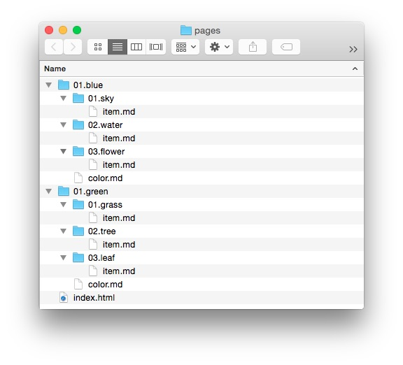

Grav has a variety of flexible linking options that allow you to link from one page to another, and even to remote pages. If you have ever linked files using HTML or worked with a file system using a command line, a lot of this should be very easy to pick up.

We will run to some easy examples using this very basic, trimmed down model of what a Grav site's **Pages** directory might look like.



Using this directory structure as an example, we will take a look at the different types of links you can use in your content.

To get us started, here is a quick look at some of the common components of a Grav link, and what they mean.

| String |                                                                           Description                                                                            |
| :----- | :--------------------------------------------------------------------------------------------------------------------------------------------------------------- |
| `[]`   | The square bracket is used to wrap the text or alternate content that becomes linked. In HTML, this would be the content placed between `<a href="">` and `</a>` |
| `()`   | The parenthesis is used to surround the link itself. This is placed directly after the square bracket.                                                           |
| `../`  | When used in the link, it indicates a move up a directory.                                                                                                       |
| `!`    | When placed at the beginning of a link, it indicates that content contained within should be loaded into the page, such as an image file.                        |

### Directory relative

**Directory Relative** links use destinations set relative to the current page. This can be as simple as linking to another file in the current directory, such as an image file, or as complex as going up several directory levels and then back down to the specific folder/file you need to have displayed. 

With relative links, the location of the source file is very bit as important as that of the destination. If either file in the mix is moved, changing the path between them, the link can be broken.

The advantage of this type of linking structure is that you can easily switch between a local development server and a live server with a different domain name and as long as the file structure remains consistent, the links should work without a problem.

#### File Link

A file link points to a particular file by name, rather than its directory or slug. If you were creating a link from `pages/01.blue/01.sky/item.md` to `/pages/02.green/01.grass/item.md` you would use the following command.

```markdown
[link](../../01.green/01.grass/item.md)
```

This link moves up two folders, as indicated by the double `../`, and then down two folders, pointing directly to `item.md` as the destination.

Sometimes, you just want to direct the user up a single directory, loading the default page. Since an exact file is not indicated, Grav is trusted to choose the right one to load. For a well-organized Grav site, this should be no problem.

In this example, we will be linking `pages/01.blue/01.sky/item.md` to `/pages/02.blue/01.sky/` which would load the `color.md` file by default.

```markdown
[link](01.sky)
```

If you want to link to a directory two steps up, you can do so using this process. In this example, we will link `pages/01.blue/01.sky/item.md` to `/pages/02.green/`.

```markdown
[link](../02.green)
```

The next example is a lot like the file link we demonstrated earlier. Instead of linking directly to the file, we're linking to its directory, which should load the file we want anyway since it's the default file. If you were creating a link from `pages/01.blue/01.sky/item.md` to `/pages/02.green/01.grass/` you would use the following command.

```markdown
[link](../../01.green/01.grass)
```

### Slug Relative

Grav doesn't just limit your internal links to specific names within your file/directory structure. It can also pull slugs assigned both in the header of the file, as well as the fallback directory name. This makes creating quick links easy as you don't have to remember the specific file name, but an easily remembered (and relevant) slug.

Grav's templating engine uses file names to determine which template to apply to them. For example, a blog might use the common file name `item.md` for each blog post. The blog post itself can be assigned a slug that makes more sense, such as `grass` or `grass-is-green`.

Directory names also have numbers assigned which helps with ordering. You don't have to include these numbers with slug-relative links. Grav ignores them when creating the slug, so your site's URL structure is more clean.

Here are a few examples of slug-relative links.

In this example, we're moving up a directory and loading the default page located in the `02.water` directory. The file, `item.md`, has no assigned slug, so Grav uses the directory name.

```markdown
[link](../water)
```

This next example does a very similar thing, but when loading the `item.md` file found under `pages/01.green/02.tree/` a slug has been assigned to the file of `trees-are-green`. 

```markdown
[link](../../green/tree/tree-is-green)
```

### Remote 

Remote links (typically referred to as absolute) enable you to link directly to pretty much any file or document out there via its URL. This doesn't have to include your own site's content, but it can. Here is an example of how you would link to Google's home page.

```markdown
[link](http://www.google.com)
```

You can link to pretty much any direct URL, including secured HTTPS links. For example:

```markdown
[link](https://github.com)
```
