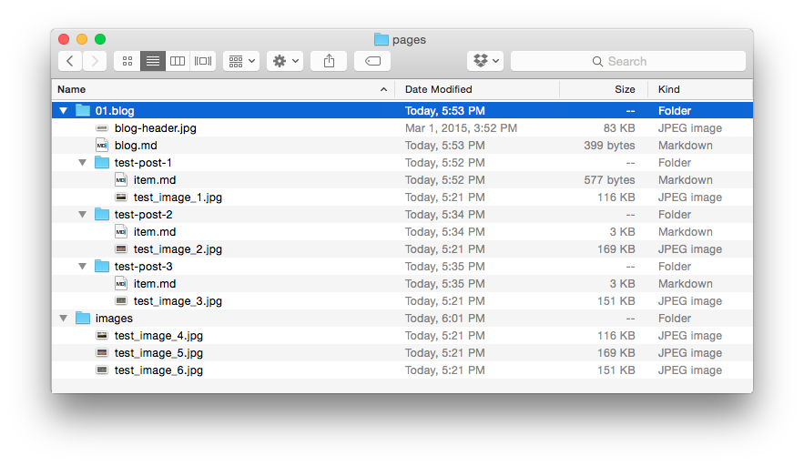

Grav has a variety of flexible linking options that allow you to link images from one page to another, and even from remote sources. If you have ever linked files using HTML or worked with a file system using a command line, a lot of this should be elementary to pick up.

We will run to some easy examples using this very basic, trimmed down model of what a Grav site's **Pages** directory might look like.



Using this directory structure as an example, we will take a look at the different types of links you can use to display media files in your content. We have image files in every folder, including one image for each blog post, and three images in a special `/images` directory which acts as a page but contains only media files.

The use of the `/images` folder serves as an example of how you can maintain a simple, centralized image directory to store files that are frequently used by multiple pages. This simplifies the linking process in these cases.

!!!! If you decide to use a centralized image directory, be advised that this directory should exist within the `/pages` folder as this folder is intended for front-end content.

To get us started, here is a quick look at some of the standard components of a Grav markdown-based image tag.

```markdown

```

[div class="table-keycol"]
| String | Description                                                                                                              |
| :----- | :-----                                                                                                                   |
| `!`    | When placed at the beginning of a traditional markdown link tag, it indicates this is an image tag.                      |
| `[]`   | The square bracket is used to wrap the **optional** alt-text for the image.                                              |
| `()`   | The parenthesis is used to surround the reference to the image itself. This is placed directly after the square bracket. |
| `../`  | When used in the link, it indicates a move up a directory.                                                               |
[/div]

!!! You can combine a regular page link and an image link like to wrap an image in a link: `[](http://example.net/)`

### Slug Relative

**Relative** image links use destinations set relative to the current page. This can be as simple as linking to another file in the current directory, such as an image file associated with the current page, or as complex as going up several directory levels and then back down to the specific folder/file where an image may reside.

With relative links, the location of the source file is every bit as important as that of the destination. If either file in the mix is moved, changing the path between them, the link can be broken.

The advantage of this type of linking structure is that you can quickly switch between a local development server and a live server with a different domain name and as long as the file structure remains consistent, the links should work without a problem.

A file link points to a particular file by name, rather than its directory or slug. If you were creating an image link in `pages/01.blog/test-post-1/item.md` to `/pages/01.blog/test-post-3/test-image-3.jpg` you would use the following command.

```markdown

```

This link moves up one folder, as indicated by `../`, and then down one folder, pointing directly to `test-image-3.jpg` as the destination.

If we want to load `blog-header.jpg` from the `01.blog` directory, we would do the following:

```markdown

```

! You do not need to include ordering numerals (`01.`) for slug relative links.

Grav has integrated support for slugs in the header of the page's primary markdown file. This slug supersedes the folder name for the page, and any media files contained within.

For example, **Test Post 2** has a slug set through its markdown file (`/pages/01.blog/test-post-2/item.md`). The header of this file contains the following:

[prism classes="language-yaml line-numbers"]
---
title: Test Post 2
slug: test-slug
taxonomy:
    category: blog
---
[/prism]

You will notice the slug `test-slug` has been set. Slugs set this way are completely optional, and do not have to be present. As mentioned in the last chapter, they do provide an easy way of linking. If a slug is set, then any link you make to a media file within that folder will have to be either **Slug Relative** or **Absolute** with a full URL set for the link.

If we want to link `test-image-2.jpg` from **Test Post 2**, we would enter the following:

```markdown

```

You will notice that we navigated up one directory using (`../`) and then down into the `test-slug` page folder using the slug which was set in `/pages/01.blog/test-post-2/item.md` file.

### Directory relative

**Directory Relative** image links use destinations set relative to the current page. The main difference between a slug relative, and directory relative link, is that rather than using the URL slugs, you reference via the full path with folder names.

An example of this would be something like:

```markdown

```

!! The main benefit of this, is that you can maintain link integrity in other systems outside of Grav, such as GitHub.

### Absolute

Absolute links are similar to relative links, but are relative to the root of the site. In **Grav**, this is typically based in your **/user/pages/** directory. This type of link can be done in two different ways.

You can do it in a similar fashion to the **Slug Relative** style which uses the slug, or directory name in the path for simplicity. This method removes potential issues of order changes later on (changing the number at the beginning of the folder name) breaking the link. This would be the most commonly used method of absolute linking.

In an absolute link, the link opens with a `/`. Here is an example of an absolute link made to `pages/01.blog/test-post-2/test-image-2.jpg` in the **Slug** style from `pages/01.blog/blog.md`.

```markdown

```

!!! A powerful technique is to create a `user/pages/images/` folder in your Grav site and put your images here.  Then you can easily reference them with an absolute URL from any Grav page: `/images/test-image-4.jpg` and still be able to perform [media actions](../media) on them.

### PHP Streams

New in Grav 1.2 is the ability to reference and link images via PHP streams.  There are several built-in PHP streams available which are useful including:

* `user://` - user folder. e.g. `user/`
* `image://` - images folder. e.g. `user/images/`
* `theme://` - current theme.  e.g. `user/themes/antimatter/`

These allow you to easily access images that are traditionally outside of the Pages hierarchy (`user/pages/`).

```markdown

```

or:

```markdown

```

### Remote

Remote image links enable you to directly display pretty much any media file via its URL. This doesn't have to include your own site's content, but it can. Here is an example of how you would display a remote image file.

```markdown

```

You can link to pretty much any direct URL, including secured HTTPS links.

### Media Actions on Images

One of the main benefits of using images associated with pages is that it enables you to take advantage of [Grav's powerful media actions](../media). For example, here is a line you would use to load an image from another page:

```markdown

```

or taking advantage of streams to access an image in your current theme:

```markdown

```

You will find more information about actions and other [media file functionality in the next chapter](../media).

### Image Attributes

A great new feature you can take advantage of is providing image attributes directly via the markdown syntax. This allows you to easily add **classes** and **id** HTML attributes without the need of [Markdown Extra](https://michelf.ca/projects/php-markdown/extra/).

Some examples of this are:

##### Single Class Attribute

```markdown

```

which will result in HTML similar to:

```html

```

##### Multiple Classes Attributes

```markdown

```

which will result in HTML similar to:

```html

```

##### ID Attribute

```markdown

```

which will result in HTML similar to:

```html

```
