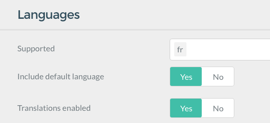

Multi-Language support was added to Grav in version **0.9.30** as a result of a great [community discussion](https://github.com/getgrav/grav/issues/170) on the subject. Multi-language support in Grav consists of several key parts:

1. [Single language different than English](#single-language-different-than-english)
1. [Multiple concurrent languages](#multi-language-basics) for a given Grav site
1. [Language fall-back](#language-configuration) based on language order
1. Language code (`en`) or Locale-based codes (`en-GB`)
1. [Multiple language-based markdown files](#multiple-language-pages) providing custom header/contents
1. Auto-detected [active language based on URL](#active-language-via-url)
1. Auto-detected [active language based on browser](#active-language-via-browser)
1. [Set locale to active language](#set-locale-to-the-active-language)
1. [Default Language Prefix](#default-language-prefix)
1. [Custom routes based on language](#multi-language-routing)
1. [Language-based home page aliases](#language-based-homepage)
1. Active language-based [Twig template overrides](#language-based-twig-templates)
1. [Translation support](#translation-support) in `.yaml` format via Twig filters, functions and PHP function
1. [Plugin and Theme language translations](#plugin-and-theme-language-translations)
1. [Environment-based language handling](#environment-based-language-handling)
1. [Language alias routes](#language-alias-routes) and switching between language versions of a page
1. [Session-based active language](#session-based-active-language)
1. [Language Switcher plugin](#language-switcher)
1. [Language logic in Twig templates](#language-logic-in-twig-templates)


We will now break these down and provide examples on how you can setup your Grav site with multiple languages.

### Single language different than English

If you just use one language, enable translations and add your language code in the `user/config/system.yaml` file:

```
languages:
  translations: true
  supported:
    - fr
```

or in the System configuration in the Admin:



This will make sure Grav uses the correct language strings in the frontend.
Also, if the theme supports it, it will add your language code to the HTML tag.

### Multi-Language Basics

As you should already be familiar with how Grav uses markdown files in folders to define architectural structure as well as setting important page options as well as content, we won't go into those mechanics directly.  However, be aware that by default Grav looks for a **single** `.md` file in a folder to represent the page.  With multi-language support enabled, Grav will look for the appropriate language based file, for example `default.en.md` or `default.fr.md`.

#### Language Configuration

For Grav do to this you must first setup some basic language configuration in your `user/config/system.yaml` file.

```
languages:
  supported:
    - en
    - fr
```

By providing a `languages` block with a list of `supported` languages, you have effectively enabled multi-language support within Grav.

In this example you can see that two supported languages have been described (`en` and `fr`). These will allow you to support **English** and **French** languages.

If no language is explicitly asked for (via the URL or by code), Grav will use the order of the languages provided to select the correct language.  So in the example above, the **default** language is `en` or English. If you had `fr` first, French would be the default language.

!! You can of course provide as many languages as you like and you may even use locale type codes such as `en-GB`, `en-US` and `fr-FR`.  If you use this locale based naming, you will have to replace all the short language codes with the locale versions.

#### Multiple Language Pages

By default in Grav, each page is represented by a markdown file, for example `default.md`. When you enable multi-language support, Grav will look for the appropriately named markdown file.  For example as English is our default language, it will first look for `default.en.md`.

If this file is not found, it will try the next language and look for `default.fr.md`.  If that file is not found, it will fall-back to the Grav default and look for `default.md` to provide information for the page.

If we had the most basic of Grav sites, with a single `01.home/default.md` file, we could start by renaming `default.md` to `default.en.md`, and its contents might look like this:

```
---
title: Homepage
---

This is my Grav-powered homepage!
```

Then you could create a new page located in the same `01.home/` folder called `default.fr.md` with the contents:

```
---
title: Page d'accueil
---

Ceci est ma page d'accueil générée par Grav !
```

Now you have defined two pages for your current homepage in multiple languages.

#### Active Language via URL

As English is the default language, if you were to point your browser without specifying a language you would get the content as described in the `default.en.md` file, but you could also explicitly request English by pointing your browser to

```
http://yoursite.com/en
```

To access the French version, you would of course, use

```
http://yoursite.com/fr
```

#### Active Language via Browser

Most browsers allow you to configure which languages you prefer to see content in. Grav has the ability to read this `http_accept_language` values and compare them to the current supported languages for the site, and if no specific language has been detected, show you content in your preferred language.

For this to function you must enable the option in your `user/system.yaml` file in the `languages:` section:

```
languages:
  http_accept_language: false
```

#### Set Locale to the Active Language

The boolean setting will set the PHP `setlocale()` method that controls things such as monetary values, dates, string comparisons, character classifications and other locale-specific settings to that of the active language.  This defaults to `false`, and then it will use the system locale, if you set this value to `true` it will override the locale with the current active language.

```
languages:
   override_locale: false
```

#### Default Language Prefix

By default, the default language code is prefixed in all URLs.  For example if you have support for English and French (`en` and `fr`), and the default is English.  A page route might look like `/en/my-page` in English and `/fr/ma-page` in French. However it's often preferrable to have the default language without the prefix, so you can just set this option to `false` and the English page would appear as `/my-page`.

```
languages:
    include_default_lang: false
```

#### Multi-Language Routing

Grav typically uses the names of the folders to produce a URL route for a particular page.  This allows for the site architecture to be easily understood and implemented as a nested set of folders.  However with a multi-language site you may wish to use a URL that makes more sense in that particular language.

If we had the following folder structure:

```
- 01.Animals
  - 01.Mammals
    - 01.Bats
    - 02.Bears
    - 03.Foxes
    - 04.Cats
  - 02.Reptiles
  - 03.Birds
  - 04.Insets
  - 05.Aquatic
```

This would produce URLs such as `http://yoursite.com/animals/mammals/bears`.  This is great for an English site, but if you wished to have a French version you would prefer these to be translated appropriately. The easiest way to achieve this is would be to add a custom [slug](../headers#slug) for each of the `fr.md` page files.  for example, the mammal page might look something like:

```
---
title: Mammifères
slug: mammiferes
---

Les mammifères (classe des Mammalia) forment un taxon inclus dans les vertébrés, traditionnellement une classe, définie dès la classification de Linné. Ce taxon est considéré comme monophylétique...
```

This combined with appropriate **slug-overrides** in the other files should result in a URL of `http://yoursite.com/animaux/mammiferes/ours` which is much more French looking!

Another option is to make use of the new [page-level routes](../headers#routes) support and provide a full route alias for the page.

#### Language-Based Homepage

If you override the route/slug for the homepage, Grav won't be able to find the homepage as defined by your `home.alias` option in your `system.yaml`. It will be looking for `/homepage` and your French homepage might have a route of `/page-d-accueil`.

In order to support multi-language homepages Grav has a new option that can be used instead of `home.alias` and that is simple `home.aliases` and it could look something like this:

```
home:
  aliases:
    en: /homepage
    fr: /page-d-accueil
```

This way Grav knows how to route your to the homepage if the active language is English or French.

#### Language-Based Twig Templates

By default, Grav uses the markdown filename to determine the Twig template to use to render.  This works with multi-language the same way.  For example, `default.fr.md` would look for a Twig file called `default.html.twig` in the appropriate Twig template paths of the current theme and any plugins that register Twig template paths.  With multi-language, Grav also adds the current active language to the path structure.  What this means is that if you need to have a language-specific Twig file, you can just put those into a root level language folder.  For example if your current theme is using a template located at `templates/default.html.twig` you can create an `templates/fr/` folder, and put your French-specific Twig file in there: `templates/fr/default.html.twig`.

Another option which requires manual setup is to override the `template:` setting in the page headers. For example:

```
template: default.fr
```

This will look for a template located at `templates/default.fr.html.twig`

This provides you with two options for providing language specific Twig overrides.

!! If no language-specific Twig template is provided, the default one will be used.


#### Translation via Twig

The simplest way to use these translation strings in your Twig templates is to use the `|t` Twig filter.  You can also use the `t()` Twig function, but frankly the filter is cleaner and does the same thing:

```
<h1 id="site-name">{{ "SITE_NAME"|t }}</h1>
<section id="header">
    <h2>{{ "HEADER.MAIN_TEXT"|t }}</h2>
    <h3>{{ "HEADER.SUB_TEXT"|t }}</h3>
</section>
```

Using the Twig function `t()` the solution is similar:

```
<h1 id="site-name">{{ t("SITE_NAME") }}</h1>
<section id="header">
    <h2>{{ t("HEADER.MAIN_TEXT") }}</h2>
    <h3>{{ t("HEADER.SUB_TEXT") }}</h3>
</section>
```

Another new Twig filter/function allows you to translate from an array.  This is particularly useful if you have a list of values such as months of the year, or days of the week.  For example, say you have this translation:

```
en:
  MONTHS_OF_THE_YEAR: [January, February, March, April, May, June, July, August, September, October, November, December]
```

You could get the appropriate translation for a post's month with the following:

```
{{ 'MONTHS_OF_THE_YEAR'|ta(post.date|date('n') - 1) }}
```

You can also use this as a Twig function with `ta()`.

#### Translations with Variables

You can also use variables in your Twig translations by using [PHP's sprintf](http://php.net/sprintf) syntax:

```
SIMPLE_TEXT: There are %d monkeys in the %s
```

And then you can populate those variables with the Twig:

```
{{ "SIMPLE_TEXT"|t(12, "London Zoo") }} 
```

resulting in the translation:

```
There are 12 monkeys in the London Zoo
```

#### Complex Translations

Sometimes it's required to perform complex translations with replacement in specific languages.  You can utilize the full power of the Language objects `translate()` method with the `tl` filter/function.  For example:

```
{{ ["SIMPLE_TEXT", 12, 'London Zoo']|tl(['fr']) }}
```

Will translate the `SIMPLE_TEXT` string and replace the placeholders with `12` and `London Zoo` respectively.  Also there's an array passed with language translations to try in first-find-first-used order.  This will output the result in french:


```
Il y a 12 singes dans le Zoo de Londres
```

#### PHP Translations

As well as the Twig filter and functions you can use the same approach within your Grav plugin:

```
$translation = $grav['language']->translate(['HEADER.MAIN_TEXT']);
```

You can also specify a language:

```
$translation = $grav['language']->translate(['HEADER.MAIN_TEXT'], 'fr');
```

To translate a specific item in an array use:

```
$translation = $grav['language']->translateArray('MONTHS_OF_THE_YEAR', 3);
```

#### Plugin and Theme Language Translations

You can also provide your own translations in plugins and themes.  This is done by creating a `languages.yaml` file in the root of your plugin or theme (e.g. `/user/plugins/error/languages.yaml`, or `user/themes/antimatter/languages.yaml`), and should contain all the supported languages prefixed by the language or locale code:

```
en:
  PLUGIN_ERROR:
    TITLE: Error Plugin
    DESCRIPTION: The error plugin provides a simple mechanism for handling error pages within Grav.
fr:
  PLUGIN_ERROR:
    TITLE: Plugin d'Erreur
    DESCRIPTION: Le plugin d'erreur fournit un mécanisme simple de manipulation des pages d'erreur au sein de Grav.
```

! The convention for plugins is to use PLUGIN_PLUGINNAME.* as a prefix for all language strings, to avoid any name conflict. Themes are less likely to introduce language strings conflicts, but it's a good idea to prefix with THEME_THEMENAME.* strings added in themes.

#### Translation Overrides

If you wish to override a particular translation, simply put the modified key/value pair in an appropriate language file in your `user/languages/` folder.  For example a file called `user/languages/en.yaml` could contain:

```
PLUGIN_ERROR:
  TITLE: My Error Plugin
```

This will ensure that you can always override a translation string without messing around with the plugins or themes themselves, and also will avoid overwriting a custom translation when updating them.

### Advanced

#### Environment-Based Language Handling

You can take advantage of [Grav's Environment Configuration](../../advanced/environment-config) to automatically route users to the correct version of your site based on URL.  For example, if you had a URL such as `http://french.mysite.com` that was an alias for your standard `http://www.mysite.com`, you could setup an environment configuration:

`/user/french.mysite.com/config/system.yaml`

```
languages:
  supported:
    - fr
    - en
```

This uses an **inverted language order** so the default language is now `fr` so the French language will show by default.

#### Language Alias Routes

Because each page can have its own custom route, it would be hard to switch between different language versions of the same page.  However, there is a new **Page.rawRoute()** method on the Page object that will get the same raw route for any of the various language translations of a single page.  All you would need to do is to put the lang code in front to get the proper route to a specific language version of a page.

For example, say you are on a page in English with a custom route of:

```
/my-custom-english-page
```

The French page has the custom route of:

```
/ma-page-francaise-personnalisee
```

You could get the raw page of the English page and that might be:

```
/blog/custom/my-page
```

Then just add the language you want and that is your new URL;

```
/fr/blog/custom/my-page
```

This will retrieve the same page as `/ma-page-francaise-personnalisee`.

### Translation Support

Grav provides a simple yet powerful mechanism for providing translations in Twig and also via PHP for use in themes and plugins. This is enabled by default, and will use `en` language if no languages are defined.  To manually enable or disable translations, there is a setting in your `system.yaml`:

```
languages:
  translations: true
```

The translations use the same list of languages as defined by the `languages: supported:` in your `system.yaml`.

The translation system works in a similar fashion to Grav configuration and there are several places and ways you can provide translations.

The first place Grav looks for translation files is in the `system/languages` folder. Files are expected to be created in the format: `en.yaml`, `fr.yaml`, etc.  Each yaml file should contain an array or nested arrays of key/values pairs:

```
SITE_NAME: My Blog Site
HEADER:
    MAIN_TEXT: Welcome to my new blog site
    SUB_TEXT: Check back daily for the latest news
```

For ease of identification, Grav prefers the use of capitalized language strings as this helps to determine untranslated strings and also makes it clearer when used in Twig templates.

Grav has the ability to fall-back through the supported languages to find a translation if one for the active language is not found.  This is enabled by default but can be disabled via the `translations_fallback` option:

```
languages:
  translations_fallback: true
```

!!! Help Grav reach a wider community of users by providing translations in **your language**. We use the [Crowdin Translation Platform](https://crowdin.com/) to facilitate translating the [Grav Core](https://crowdin.com/project/grav-core) and [Grav Admin Plugin](https://crowdin.com/project/grav-admin). [Sign-up](https://crowdin.com/join) and get started translating today!

#### Session-Based Active Language

If you wish to remember the active language independently from the URL, you can activate **session-based** storage of the active language.  To enable this, you must ensure you have `session: enabled: true` in [the system.yaml](../../basics/grav-configuration).  Then you need to enable the language setting:

```
languages:
  session_store_active: true
```

This will then store the active language in the session.

#### Language Switcher

You can download a simple **Language Switching** plugin via the Admin plugin, or through the GPM with:

```
$ bin/gpm install langswitcher
```

The [documentation for configuration and implementation can be found on GitHub](https://github.com/getgrav/grav-plugin-langswitcher).


#### Setup with language specific domains

configure your site with [Environment-based language handling](#environment-based-language-handling) to assign default languages (the first language) to domains.


make sure the option

```
pages.redirect_default_route: true
```
is set to true in your system.yaml.

Add following to your .htaccess file and adopt the language slugs and domain names to your needs:

```
# http://www.cheat-sheets.org/saved-copy/mod_rewrite_cheat_sheet.pdf
# http://www.workingwith.me.uk/articles/scripting/mod_rewrite

# handle top level e.g. http://grav-site.com/de
RewriteRule ^en/?$ "http://grav-site.com" [R=302,L]
RewriteRule ^de/?$ "http://grav-site.de" [R=302,L]

# handle sub pages, exclude admin path
RewriteCond %{REQUEST_URI} !(admin) [NC]
RewriteRule ^en/(.*)$ "http://grav-site.com/$1" [R=302,L]
RewriteCond %{REQUEST_URI} !(admin) [NC]
RewriteRule ^de/(.*)$ "http://grav-site.de/$1" [R=302,L]
```

if you know how to simplify the rewrite rules, please edit this page through the Github link in the upper left corner

#### Language Logic in Twig Templates

There is often a need to access Language state and logic from Twig templates.  For example if you need to access a certain image file that is different for a particular language and is named differently (`myimage.en.jpg` and `myimage.fr.jpg`).

To display the correct version of the image you would need to know the current active language.  This is possible in Grav by accessing the `Language` object via the `Grav` object, and calling the appropriate method. In the example above this could be achieved with the following Twig code:

```
{{ page.media.images['myimage.'~grav.language.getActive~'.jpg'].html }}
```

The `getActive` call in the Twig is effectively calling `Language->getActive()` to return the current active language code.  A few useful Language methods include:

* `getLanguages()` - Returns an array of all supported languages
* `getLanguage()` - Returns current active, else returns default language
* `getActive()` - Returns current active language
* `getDefault()` - Returns the default (first) language

For a complete list of available methods, you can look in the `\Grav\Common\Language\Language.php` file.

