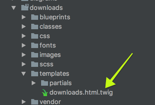

In the previous [Plugin Tutorial](../plugin-tutorial) chapter, you might have noticed that our plugin logic was encompassed in two methods.  Each of these methods `onPluginsInitialized` and `onPageInitialized` correspond to **event hooks** that are available throughout the Grav life cycle.

To fully harness the power of Grav plugins you need to know which event hooks are available, in what order are these hooks called, and what is available during these calls. The **event hooks** have a direct relationship to the overall [Grav Lifecycle](../../plugins/grav-lifecycle).

## Event Order

Most events within Grav fire in a specific order and it is important to understand this order if you are creating plugins:

1. [onFatalException](../event-hooks#onFatalException) _(no order, can occur anytime)_
1. [onPluginsInitialized](../event-hooks#onPluginsInitialized)
1. onThemeInitialized
1. onRequestHandlerInit (1.6)
1. onTask (1.6)
  1. onTask.{task}
1. onAction (1.6)
  1. onAction.{action} (1.6)
1. onBackupsInitialized
1. onSchedulerInitialized (1.6)
1. [onAssetsInitialized](../event-hooks#onAssetsInitialized)
1. [onTwigTemplatePaths](../event-hooks#onTwigTemplatePaths)
1. [onTwigLoader](../event-hooks#onTwigLoader)
1. [onTwigInitialized](../event-hooks#onTwigInitialized)
1. [onTwigExtensions](../event-hooks#onTwigExtensions)
1. [onBuildPagesInitialized](../event-hooks#onBuildPagesInitialized) _(once when pages are reprocessed)_
  1. [onPageProcessed](../event-hooks#onPageProcessed) _(each page not cached yet)_
  1. onFormPageHeaderProcessed (1.6) _(each page not cached yet)_
  1. [onFolderProcessed](../event-hooks#onFolderProcessed) _(for each folder found)_
1. [onPagesInitialized](../event-hooks#onPagesInitialized)
1. [onPageInitialized](../event-hooks#onPageInitialized)
  1. [onPageContentRaw](../event-hooks#onPageContentRaw) _(each page not cached yet)_
  1. [onMarkdownInitialized](../event-hooks#onMarkdownInitialized)
  1. [onPageContentProcessed](../event-hooks#onPageContentProcessed) _(each page not cached yet)_
  1. onPageContent _(called first time Page::content() is called even when cached)_
1. [onPageNotFound](../event-hooks#onPageNotFound)
1. onPageAction (1.6)
  1. onPageAction.{action} (1.6)
1. onPageTask (1.6)
  1. onPageTask.{task} (1.6)
1. [onTwigPageVariables](../event-hooks#onTwigPageVariables) _(each page not cached yet)_
1. onHttpPostFilter (1.5.2)
1. [onTwigSiteVariables](../event-hooks#onTwigSiteVariables)
1. [onCollectionProcessed](../event-hooks#onCollectionProcessed) _(when collection is requested)_
1. [onOutputGenerated](../event-hooks#onOutputGenerated)
1. [onOutputRendered](../event-hooks#onOutputRendered)
1. [onShutdown](../event-hooks#onShutdown)

Misc events:

1. [onBlueprintCreated](../event-hooks#onBlueprintCreated)
1. onTwigTemplateVariables
1. onTwigStringVariables
1. [onBeforeDownload](../event-hooks#onBeforeDownload)
1. [onPageFallBackUrl](../event-hooks#onPageFallBackUrl)
1. [onMediaLocate](../event-hooks#onMediaLocate)
1. [onGetPageBlueprints](../event-hooks#onGetPageBlueprints)
1. [onGetPageTemplates](../event-hooks#onGetPageTemplates)
1. onFlexObjectRender (1.6)
1. onFlexCollectionRender (1.6)
1. onBeforeCacheClear
1. onImageMediumSaved (ImageFile)

## Core Grav Event Hooks

There are several core Grav event hooks that are triggered during the processing of a page:

#### onFatalException

This is an event that can be fired at any time if PHP throws a fatal exception. This is currently used by the `problems` plugin to handle displaying a list of potential reasons why Grav throws the fatal exception.

#### onPluginsInitialized

This is the first plugin event available. At this point the following objects have been initiated:

* Uri
* Config
* Debugger
* Cache
* Plugins

!!!! A plugin will not be loaded at all if the `enabled: false` configuration option has been set for that particular plugin.

#### onAssetsInitialized

The event indicates the assets manager has been initialized and is ready for assets to be added and managed.

#### onPagesInitialized

This event signifies that all the pages in Grav's `user/pages` folder have been loaded as objects and are available in the **Pages object**.

#### onPageNotFound

This is an event that can be fired if an expected page is not found. This is currently used by the `error` plugin to display a pretty 404 error page.

#### onPageInitialized

The current page as requested by a URL has been loaded into the **Page object**.

#### onOutputGenerated

The output has been processed by the **Twig templating engine** and is now just a string of HTML.

#### onOutputRendered

The output has been fully processed and sent to the display.

#### onShutdown

A new and very powerful event that lets you perform actions after Grav has finished processing and the connection to the client has been closed.  This is particularly useful for performing actions that don't need user interaction and potentially could impact performance.  Possible uses include user tracking and jobs processing.

#### onBeforeDownload

This new event passes in an event object that contains a `file`.  This event can be used to perform logging, or grant/deny access to download said file.

#### onGetPageTemplates

This event enables plugins to provide their own templates in addition to the ones gathered from the theme's directory structure and core. This is especially useful if you wish the plugin to provide its own template.

**Example**

[prism classes="language-twig line-numbers"]
/**
 * Add page template types.
 */
public function onGetPageTemplates(Event $event)
{
    /** @var Types $types */
    $types = $event->types;
    $types->register('downloads');
}
[/prism]

This allows a plugin to register a template (that it might provide) so that it shows up in the dropdown list of page template types (like when editing a page). In the example above, a template type of `downloads` is added as there is a `downloads.html.twig` file in the `downloads` directory.

#### onGetPageBlueprints

This event, like `onGetPageTemplates` enables the plugin to provide its own resources in addition to core and theme-specific ones. In this case, it's blueprints.

**Example**

[prism classes="language-twig line-numbers"]
$scanBlueprintsAndTemplates = function () use ($grav) {
    // Scan blueprints
    $event = new Event();
    $event->types = self::$types;
    $grav->fireEvent('onGetPageBlueprints', $event);

    self::$types->scanBlueprints('theme://blueprints/');

    // Scan templates
    $event = new Event();
    $event->types = self::$types;
    $grav->fireEvent('onGetPageTemplates', $event);

    self::$types->scanTemplates('theme://templates/');
};
[/prism]

In this example, we are using both the `onGetPageTemplates` and `onGetPageBlueprints` hooks to make these plugin-provided resources (templates and blueprints) available to Grav for inheritance and other uses.

## Twig Event Hooks

Twig has its own set of event hooks.

#### onTwigTemplatePaths

The base locations for template paths have been set on the **Twig object**.  If you need to add other locations where Twig will search for template paths, this is the event to use.

**Example**

[prism classes="language-twig line-numbers"]
/**
 * Add template directory to twig lookup path.
 */
 public function onTwigTemplatePaths()
 {
     $this->grav['twig']->twig_paths[] = __DIR__ . '/templates';
 }
[/prism]

#### onTwigInitialized

The Twig templating engine is now initialized at this point.

#### onTwigExtensions

The core Twig extensions have been loaded, but if you need to add your own Twig extension, you can do so with this event hook.

#### onTwigPageVariables

Where Twig processes a page directly, i.e. when you set `process: twig: true` in a page's YAML headers. This is where you should add any variables to Twig that need to be available to Twig during this process.

#### onTwigSiteVariables

Where Twig processes the full site template hierarchy.  This is where you should add any variables to Twig that need to be available to Twig during this process.

## Collection Event Hooks

#### onCollectionProcessed

If you need to manipulate a collection after it has been processed this is the time to do it.

## Page Event Hooks

#### onBuildPagesInitialized

This event is triggered once when pages are going to be reprocessed.  This typically happens if the cache has expired or needs refreshing.  This is a useful event to use for plugins that need to manipulate content and cache the results.

#### onBlueprintCreated

This is used for processing and handling forms.

#### onPageContentRaw

After a page has been found, header processed, but content **not** processed.  This is fired for **every page** in the Grav system.  Performance is not a problem because this event will not run on a cached page, only when the cache is cleared or a cache-clearing event occurs.

#### onPageProcessed

After a page is parsed and processed.  This is fired for **every page** in the Grav system.  Performance is not a problem because this event will not run on a cached page, only when the cache is cleared or a cache-clearing event occurs.

#### onMarkdownInitialized

Called when Markdown has been initialized. Allows to override the default Parsedown processing implementation. See [an usage example on the PR that introduced it](https://github.com/getgrav/grav/pull/747#issuecomment-206821370).

#### onPageContentProcessed

This event is fired after the page's `content()` method has processed the page content.  This is particularly useful if you want to perform actions on the post-processed content but ensure the results are cached.  Performance is not a problem because this event will not run on a cached page, only when the cache is cleared or a cache-clearing event occurs.

#### onFolderProcessed

After a folder is parsed and processed.  This is fired for **every folder** in the Grav system.  Performance is not a problem because this event will not run on a cached page, only when the cache is cleared or a cache-clearing event occurs.

#### onPageFallBackUrl

If a route is not recognized as a page, Grav tries to access a page media asset. The event is fired as soon as the procedure begins, so plugins can hook and provide additional functionality.

#### onMediaLocate

Adds support for custom media locations for excerpts.

#### onTwigLoader

Adds support for use of namespaces in conjunction with two new methods in Twig class: `Twig::addPath($path, $namespace)` and `Twig::prependPath($path, $namespace)`.
