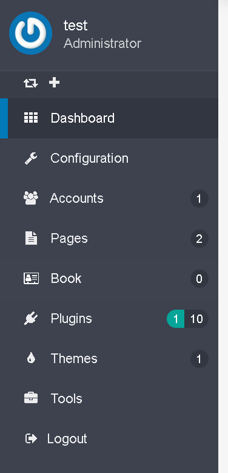
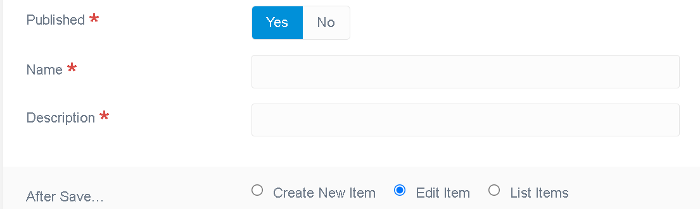
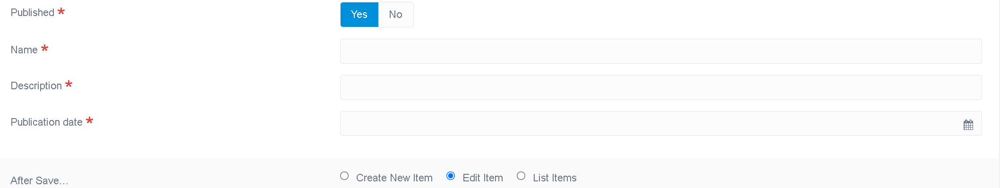

## Introduction

Flex usages, be in twig or in code, will be only covered for the purpose of this introduction. To understand the power and flexibily of Flex, please read our [dedicated Flex documentation](/advanced/flex).

Flex allows custom Objects CRUDS, as single object or collection, and provides an extensive APIs usable from your plugin code or templates.

Admin UI can be added easily, either using standard templates or your own customized listing or forms (or else).

## Requirements

Grav 1.7 or later is required. For the purpose of this documentation, we will be using the grav+admin installation, make sure you have it up and running to follow the steps below. See the [installation documentation](/basics/installation) to get it ready.

## Create your plugins

As it is possible to create a plugin, with or without flex from scratch, to ensure all latest changes are in place, we highly recommend to use the devtools to generate the skeleton and basic features for you:

To do so, we will use the devtools CLI:

```bash
bin/gpm install devtools
```

To [create a new plugin using the devtools](/plugins/plugin-tutorial), the following command is used, the plugin name is myflexplugin:

```bash
 grav-admin bin/plugin devtools new-plugin
```

and fill up the questions using the following answers, the important part is to choose a plugin prepared for flex:

```bash
 Enter Plugin Name:
 > myflexplugin

 Enter Plugin Description:
 > A little Flex plugin test

 Enter Developer Name:
 > grav@example.com

 Enter GitHub ID (can be blank):
 > gravcms

 Enter Developer Email:
 > grav@example.com

 Please choose an option:
  [blank] Basic Plugin
  [flex ] Basic Plugin prepared for custom Flex Objects
 > flex

 Enter Flex Object Name:
 > book

 Please choose a storage type:
  [simple] Basic Storage (1 file for all objects) - no media support
  [file  ] File Storage (1 file per object)
  [folder] Folder Storage (1 folder per object)
 > folder


SUCCESS plugin myflexplugin -> Created Successfully

Path: /home/pierre/project/grav/grav-admin/user/plugins/myflexplugin

Please run `cd /home/pierre/project/grav/grav-admin/user/plugins/myflexplugin` and `composer update` to initialize the autoloader
```

On success, we need now to install the dependencies, if any, for our new plugin:


```bash
cd /home/pierre/project/grav/grav-admin/user/plugins/myflexplugin
```
```bash
composer update
```

On success, the following output should be displayed:

```bash
Loading composer repositories with package information
Updating dependencies
Nothing to modify in lock file
Writing lock file
Installing dependencies from lock file (including require-dev)
Nothing to install, update or remove
Generating autoload files
No installed packages - skipping audit.
```

and go back to the root folder of the grav-admin install:


```bash
$ cd -
```

The devtools generated a very basic flex object, made of a name and a description, and its collection. The admin UI already allows one to list these books objects, create, edit or delete them, without having written a single line of code.

A new entry in the left side menu has been added:



The default edit form looks like:




You should also see the various folders and files related to your plugin and its flex object 'book'.

## What is done where


The plugin folder should look like this:

```bash
../grav-admin/user/plugins/myflexplugin
├── CHANGELOG.md
├── LICENSE
├── README.md
├── blueprints
│   └── flex-objects
│       └── book.yaml
├── blueprints.yaml
├── classes
│   └── Flex
│       └── Types
│           └── Book
│               ├── BookCollection.php
│               └── BookObject.php
├── composer.json
├── composer.lock
├── languages.yaml
├── myflexplugin.php
├── myflexplugin.yaml
└── vendor
    ├── autoload.php
    └── composer
        ├── ClassLoader.php
        ├── InstalledVersions.php
        ├── LICENSE
        ├── autoload_classmap.php
        ├── autoload_namespaces.php
        ├── autoload_psr4.php
        ├── autoload_real.php
        ├── autoload_static.php
        ├── installed.json
        ├── installed.php
        └── platform_check.php
```

The key file is the [blueprints](advanced/flex/custom-types/blueprint) definition. It is where the schema of this flex object will be defined, along with the numerous options to customize pretty much anything about it.

In our plugin, the book blueprints can be found at user/plugins/myflexplugin/blueprints/flex-objects/book.yaml.

> **IMPORTANT** The blueprint for each flex object in your plugin (or main install /blueprints) must be in  blueprints/flex-objects/ folder or they won't be found.

The schema is defined using the Form section of this blueprints. Whether or not the admin UI forms will be used, this section defines the properties of this flex object.

We won't cover all options here, but focus on getting our book object implement. The [extensive Flex blueprints documentation](/advanced/flex/custom-types/blueprint) will guide you to go deeper and customize it.

The schema below defines the two properties:
```yaml
form:
    validation: loose
    fields:
        published:
            type: toggle
            label: Published
            highlight: 1
            default: 1
            options:
                1: PLUGIN_ADMIN.YES
                0: PLUGIN_ADMIN.NO
            validate:
                type: bool
                required: true
        name:
            type: text
            label: Name
            validate:
                required: true
        description:
            type: text
            label: Description
            validate:
                required: true
```

To add a field to our object, say a datetime field representing the publication's date of this book, we can add:

```yaml
form:
    validation: loose
    fields:
        published:
            type: toggle
            label: Published
            highlight: 1
            default: 1
            options:
                1: PLUGIN_ADMIN.YES
                0: PLUGIN_ADMIN.NO
            validate:
                type: bool
                required: true
        name:
            type: text
            label: Name
            validate:
                required: true
        pub_date:
            type: datetime
            label: Description
            validate:
                required: true
```

The default edit form now shows the date input fields for the publication date:

