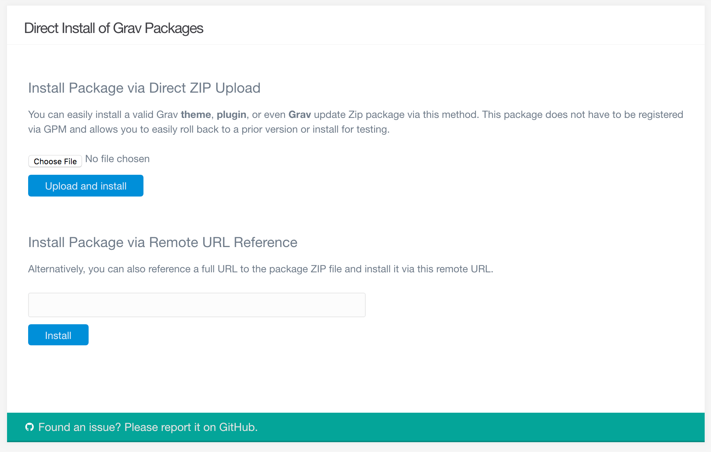
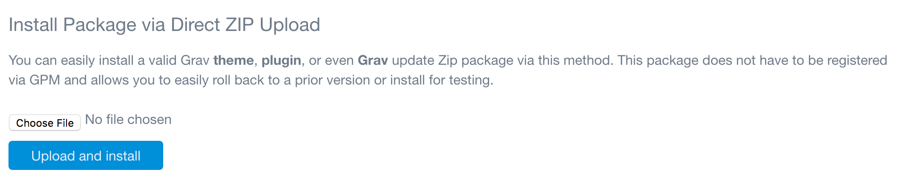
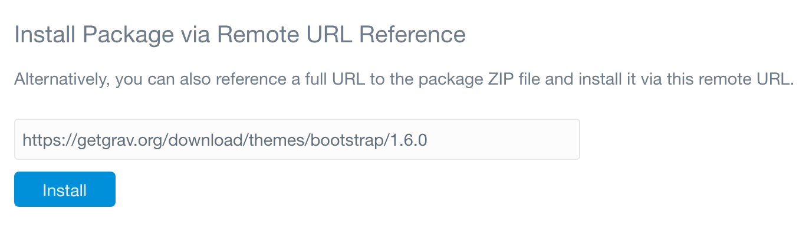

There are instances where you may want to upload a theme or plugin package that isn't currently in the main Grav plugins directory. Perhaps you have a premium theme that is made available in a zip file, or you're developing a plugin and want to upload your latest build to your Grav install for testing. In any case, you can do this by way of FTP, but the Admin gives you an even simpler solution.

Using the **Direct Install** tool, you can upload a zipped package directly to your Grav install and have it available for use in seconds. This isn't just limited to plugins and themes. You can even upload Grav itself this way and upgrade (or downgrade) doing this, as well. This is especially useful for Grav contributors that want to test their work easily.

As with any installation process, we recommend having a recent backup of your Grav install before using this tool - especially if you plan on using it to change your entire Grav install.

### Uploading

The first method of direct install available is a file upload. You can upload a zip package directly to Grav using this tool. Simply select the **Choose File** button (or drag your zip package to the button with some browsers) and select your local package file. Once you have your file selected, simply hit **Upload and Install** to install your package.

Once your package has been successfully installed, you will be greeted with an alert letting you know. That's all there is to it!

#### Remote Location

The second method involves linking directly to a package file. For example, if you have a package hosted on a remote server, you can enter the URL of that package in the field. GPM friendly download links such as `https://getgrav.org/download/themes/bootstrap/1.6.0` should work fine.

By default, these uploads are limited to official GPM repository links. But, you can go to **Configuration > System** and toggle the **Official GPM Only** option to **No** to unlock this field and enable direct zip package links that are not official GPM repositories. For example: `http://example.com/mypackage.zip`. This is an advanced feature and should only be used in cases where you have properly vetted the package as safe.
