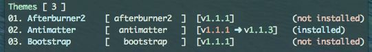
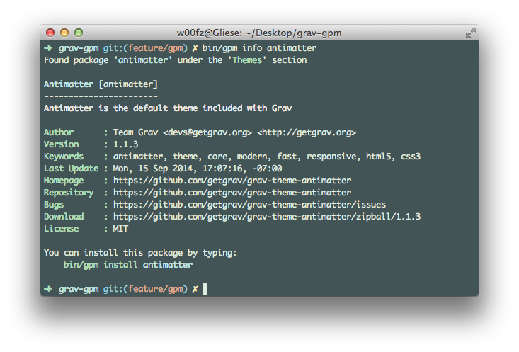
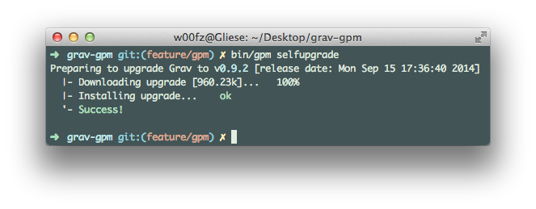

Since the release of version **0.9.3**, Grav includes a _GPM_ (Grav Package Manager) which allows you to install, update, uninstall and list all the themes and plugins available on the Grav repository, as well as upgrade Grav itself to the latest version.

Like the [Grav CLI](../grav-cli), the _GPM_ is a command-line tool which requires the user to run commands via a command-line interface, such as **Terminal** in OS X. UNIX style commands are not natively available in Windows cmd. Installing the [msysgit](http://msysgit.github.io/) package on a Windows machine adds [Git](http://git-scm.com/) and Git BASH, which is an alternative command prompt that makes UNIX commands available.

To get started with _GPM_, you can run the following command to receive a list of all presently available commands:

```bash
$ bin/gpm list
```

To receive help for a specific command, you can add help to the line before the command:

```bash
$ bin/gpm help install
```

>>> To be able to perform **install**, **upgrade**, and **selfupgrade**, PHP must have the `php_openssl` extension enabled.  If you get a fatal error while downloading, this is probably the cause.

#### PHP CGI-FCGI Information

To determine if your server is running `cgi-fcgi` on the command line, type the following:

```bash
$ php -v
PHP 5.5.17 (cgi-fcgi) (built: Sep 19 2014 09:49:55)
Copyright (c) 1997-2014 The PHP Group
Zend Engine v2.5.0, Copyright (c) 1998-2014 Zend Technologies
    with the ionCube PHP Loader v4.6.1, Copyright (c) 2002-2014, by ionCube Ltd.
```

If you see a reference to `(cgi-fcgi)` you will need to prefix all `bin/gpm` commands with `php-cli`. Alternatively you can setup an alias in your shell with something like: `alias php="php-cli"` which will ensure the **CLI** verison of PHP runs from the command line.

## How Does it Work?

_GPM_ downloads the repository metadata from **GetGrav.org**. The repository contains all the details about the packages available and _GPM_ is also capable of determining whether any of these packages are already installed and if they need updating.

The repository itself gets cached locally, on the Grav instance machine running the command, for 24 hours. Any further request after the cache has been generated will not contact the **GetGrav.org** server, but rather serve from the locally-stored repository. This approach guarantees a much quicker response.

Most of the commands (listed below) come with the option `--force (-f)` which allows the forcing a re-fetch of the repository. This could be extremely useful in the event an update is known to be out there and the user doesn't want to wait a full 24 hour cycle before the cache gets cleared.

## Commands

Below, we have broken down all of the commands available for _GPM_. To run a command, launch your favorite terminal app and from within the root of your Grav instance you can type `bin/gpm <command>`.

## Index

The `index` command shows a list of all the available resources in the Grav repository, organized by _themes_ and _plugins_.


Each row displays the **name**, **slug**, **version** and whether it's installed already or not.

In this view, you can also quickly determine if there is a new version of any of the resources you have already installed.

For instance, if we had a very old version of Antimatter (v1.1.1), but the latest version was v1.1.3, it will appear in the index as seen below.



## Info

The `info` command dispays the details of the desired package, such as description, author, homepage, etc.



## Install

The `install` command does exactly what it states. It installs a resource from the repository to your current Grav instance with a simple command.

The command will also detect if a resource is already installed, or if it is symbolically linked, and prompts you on what to do.

You can also install multiple resources at once by separating the slugs with a space.

https://www.youtube.com/watch?v=SUUtcYl2xrE

>>> You can use the option `--all-yes (-y)` to skip any prompts. Existing resources will be overridden and if they are symbolic links will automatically be skipped.

## Update

The `update` command shows a list of updatable resources and works similarly to `install`.


https://www.youtube.com/watch?v=jkxk2xBr5TM

Alternatively, you can limit the updates to specific resources only.


https://www.youtube.com/watch?v=rSWdmdx9TDA

## Uninstall

The `uninstall` command removes an installed theme or plugin and cleares the cache. Because Grav is purely filesystem, uninstalling a theme or a plugin means deleting the folder physically.

The command will also detect if a resource is symbolically linked, and prompts you on what to do.

You can also uninstall multiple resources at once by separating the slugs with a space.

>>> You can use the option `--all-yes (-y)` to skip any prompts. If a resource is detected as symbolic link, it will automatically be skipped.

## Self-upgrade

The `self-upgrade` (or selfupgrade) allows you to update Grav to the latest available version. If no upgrade is needed, a message will tell you so, noting also which version you are currently running and when the release was published.

It is strongly advised to always do a backup before performing a self-upgrade (see _Creating a Backup_ in the [CLI section](../grav-cli)).

>>> The self-upgrade only upgrades portions of your Grav instance, like `system/` folder, `vendor/` folder, `index.php`, and others. Your **`user`** and **`images`** folders will never be touched.



https://www.youtube.com/watch?v=15-E8l5aaUo

## Important Developer Information

#### Blueprints

With the introduction of _GPM_, we now have strict rules about valid `blueprints`. Whether it's a _theme_ or a _plugin_ you are developing, you should always ensure `blueprints` are formatted properly.

A blueprint can serve several different purposes, including defining your resource identity. Please refer to the [Blueprints](../blueprints) for more detailed documentation about what blueprints are and how they should be compiled.

#### Releases

Grav repository refreshes every hour and automatically detects when there are new releases, this implies that as a developer you followed our [Contributing](https://github.com/getgrav/grav#contributing) requirements.

On your end all you have to do is ensure you have updated the blueprints with the new version, and that you tagged and released the new version. The Grav repository will do the rest for you and as soon as your release is picked up, it will be available to everyone via Grav website or through _GPM_.

#### Add your resource to the repository

Follow the instructions in the [Theme/Plugin Release Process](../grav-development#theme/plugin-release-process) section.

To add your new plugin/theme to the Grav repository, please open a Grav Issue on GitHub. You can also [use this precompiled link](https://github.com/getgrav/grav/issues/new?title=[add-resource]%20New%20Plugin/Theme&body=I%20would%20like%20to%20add%20my%20new%20plugin/theme%20to%20the%20Grav%20Repository.%0AHere%20are%20the%20project%20details:%20**user/repository**). Make sure you update the body to the proper `user/repository`.

More details about what the plugin/theme does are welcome, and can can be placed in the Issue.

Also please be aware that before adding a repository, the Grav team will inspect your plugin/theme ensuring that it fits with the Grav standards. The team may also respond with requests for additional information, suggest minor improvements, etc. prior to closing the issue and adding the plugin/theme.
