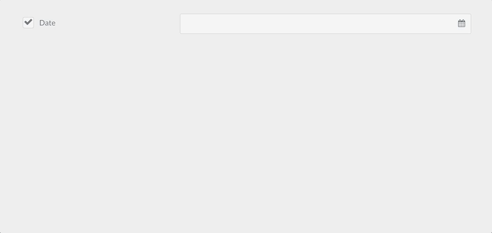

## Available Form Fields for Use in the Admin

Admin-side forms can be created with a variety of fields. This document provides a complete reference of the properties of each field, and provides usage examples.

In addition to the fields listed below, reserved for usage in the Admin, you can also use all the fields available in the frontend forms described in [the Frontend Forms Fields Reference](/forms/forms/fields-available).

### Special Form Fields Available Exclusively in the Admin

| Field                                             | Description                                                                                                                                                                                                 |
| :-----                                            | :-----                                                                                                                                                                                                      |
| **[Array](#the-array-field)**                     | used to create key-value arrays                                                                                                                                                                             |
| **[Colorpicker](#the-colorpicker-field)**                     | show a color picker                                                                                                                                                                             |
| **[Columns](#the-columns-column-fields)**         | used to break the form into multiple columns                                                                                                                                                                  |
| **[Column](#the-columns-column-fields)**          | used to show a single column (used with the `Columns` field)                                                                                                                                                |
| **[Dateformat](#the-dateformat-field)**           | a special select that renders the current date/time in the passed formats                                                                                                                                   |
| **[Datetime](#the-datetime-field)**               | a date and time selection field                                                                                                                                                                             |
| **[Editor](#the-editor-field)**                   | show a markdown editor                                                                                                                                                                                      |
| **[Fieldset](#the-fieldset-field)**               | group a set of fields inside a collapsible accordion                                                                                                                                                        |
| **[File](#the-file-field)**                       | in Admin, **File** is specialized to be used in plugin and theme configurations (blueprints). Handles uploading a file to a location and deleting it, and removing it from the theme / plugin configuration |
| **[Filepicker](#the-filepicker-field)**                       | **Filepicker** allows to choose files from a location in the web server filesystem. |
| **[Ignore](#the-ignore-field)**                   | used to remove unused fields when extending from another blueprint                                                                                                                                          |
| **[List](#the-list-field)**                       | used to create collections of fields                                                                                                                                                                        |
| **[PageMediaSelect](#the-pagemediaselect-field)** | shows a select with all the page media. Used in Pages blueprints to let the user choose a media file to be assigned to a field.                                                                             |
| **[Pages](#the-pages-field)**                     | shows a list of the site pages                                                                                                                                                                              |
| **[Section](#the-section-field)**                 | used to divide a setting page into sections; each section comes with a title                                                                                                                                |
| **[Selectize](#the-selectize-field)**             | a hybrid of a text box and a select box. Mostly useful for tagging and other element picking fields.                                                                                                        |
| **[Tabs](#the-tabs-tab-fields)**                  | divides the settings in a list of tabs                                                                                                                                                                      |
| **[Tab](#the-tabs-tab-fields)**                   | used by the `Tabs` field to render a tab                                                                                                                                                                    |
| **[Taxonomy](#the-taxonomy-field)**               | a special select preconfigured to select one or more taxonomies                                                                                                                                             |
| **[Toggle](#the-toggle-field)**                   | a on/off kind of input, with configurable labels                                                                                                                                                            |

### Common Fields Attributes

Every field accepts a list of attributes you can use. Each field could share these common attributes, but particular fields might ignore them. The best way to check which attributes are allowed on a field is to check the field description in this page, and see which attributes are mentioned.

This list provides a common ground so there's no need to repeat the description of a common field.

| Attribute           | Description                                                                                                                                                                                                    |
| :-----              | :-----                                                                                                                                                                                                         |
| `autocomplete`      | accepts `on` or `off`                                                                                                                                                                                          |
| `autofocus`         | if enabled, autofocus on that field                                                                                                                                                                            |
| `classes`           | accepts a string with one or more CSS classes to add                                                                                                                                                           |
| `default`           | sets the field default value                                                                                                                                                                                   |
| `disabled`          | sets the field disabled state                                                                                                                                                                                  |
| `help`              | Adds a tooltip to the field                                                                                                                                                                                    |
| `id`                | sets the field id as well as the `for` attribute on the label                                                                                                                                                  |
| `label`             | sets the field label                                                                                                                                                                                           |
| `name`              | sets the field name                                                                                                                                                                                            |
| `novalidate`        | sets the field novalidate state                                                                                                                                                                                |
| `placeholder`       | sets the field placeholder value                                                                                                                                                                               |
| `readonly`          | sets the field read-only state                                                                                                                                                                                  |
| `size`              | sets the field size, which in turn adds a class to its container. Valid values are `large`, `x-small`, `medium`, `long`, `small`. You can of course add more in the template you see, when used in the frontend |
| `style`             | sets the field style. If set to `vertical`, the field is able to appear full width. This is an easy way to clean up the form.                                                                                  |
| `title`             | sets the field title value                                                                                                                                                                                     |
| `toggleable`        | add a checkbox that will toggle the enabled/disabled attribute of the field                                                                                                                                    |
| `validate.required` | if set to a positive value, sets the field as required                                                                                                                                                        |
| `validate.pattern`  | sets a validation pattern                                                                                                                                                                                      |
| `validate.message`  | sets the message shown if the validation fails                                                                                                                                                                 |
| `validate.type`     | sets the field type used during validation                                                                                                                                                                     |

### Know more about fields

You can read how the fields are built from the source: [Fields added by the Form Plugin](https://github.com/getgrav/grav-plugin-form/tree/master/templates/forms) and [Fields only available in Admin](https://github.com/getgrav/grav-plugin-admin/tree/master/themes/grav/templates/forms).

### Validation

Most of the fields allow validation.

```
validate:
    required: true
```

will cause the field to be marked as required.

```
validate:
    message: 'Some message'
```

will show the defined message when the field is not correctly filled.

```
validate:
    pattern: 'Some pattern'
```

will validate the field value against the passed regex pattern. Examples: `pattern: "[1-9][0-9]*"`, `pattern: '[A-Za-z0-9-]+'`, `pattern: '[a-z0-9-]+'`, ` pattern: '^[a-z0-9_-]{3,16}$'`, `pattern: '(?=.*\d)(?=.*[a-z])(?=.*[A-Z]).{8,}'`

#### validate.type

`validate.type` indicates which type should it validate against.

Some examples:

An editor will result in a `textarea`:

```
content:
    type: editor
    validate:
      type: textarea
```

A selectize will be a `commalist`:

```
taxonomies:
    type: selectize
    size: large
    label: PLUGIN_ADMIN.TAXONOMY_TYPES
    classes: fancy
    help: PLUGIN_ADMIN.TAXONOMY_TYPES_HELP
    validate:
        type: commalist

filters.category:
  type: selectize
  label: Category filter
  help: Comma separated list of category names
  validate:
    type: commalist
```

Validate an email address:

```
author.email:
    type: text
    size: large
    label: PLUGIN_ADMIN.DEFAULT_EMAIL
    help: PLUGIN_ADMIN.DEFAULT_EMAIL_HELP
    validate:
        type: email
```

Make sure a value is a bool:

```
summary.enabled:
    type: toggle
    label: PLUGIN_ADMIN.ENABLED
    highlight: 1
    help: PLUGIN_ADMIN.ENABLED_HELP
    options:
        1: PLUGIN_ADMIN.YES
        0: PLUGIN_ADMIN.NO
    validate:
        type: bool
```

Make sure a value is an integer between 0 and 65536:

```
summary.size:
    type: text
    size: x-small
    label: PLUGIN_ADMIN.SUMMARY_SIZE
    help: PLUGIN_ADMIN.SUMMARY_SIZE_HELP
    validate:
        type: int
        min: 0
        max: 65536
```

Make sure a value is a number > 1:

```
pages.list.count:
    type: text
    size: x-small
    label: PLUGIN_ADMIN.DEFAULT_PAGE_COUNT
    help: PLUGIN_ADMIN.DEFAULT_PAGE_COUNT_HELP
    validate:
        type: number
        min: 1
```

Validate a taxonomy type as an array:

```
header.taxonomy:
  type: taxonomy
  label: PLUGIN_ADMIN.TAXONOMY
  multiple: true
  validate:
    type: array
```

Validate a text field as a slug:

```
folder:
  type: text
  label: PLUGIN_ADMIN.FOLDER_NAME
  validate:
    type: slug
```

---

### The Array Field


The `array` field type is used to create a simple list of key - values objects.

Example:

```yaml
metadata:
   type: array
   label: PLUGIN_ADMIN.METADATA
   help: PLUGIN_ADMIN.METADATA_HELP
   placeholder_key: PLUGIN_ADMIN.METADATA_KEY
   placeholder_value: PLUGIN_ADMIN.METADATA_VALUE
   required: true
```


| Attribute           | Description |
| :-----              | :-----      |
| `placeholder_key`   |             |
| `placeholder_value` |             |
| `value_only`        |             |

| Common Attributes Allowed                      |
| :-----                                         |
| [default](#common-fields-attributes)           |
| [help](#common-fields-attributes)              |
| [label](#common-fields-attributes)             |
| [name](#common-fields-attributes)              |
| [style](#common-fields-attributes)             |
| [toggleable](#common-fields-attributes)        |
| [validate.required](#common-fields-attributes) |
| [validate.type](#common-fields-attributes)     |

---

### The Colorpicker Field


The `colorpicker` field type is used to display a color picker field

Example:

```yaml
color:
   type: colorpicker
   label: Choose a color
```


| Common Attributes Allowed                      |
| :-----                                         |
| [autocomplete](#common-fields-attributes)     |
| [autofocus](#common-fields-attributes)                |
| [classes](#common-fields-attributes)                |
| [default](#common-fields-attributes)           |
| [disabled](#common-fields-attributes)                |
| [help](#common-fields-attributes)              |
| [id](#common-fields-attributes)                |
| [label](#common-fields-attributes)             |
| [name](#common-fields-attributes)              |
| [placeholder](#common-fields-attributes)                |
| [style](#common-fields-attributes)             |
| [title](#common-fields-attributes)        |
| [toggleable](#common-fields-attributes)        |
| [validate.message](#common-fields-attributes) |
| [validate.required](#common-fields-attributes) |
| [validate.type](#common-fields-attributes)     |

---

### The Columns / column Fields


The `columns` and `column` field types are used to divide the contained form fields in columns

Example:

```yaml
columns:
  type: columns
  fields:
    column1:
      type: column
      fields:

        # .... subfields

    column2:
      type: column
      fields:

        # .... other subfields


```


| Attribute | Description                    |
| :-----    | :-----                         |
| `fields`  | The columns / column subfields |

---

### The Dateformat Field


The `dateformat` field type is used to

Example:

```yaml
pages.dateformat.short:
    type: dateformat
    size: medium
    classes: fancy
    label: PLUGIN_ADMIN.SHORT_DATE_FORMAT
    help: PLUGIN_ADMIN.SHORT_DATE_FORMAT_HELP
    default: "jS M Y"
    options:
        "F jS \\a\\t g:ia": Date1
        "l jS \\of F g:i A": Date2
        "D, d M Y G:i:s": Date3
        "d-m-y G:i": Date4
        "jS M Y": Date5
```


| Attribute   | Description                                             |
| :-----      | :-----                                                  |
| `options`   | The field available key-value options                   |
| `multiple`  | boolean. If positive, the field accepts multiple values |
| `selectize` |                                                         |

| Common Attributes Allowed                      |
| :-----                                         |
| [autofocus](#common-fields-attributes)         |
| [classes](#common-fields-attributes)           |
| [default](#common-fields-attributes)           |
| [disabled](#common-fields-attributes)          |
| [help](#common-fields-attributes)              |
| [label](#common-fields-attributes)             |
| [name](#common-fields-attributes)              |
| [novalidate](#common-fields-attributes)        |
| [size](#common-fields-attributes)              |
| [style](#common-fields-attributes)             |
| [toggleable](#common-fields-attributes)        |
| [validate.required](#common-fields-attributes) |
| [validate.type](#common-fields-attributes)     |

---

### The Datetime Field



The `datetime` field type is used to store and present a date and time field.

Example:

```yaml
header.date:
  type: datetime
  label: PLUGIN_ADMIN.DATE
  toggleable: true
  help: PLUGIN_ADMIN.DATE_HELP
```


| Attribute      | Description           |
| :-----         | :-----                |
| `validate.min` | A minimum valid value |
| `validate.max` | A maximum valid value |

| Common Attributes Allowed                      |
| :-----                                         |
| [default](#common-fields-attributes)           |
| [help](#common-fields-attributes)              |
| [label](#common-fields-attributes)             |
| [name](#common-fields-attributes)              |
| [size](#common-fields-attributes)              |
| [style](#common-fields-attributes)             |
| [toggleable](#common-fields-attributes)        |
| [validate.required](#common-fields-attributes) |
| [validate.type](#common-fields-attributes)     |

---

### The Editor Field


The `editor` field type is used to present the Codemirror editor

Example:

```yaml
frontmatter:
  classes: frontmatter
  type: editor
  label: PLUGIN_ADMIN.FRONTMATTER
  autofocus: true
  codemirror:
    mode: 'yaml'
    indentUnit: 4
    autofocus: true
    indentWithTabs: false
    lineNumbers: true
    styleActiveLine: true
    gutters: ['CodeMirror-lint-markers']
    lint: true
```


| Attribute    | Description                                                                              |
| :-----       | :-----                                                                                   |
| `codemirror` | A set of values to be set on the [codemirror editor](https://codemirror.net/doc/manual.html#config). By default uses mode: gfm (github flavored markdown) |
| `resizer`    | If positive, enables the resizer. Otherwise the editor is fixed                          |

| Common Attributes Allowed                      |
| :-----                                         |
| [default](#common-fields-attributes)           |
| [help](#common-fields-attributes)              |
| [label](#common-fields-attributes)             |
| [name](#common-fields-attributes)              |
| [style](#common-fields-attributes)             |
| [validate.required](#common-fields-attributes) |
| [validate.type](#common-fields-attributes)     |
| [autofocus](#common-fields-attributes)         |
| [classes](#common-fields-attributes)           |
| [disabled](#common-fields-attributes)          |
| [id](#common-fields-attributes)                |
| [novalidate](#common-fields-attributes)        |
| [placeholder](#common-fields-attributes)       |
| [readonly](#common-fields-attributes)          |


---

### The Fieldset Field


The `fieldset` groups a set of fields inside a collapsible box.
                    

Example:

```yaml
header.fieldset:
  type: fieldset
  title: Your title
  help: Help text
  info: Info text
  text: Text inside fieldset and before other fields
  icon: comments
  collapsed: true     # Initial state of fieldset (see collapsible option)
  collapsible: true    # Whether one can expand the fieldset or not 
  fields:
    header.fieldset.an_example_text:
      type: text
      label: text
    header.fieldset.an_example_textarea:
      type: textarea
      label: textarea
```


| Attribute     | Description                                                                                                |
| :-----        | :-----                                                                                                     |
| `icon`        | An icon for the box                                                                                        |         
| `collapsed`   | If `true`, the list is opened collapsed. By default it's expanded                                          |
| `collapsible` | Whether one can expand the fieldset or not                                                                 |


| Common Attributes Allowed                      |
| :-----                                         |
| [disabled](#common-fields-attributes)          |
| [help](#common-fields-attributes)              |
| [label](#common-fields-attributes)             |
| [name](#common-fields-attributes)              |
| [size](#common-fields-attributes)              |
| [style](#common-fields-attributes)             |
| [toggleable](#common-fields-attributes)        |


---

### The File Field


The `file` field type can be used in pages, plugin and theme configurations (blueprints). Handles uploading a file to a location as well as removing it from the page headers or theme / plugin configuration.

! More details can be found in the dedicated [How To: Add a File Upload](../how-to-add-file-upload) section. Also note that displaying an image uploaded in a file field is not done the same way than with a filepicker field. More details about how to access images uploaded in a file field can be found on this [cookbook entry](https://learn.getgrav.org/cookbook/twig-recipes#displaying-an-image-uploaded-in-a-file-field).

Example:

```yaml
custom_logo_login_screen:
  type: file
  label: Custom Logo Login Screen
  destination: 'user/plugins/admin-pro/assets'
  accept:
    - image/*
```

```yaml
custom_file:
  type: file
  label: A Label
  destination: 'user/themes/my-theme/assets'
  multiple: true
  limit: 5
  filesize: 1
  accept:
    - image/*
```


| Attribute     | Description                                                                                                |
| :-----        | :-----                                                                                                     |
| `destination` | The folder where the files will be stored, relative to the Grav root. E.g. `user/plugins/my-plugin/assets` |
| `multiple`    | Whether or not to allow more than one file per field                                                          |
| `limit`       | When `multiple` is enabled, allows to constrain the amount of files permitted to be uploaded               |
| `filesize`    | The size in MB each file is allowed                                                                        |
| `accept`      | Add a list of accepted page mime types and extensions. E.g. `["image/*", '.mp3']`                          |

| Common Attributes Allowed                      |
| :-----                                         |
| [default](#common-fields-attributes)           |
| [disabled](#common-fields-attributes)          |
| [help](#common-fields-attributes)              |
| [label](#common-fields-attributes)             |
| [name](#common-fields-attributes)              |
| [size](#common-fields-attributes)              |
| [style](#common-fields-attributes)             |
| [toggleable](#common-fields-attributes)        |
| [validate.required](#common-fields-attributes) |
| [validate.type](#common-fields-attributes)     |

---

### The Filepicker Field


The `filepicker` field type can be used in pages, plugin and theme configurations (blueprints). Handles selecting a file from a location and saving it to the page headers or theme / plugin configuration.

Example:

```yaml
picked_image:
  type: filepicker
  folder: 'theme@:/images/pages'
  label: Select a file
  preview_images: true
  accept:
    - .png
    - .jpg
```

```yaml
header.a_file:
  type: filepicker
  folder: '@self'
  preview_images: true
  label: Select a file
```

| Attribute     | Description                                                                                                |
| :-----        | :-----                                                                                                     |
| `folder` | The folder where the files will be looked up, relative to the Grav root. Accepts any value in the [file field destination format](/forms/blueprints/how-to-add-file-upload#destination). |
| `accept` | A list of accepted file extensions                                                          |
| `preview_images` | If enabled, image files will have a little preview |

| Common Attributes Allowed                      |
| :-----                                         |
| [default](#common-fields-attributes)           |
| [disabled](#common-fields-attributes)          |
| [help](#common-fields-attributes)              |
| [label](#common-fields-attributes)             |
| [name](#common-fields-attributes)              |
| [size](#common-fields-attributes)              |
| [style](#common-fields-attributes)             |
| [toggleable](#common-fields-attributes)        |
| [validate.required](#common-fields-attributes) |

---

### The Honeypot Field

The `honeypot` field type creates a hidden field that, when filled out, will return with an error. This is a useful way to prevent bots from filling out and submitting a form.

Example:

```yaml
fields:
    - name: honeypot
      type: honeypot
```

This is a simple text field which does not appear on the front end. Bots, which detect fields in the code and fill them out automatically, will likely fill the field out. The error prevents that form from being properly submitted. The error comes back next to the form element, rather than on the top in a message block.

A honeypot field is a popular alternative to captcha fields.

---

### The Ignore Field

The `ignore` field type can be used to remove unused fields when extending from another blueprint

Example:

```yaml
header.process:
  type: ignore
content:
  type: ignore
```

---

### The List Field


The `list` field type is used to create collections of fields. The field accepts a `fields` attribute that will host subfields, and there will be an "Add item" button to allow the user to add more items to the collection.

Example:

```
header.buttons:
  name: buttons
  type: list
  style: vertical
  label: Buttons
  fields:
    .text:
      type: text
      label: Text
    .url:
      type: text
      label: URL
    .primary:
      type: toggle
      label: Primary
      highlight: 1
      default: 1
      options:
          1: 'Yes'
          0: 'No'
      validate:
          type: bool
```

This example will generate this Admin interface:


When saving the page, we'll see the following YAML added to the page frontmatter:

```
buttons:
    -
        text: 'Some text'
        url: 'http://getgrav.org'
        primary: false
    -
        text: 'Another text'
        url: 'https://another-url.com'
        primary: true
```

This will be used in the Theme Twig to output the list in some nice way.

Another example of this field definition is this list of Features, used by Antimatter's Features Modular child page. Every feature has an icon, a header and some text:

```yaml
header.features:
  name: features
  type: list
  label: Features

  fields:
    .icon:
      type: text
      label: Icon
    .header:
      type: text
      label: Header
    .text:
      type: text
      label: Text
```

Accessing and displaying the data of a `list` field is done with a simple twig for loop, like in the example below:

```

    {{ feature.icon }}
    {{ feature.header }}
    {{ feature.text }}

```


| Attribute   | Description                                              |
| :-----      | :-----                                                   |
| `fields`    | The subfields                                            |
| `collapsed` | If `true`, the list is opened collapsed. By default it's expanded |
| `style`     | Can be set to `vertical` to conserve horizontal space    |
| `btnLabel`  | The "add new item" label text                            |
| `sort`      | Boolean. If negative, disables the ability to sort items |
| `controls`  | Decides where the "Add Item" button will be placed. Can be set to `[top|bottom|both]` defaults to `bottom`.  |
| `min`       | Minimum number of items allowed in the list.             |
| `max`       | Maximum number of items allowed in the list. 'Add item' button won't function past this number |


| Common Attributes Allowed                      |
| :-----                                         |
| [default](#common-fields-attributes)           |
| [help](#common-fields-attributes)              |
| [label](#common-fields-attributes)             |
| [name](#common-fields-attributes)              |
| [validate.required](#common-fields-attributes) |
| [validate.type](#common-fields-attributes)     |
| [size](#common-fields-attributes)              |

---

### The PageMediaSelect Field

The `pagemediaselect` field type is used to allow the users to choose a media from one of the page media already uploaded through FTP or using the page media manager.

Example

```yaml
header.img_link:
  label: Choose media
  type: pagemediaselect
```

| Attribute  | Description           |
| :-----     | :-----                |
| `multiple` | Select multiple files |

| Common Attributes Allowed                      |
| :-----                                         |
| [default](#common-fields-attributes)           |
| [help](#common-fields-attributes)              |
| [label](#common-fields-attributes)             |
| [name](#common-fields-attributes)              |
| [style](#common-fields-attributes)             |
| [toggleable](#common-fields-attributes)        |
| [validate.required](#common-fields-attributes) |
| [validate.type](#common-fields-attributes)     |
| [autofocus](#common-fields-attributes)         |
| [classes](#common-fields-attributes)           |
| [disabled](#common-fields-attributes)          |
| [id](#common-fields-attributes)                |
| [novalidate](#common-fields-attributes)        |
| [size](#common-fields-attributes)              |


---

### The Pages Field


The `pages` field type shows a list of the site pages.

Example

```yaml
home.alias:
    type: pages
    size: medium
    classes: fancy
    label: PLUGIN_ADMIN.HOME_PAGE
    show_all: false
    show_modular: false
    show_root: false
    help: PLUGIN_ADMIN.HOME_PAGE_HELP

```

| Attribute      | Description                            |
| :-----         | :-----                                 |
| `show_all`     | Shows all pages                        |
| `show_modular` | Shows all pages                        |
| `show_root`    | Shows all pages                        |
| `options`      | An optional list of additional choices |
| `multiple`     | Select multiple pages                  |
| `selectize`    |                                        |

If you set `multiple` to true, you need to add `validate.type: array`. Otherwise the array of selected pages will not be saved correctly.

| Common Attributes Allowed                      |
| :-----                                         |
| [default](#common-fields-attributes)           |
| [help](#common-fields-attributes)              |
| [label](#common-fields-attributes)             |
| [name](#common-fields-attributes)              |
| [style](#common-fields-attributes)             |
| [toggleable](#common-fields-attributes)        |
| [validate.required](#common-fields-attributes) |
| [validate.type](#common-fields-attributes)     |
| [autofocus](#common-fields-attributes)         |
| [classes](#common-fields-attributes)           |
| [disabled](#common-fields-attributes)          |
| [novalidate](#common-fields-attributes)        |
| [size](#common-fields-attributes)              |

---

### The Section Field

The `Section` field type is used to divide a setting page into sections.

Example:

```yaml
content:
    type: section
    title: PLUGIN_ADMIN.DEFAULTS
    underline: true

    fields:

        #..... subfields
```


| Attribute   | Description                                                    |
| :-----      | :-----                                                         |
| `title`     | A heading title                                                |
| `underline` | Add an underline after the title                               |
| `text`      | A text to show beneath                                         |
| `security`  | An array of credentials a user needs to visualize this section |

---

### The Selectize Field


The `selectize` field type is used to show a hybrid of a text box and a select box. Mostly useful for tagging and other element picking fields.

Example:

```yaml
taxonomies:
    type: selectize
    size: large
    label: PLUGIN_ADMIN.TAXONOMY_TYPES
    classes: fancy
    help: PLUGIN_ADMIN.TAXONOMY_TYPES_HELP
    validate:
        type: commalist
```

| Common Attributes Allowed                      |
| :-----                                         |
| [default](#common-fields-attributes)           |
| [help](#common-fields-attributes)              |
| [label](#common-fields-attributes)             |
| [name](#common-fields-attributes)              |
| [style](#common-fields-attributes)             |
| [toggleable](#common-fields-attributes)        |
| [validate.required](#common-fields-attributes) |
| [validate.type](#common-fields-attributes)     |


| Common Attributes IN INPUT BLOCK              |
| :-----                                        |
| [autocomplete](#common-fields-attributes)     |
| [autofocus](#common-fields-attributes)        |
| [classes](#common-fields-attributes)          |
| [disabled](#common-fields-attributes)         |
| [id](#common-fields-attributes)               |
| [novalidate](#common-fields-attributes)       |
| [placeholder](#common-fields-attributes)      |
| [readonly](#common-fields-attributes)         |
| [size](#common-fields-attributes)             |
| [title](#common-fields-attributes)            |
| [validate.pattern](#common-fields-attributes) |
| [validate.message](#common-fields-attributes) |

---

### The Tabs / Tab Fields


The `tabs` and `tab` field types are used to divide the contained form fields in tabs.

Example:

```yaml
tabs:
  type: tabs
  active: 1

  fields:
    content:
      type: tab
      title: PLUGIN_ADMIN.CONTENT

      fields:

        # .... other subfields

    options:
      type: tab
      title: PLUGIN_ADMIN.OPTIONS

      fields:

        # .... other subfields
```


| Attribute | Description           |
| :-----    | :-----                |
| `active`  | The active tab number |

---

### The Taxonomy Field


The `taxonomy` field type is a special select preconfigured to select one or more taxonomy values.

Example:

```yaml
header.taxonomy:
  type: taxonomy
  label: PLUGIN_ADMIN.TAXONOMY
  multiple: true
  validate:
    type: array
```

| Attribute  | Description                                             |
| :-----     | :-----                                                  |
| `multiple` | boolean. If positive, the field accepts multiple values |

| Common Attributes Allowed                 |
| :----- |
| [autofocus](#common-fields-attributes)           |
| [classes](#common-fields-attributes)             |
| [default](#common-fields-attributes)             |
| [disabled](#common-fields-attributes)            |
| [help](#common-fields-attributes)                |
| [id](#common-fields-attributes)                  |
| [label](#common-fields-attributes)               |
| [name](#common-fields-attributes)                |
| [novalidate](#common-fields-attributes)          |
| [outerclasses](#common-fields-attributes)        |
| [size](#common-fields-attributes)                |
| [style](#common-fields-attributes)               |
| [validate.required](#common-fields-attributes)   |
| [validate.pattern](#common-fields-attributes)    |
| [validate.message](#common-fields-attributes)    |

---

### The Toggle Field


The `toggle` field type is an on/off kind of input, with configurable labels.

Example:

```yaml
summary.enabled:
    type: toggle
    label: PLUGIN_ADMIN.ENABLED
    highlight: 1
    help: PLUGIN_ADMIN.ENABLED_HELP
    options:
        1: PLUGIN_ADMIN.YES
        0: PLUGIN_ADMIN.NO
    validate:
        type: bool
```


| Attribute   | Description                                                  |
| :-----      | :-----                                                       |
| `highlight` | The key of the option to highlight (set green when selected) |
| `options`   | The list of key-value options                              |

| Common Attributes Allowed                      |
| :-----                                         |
| [default](#common-fields-attributes)           |
| [help](#common-fields-attributes)              |
| [label](#common-fields-attributes)             |
| [name](#common-fields-attributes)              |
| [style](#common-fields-attributes)             |
| [toggleable](#common-fields-attributes)        |
| [validate.required](#common-fields-attributes) |
| [validate.type](#common-fields-attributes)     |
| [disabled](#common-fields-attributes)          |
