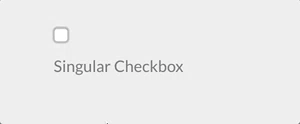

## Common Field Attributes

Every field accepts a list of attributes you can use. Each field could share these common attributes, but particular fields might ignore them. The best way to check which attributes are allowed on a field is to check the field description in this page and see which attributes are mentioned.

This list provides a common ground so there's no need to repeat the description of a common field.

[div class="table table-keycol"]
| Attribute           | Description                                                                                                                                                                                                    |
| :-----              | :-----                                                                                                                                                                                                         |
| `autocomplete`      | Accepts `on` or `off`                                                                                                                                                                                          |
| `autofocus`         | if enabled, autofocus on that field                                                                                                                                                                            |
| `classes`           | accepts a string with one or more CSS classes to add                                                                                                                                                           |
| `default`           | sets the field default value                                                                                                                                                                                   |
| `disabled`          | sets the field disabled state                                                                                                                                                                                  |
| `help`              | Adds a tooltip to the field                                                                                                                                                                                    |
| `id`                | sets the field id. Also sets the `for` attribute on the label                                                                                                                                                  |
| `label`             | sets the field label                                                                                                                                                                                           |
| `display_label`     | Accepts `true` or `false`                                                                                                                                                                                           |
| `labelclasses`      | accepts a string with one or more CSS classes to add                                                                                                                                                            |
| `name`              | sets the field name                                                                                                                                                                                            |
| `novalidate`        | sets the field novalidate state                                                                                                                                                                                |
| `outerclasses`      | Classes added to the div that includes the label and the field                                                                                                                                                 |
| `placeholder`       | sets the field placeholder value                                                                                                                                                                               |
| `readonly`          | sets the field readonly state                                                                                                                                                                                  |
| `size`              | sets the field size, which in turn adds a class to its container. Valid values are `large`, `x-small`, `medium`, `long`, `small`. You can of course add more in the template you see, when used in the frontend |
| `style`             | sets the field style                                                                                                                                                                                           |
| `title`             | sets the field title value                                                                                                                                                                                     |
| `type`              | sets the field type                                                                                                                                                                                            |
| `validate.required` | if set to a positive value, sets the field as required.                                                                                                                                                        |
| `validate.pattern`  | sets a validation pattern                                                                                                                                                                                      |
| `validate.message`  | sets the message shown if the validation fails                                                                                                                                                                 |
[/div]

To add custom attributes, you can use:
```
attributes:
  key: value
```

To add custom data-* values, you can use:
```
datasets:
  key: value
```

The above shown `attributes` and `datasets` definitions lead to the following field definition:
```
<input name="data[name]" value="" type="text" class="form-input " key="value" data-key="value">
```

!!! NOTE: You can set positive values in multiple ways: `'on'`, `true`, `1`. Other values are interpreted as negative.

---

## Available Fields

### Basic-Captcha Field

Added in Forms `7.0.0` as an local alternative to the Google ReCaptcha field.  This field is particularly handy when dealing with SPAM in contact forms when you don't want to deal with the hassle or perhaps GDPR restrictions that come with Google's offering. It uses **OCR-resistant** fonts to deter attacks, and can be configured with codes to be copied, or simple math questions.


the `basic-captcha` field type is fully configurable via the `forms` configuration but comes with sensible defaults. The overall configuration of Basic-Captcha is configured in your global form configuration file (typically `user/config/plugins/form.yaml`).  The default options are:

[prism classes="language-yaml line-numbers"]
basic_captcha:
  type: characters            # options: [characters | math]
  chars:
    length: 6                 # number of chars to output
    font: zxx-noise.ttf       # options: [zxx-noise.ttf | zxx-camo.ttf | zxx-xed.ttf | zxx-sans.ttf]
    bg: '#cccccc'             # 6-char hex color
    text: '#333333'           # 6-char hex color
    size: 24                  # font size in px
    start_x: 5                # start position in x direction in px
    start_y: 30               # start position in y direction in px
    box_width: 135            # box width in px
    box_height: 40            # box height in px
  math:
    min: 1                    # smallest digit
    max: 12                   # largest digit
    operators: ['+','-','*']  # operators that can be used in math
[/prism]

Example:

[prism classes="language-yaml line-numbers"]
basic-captcha:
    type: basic-captcha
    placeholder: copy the 6 characters
    label: Are you human?
[/prism]

This also requires a matching `process:` element to ensure the form is validated properly.

! This must be the first entry in the `process:` section of the form to ensure the form is not processed if captcha validation fails.

Example:

[prism classes="language-yaml line-numbers"]
process:
    basic-captcha:
        message: Humanity verification failed, please try again...
[/prism]

### Turnstile Captcha Field (Cloudflare)

As of Form `v7.1.0`, Grav adds support for the new Cloudflare Turnstile field.  This field is a new way to prevent SPAM in forms, and is a great alternative to the Google ReCaptcha field and **GPDR** restrictions that come with Google's offering. This field is particularly handy when dealing with SPAM in contact forms.  [Learn more about Turnstile](https://blog.cloudflare.com/turnstile-private-captcha-alternative/?target=_blank).

##### Advantages over Google ReCaptcha

1. GDPR compliant and user-privacy focused
2. Extremely fast challenge verification
3. Very simple to implement both in Cloudflare and Grav, no complex UIs or parameters to configure
4. No fancy workarounds for asynchronous form submissions (ajax), it just works!
4. Exceptional user experience compared to ReCaptcha, no more counting cars, traffic lights, or other nonsense
5. Built on top of machine learning, it will get better over-time and adapt to new attack vectors
6. Exhaustive analytics on the effectiveness of the challenge, [see screenshot](https://blog.cloudflare.com/content/images/2022/09/image1-64.png?target=_blank)


##### Integration
Before integrating Grav Forms with Turnstile, you must first [create a new Turnstile site](https://dash.cloudflare.com/?to=/:account/turnstile?target=_blank), you can also follow the [official "get started" tutorial](https://developers.cloudflare.com/turnstile/get-started/?target=_blank).
Here you can also choose the type of widget you want to use, it can be either `managed`, `non-interactive` or `invisible`. It is important to note that you can only change the type of widget from Cloudflare, you won't be able to configure this via Grav. However, if not happy with one choice, you will be able to change it later if you need to. [Learn more about the different widget types](https://developers.cloudflare.com/turnstile/reference/widget-types/?target=_blank).

! Make sure you add any Domain you might need to use the Turnstile field on, this might include your local environment.

Once you have created a site, you will be given a `site_key` and `site_secret` that you will need to configure in your form configuration file (typically `user/config/plugins/form.yaml`). You can ignore the script tag suggested, as Grav takes care of it for you.

The default options are:

[prism classes="language-yaml line-numbers"]
turnstile:
  theme: light
  site_key: <Your Turnstile Site Key>
  secret_key: <Your Turnstile Secret Key>
[/prism]

Finally, you will also requires a matching `process:` element to ensure the form is validated properly.

! This must be the first entry in the `process:` section of the form to ensure the form is not processed if captcha validation fails.

##### Example
A typical example for a contact form would look like the following.

[prism classes="language-yaml line-numbers" highlight="19-21,27"]
form:
  name: contact
  fields:
    name:
      label: Name
      type: text
      validate:
        required: true
    email:
      label: Email
      type: email
      validate:
        required: true
    message:
      label: Message
      type: textarea
      validate:
        required: true
    captcha:
        type: turnstile
        theme: light
  buttons:
    submit:
      type: submit
      value: Submit
  process:
    turnstile: true
    email:
      subject: "[Acme] {{ form.value.name|e }}"
      reply_to: "{{ form.value.name|e }} <{{ form.value.email }}>"
    message: Thanks for contacting us!
    reset: true
    display: '/'
[/prism]


### Google Captcha Field (ReCaptcha)

The `captcha` field type is used to add a Google reCAPTCHA element to your form. Unlike other elements, it can only be used once in a form.

! You should configure your Google reCAPTCHA configurations in the [reCAPTCHA Admin Console](https://www.google.com/recaptcha/admin?target=_blank)

As of version `3.0`, the field supports 3 variations of reCAPTCHA.  The overall configuration of reCAPTCHA is best set in your global form configuration file (typically `user/config/plugins/form.yaml`).  The default options are:

[prism classes="language-yaml line-numbers"]
recaptcha:
  version: 2-checkbox
  theme: light
  site_key:
  secret_key:
[/prism]

These options should be set based on the following:

[div class="table table-keycol"]
| Key | Values |
|-----|--------|
| version | Defaults to `2-checkbox`, but can also be `2-invisible` or `3` |
| theme | Defaults to `light`, but can also be `dark` (currently only works for version `2-x` versions) |
| site_key | Your Google Site Key  |
| secret_key | Your Google Secret Key |
[/div]

!! Please ensure the domain of the site is listed in Google's reCAPTCHA configuration

In the form definition, the `name` attribute of the captcha field must be `g-recaptcha-response`. The reason is that Google reCAPTCHA stores the Captcha confirmation code in a field named `g-recaptcha-response`.

Example:

[prism classes="language-yaml line-numbers"]
g-recaptcha-response:
  type: captcha
  label: Captcha

[/prism]

You can also provide a custom failure `recaptcha_not_validated` message, but if you don't the default one is provided by the Form plugin.  If you want to set a form-specific `recaptcha_site_key` rather than setting it globally in the form configuration, you can set that also.

[prism classes="language-yaml line-numbers"]
g-recaptcha-response:
  type: captcha
  label: Captcha
  recaptcha_site_key: ENTER_YOUR_CAPTCHA_PUBLIC_KEY
  recaptcha_not_validated: 'Captcha not valid!'
[/prism]

[div class="table table-keycol"]
| Attribute                 | Description                                     |
| :-----                    | :-----                                          |
| `recaptcha_site_key`      | The Google reCAPTCHA Site Key (optional)                   |
| `recaptcha_not_validated` | The message to show if the captcha is not valid |
[/div]

[div class="table"]
| Common Attributes Allowed                      |
| :-----                                         |
| [help](#common-fields-attributes)              |
| [label](#common-fields-attributes)             |
| [name](#common-fields-attributes)              |
| [outerclasses](#common-fields-attributes)      |
| [validate.required](#common-fields-attributes) |
[/div]

This also requires a matching `process:` element to ensure the form is validated properly.

! This must be the first entry in the `process:` section of the form to ensure the form is not processed if ReCaptcha validation fails.

Example:

[prism classes="language-yaml line-numbers"]
process:
    captcha: true
[/prism]

##### Server-side Captcha validation

The above code will validate the Captcha in the frontend and prevent form submission if not correct. To also validate the captcha server-side, add the captcha process action to your forms:

[prism classes="language-yaml line-numbers"]
  process:
    captcha: true
[/prism]

You can also provide an optional success `message`, but if you don't, no specific message will be displayed on success.  If you want to set a form-specific `recaptcha_secret` rather than setting it globally in the form configuration, you can set that also.

[prism classes="language-yaml line-numbers"]
  process:
    captcha:
      recaptcha_secret: ENTER_YOUR_CAPTCHA_SECRET_KEY
      message: 'Successfully passed reCAPTCHA!'
[/prism]

[See the Contact Form example](/forms/forms/example-form) to see it in action.

---

### Checkbox Field



The `checkbox` field type is used to add a single checkbox to your form.

Example:

[prism classes="language-yaml line-numbers"]
agree_to_terms:
  type: checkbox
  label: "Agree to the terms and conditions"
  validate:
      required: true
[/prism]

[div class="table"]
| Common Attributes Allowed                      |
| :-----                                         |
| [autofocus](#common-fields-attributes)         |
| [classes](#common-fields-attributes)           |
| [default](#common-fields-attributes)           |
| [disabled](#common-fields-attributes)          |
| [id](#common-fields-attributes)                |
| [label](#common-fields-attributes)             |
| [name](#common-fields-attributes)              |
| [novalidate](#common-fields-attributes)        |
| [outerclasses](#common-fields-attributes)      |
| [size](#common-fields-attributes)              |
| [style](#common-fields-attributes)             |
| [validate.required](#common-fields-attributes) |
| [validate.pattern](#common-fields-attributes)  |
| [validate.message](#common-fields-attributes)  |
[/div]

---

### Checkboxes Field


The `checkboxes` field type is used to add a group of checkboxes to your form.

Examples:

[prism classes="language-yaml line-numbers"]
pages.process:
    type: checkboxes
    label: PLUGIN_ADMIN.PROCESS
    help: PLUGIN_ADMIN.PROCESS_HELP
    default:
        markdown: true
        twig: true
    options:
        markdown: Markdown
        twig: Twig
    use: keys
[/prism]

[prism classes="language-yaml line-numbers"]
my_field:
    type: checkboxes
    label: A couple of checkboxes
    default:
        - option1
        - option2
    options:
        option1: Option 1
        option2: Option 2
[/prism]


[div class="table table-keycol"]
| Attribute | Description                                                                                                                                    |
| :-----    | :-----                                                                                                                                         |
| `use`     | When set to `keys`, the checkbox will store the value of the element key when the form is submitted. Otherwise, it will use the element value. |
| `options` | An array of key-value options that will be allowed.                                                                                            |
[/div]

[div class="table"]
| Common Attributes Allowed                      |
| :-----                                         |
| [autofocus](#common-fields-attributes)         |
| [classes](#common-fields-attributes)           |
| [default](#common-fields-attributes)           |
| [disabled](#common-fields-attributes)          |
| [help](#common-fields-attributes)              |
| [id](#common-fields-attributes)                |
| [label](#common-fields-attributes)             |
| [name](#common-fields-attributes)              |
| [outerclasses](#common-fields-attributes)      |
| [size](#common-fields-attributes)              |
| [style](#common-fields-attributes)             |
| [validate.required](#common-fields-attributes) |
| [validate.pattern](#common-fields-attributes)  |
| [validate.message](#common-fields-attributes)  |
[/div]

!! NOTE: The checkboxes field does not support the `remember` process action.

---
### Conditional Field


The `conditional` field type is used to conditionally display some other fields base on a condition.

Examples:

If your conditional already returns a `true` or `false` then you can simply use this simplified format:

[prism classes="language-yaml line-numbers"]
my_conditional:
  type: conditional
  condition: config.plugins.yourplugin.enabled
  fields: # The field(s) below will be displayed only if the plugin named yourplugin is enabled
    header.mytextfield:
      type: text
      label: A text field
[/prism]

However, if you require more complex conditions, you can perform some logic that returns `'true'` or `'false'` as strings, and the field will understand that too.

[prism classes="language-yaml line-numbers"]
my_conditional:
  type: conditional
  condition: "config.site.something == 'custom'"
  fields: # The field(s) below will be displayed only if the `site` configuration option `something` equals `custom`
    header.mytextfield:
        type: text
        label: A text field
[/prism]

[div class="table table-keycol"]
| Attribute   | Description                                                                       |
| :-----      | :-----                                                                            |
| `condition` | The condition evaluated by twig. Any variable accessible by twig can be evaluated |
[/div]

[div class="table"]
| Common Attributes Allowed             |
| :-----                                |
| [disabled](#common-fields-attributes) |
| [id](#common-fields-attributes)       |
| [label](#common-fields-attributes)    |
| [name](#common-fields-attributes)     |
[/div]

---

### Date Field


The `date` field type is used to add an HTML5 `date` input field.

Example:

[prism classes="language-yaml line-numbers"]
-
  type: date
  label: Enter a date
  validate.min: "2014-01-01"
  validate.max: "2018-12-31"
[/prism]

[div class="table table-keycol"]
| Attribute      | Description                                                                                                                                                                                        |
| :-----         | :-----                                                                                                                                                                                             |
| `validate.min` | Sets the `min` attribute of the field (see [http://html5doctor.com/the-woes-of-date-input/#feature-min-max-attributes](http://html5doctor.com/the-woes-of-date-input/#feature-min-max-attributes)) |
| `validate.max` | Sets the `max` attribute of the field (see [http://html5doctor.com/the-woes-of-date-input/#feature-min-max-attributes](http://html5doctor.com/the-woes-of-date-input/#feature-min-max-attributes)) |
[/div]

[div class="table"]
| Common Attributes Allowed                      |
| :-----                                         |
| [autofocus](#common-fields-attributes)         |
| [classes](#common-fields-attributes)           |
| [default](#common-fields-attributes)           |
| [disabled](#common-fields-attributes)          |
| [help](#common-fields-attributes)              |
| [id](#common-fields-attributes)                |
| [label](#common-fields-attributes)             |
| [name](#common-fields-attributes)              |
| [novalidate](#common-fields-attributes)        |
| [outerclasses](#common-fields-attributes)      |
| [readonly](#common-fields-attributes)          |
| [size](#common-fields-attributes)              |
| [style](#common-fields-attributes)             |
| [title](#common-fields-attributes)             |
| [validate.required](#common-fields-attributes) |
| [validate.pattern](#common-fields-attributes)  |
| [validate.message](#common-fields-attributes)  |
[/div]

---

### Display Field


The `display` field type is used to show some text or instructions inside the form. Can accept markdown content

Example:


[prism classes="language-yaml line-numbers"]
test:
    type: display
    size: large
    label: Instructions
    markdown: true
    content: "This is a test of **bold** and _italic_ in a text/display field\n\nanother paragraph...."
[/prism]

[div class="table table-keycol"]
| Attribute  | Description                                                         |
| :-----     | :-----                                                              |
| `markdown` | boolean value that enables markdown processing on the content field |
| `content`  | the textual content to show                                         |
[/div]

[div class="table"]
| Common Attributes Allowed                 |
| :-----                                    |
| [help](#common-fields-attributes)         |
| [id](#common-fields-attributes)        |
| [label](#common-fields-attributes)        |
| [name](#common-fields-attributes)         |
| [id](#common-fields-attributes)           |
| [outerclasses](#common-fields-attributes) |
| [size](#common-fields-attributes)         |
| [style](#common-fields-attributes)        |
[/div]

---

### Email Field


The `email` field type is used to present a text input field that accepts an email, using the [email HTML5 input](http://html5doctor.com/html5-forms-input-types/#input-email).

!! Emails are case-insensitive by design. Ensure that your application logic handles upper-, lower- or mixed case emails properly.

Example:
[prism classes="language-yaml line-numbers"]
header.email:
  type: email
  autofocus: true
  label: Email
[/prism]

[div class="table table-keycol"]
| Attribute | Description                                       |
| :-----    | :-----                                            |
| `minlength` | minimum text length |
| `maxlength`  | maximum text length  |
| `validate.min` | same as minlength |
| `validate.max`  | same as maxlength  |
[/div]

[div class="table"]
| Common Attributes Allowed                      |
| :-----                                         |
| [autofocus](#common-fields-attributes)         |
| [classes](#common-fields-attributes)           |
| [default](#common-fields-attributes)           |
| [disabled](#common-fields-attributes)          |
| [help](#common-fields-attributes)              |
| [id](#common-fields-attributes)                |
| [label](#common-fields-attributes)             |
| [name](#common-fields-attributes)              |
| [novalidate](#common-fields-attributes)        |
| [outerclasses](#common-fields-attributes)      |
| [readonly](#common-fields-attributes)          |
| [size](#common-fields-attributes)              |
| [style](#common-fields-attributes)             |
| [title](#common-fields-attributes)             |
| [validate.required](#common-fields-attributes) |
| [validate.pattern](#common-fields-attributes)  |
| [validate.message](#common-fields-attributes)  |
[/div]

---

### File Field

With the `file` field type, you can let users upload files through the form. The field by default allows **one file** only, of type **image** and will get uploaded to the **current** page where the form has been declared.

[prism classes="language-yaml line-numbers"]
# Default settings
my_files:
  type: file
  multiple: false
  destination: 'self@'
  accept:
    - image/*
[/prism]

[div class="table table-keycol"]
| Attribute     | Description                                                                                                                                                                                                                                                                                                                                                                                                                                                                              |
| :-----        | :-----                                                                                                                                                                                                                                                                                                                                                                                                                                                                                   |
| `multiple`    | Can be `true` or `false`, when set to **true**, multiple files can be selected at the same time                                                                                                                                                                                                                                                                                                                                                                                          |
| `destination` | Can be either **@self**, **@page:/route**, **local/rel/path/**, or a PHP stream.<br> Set to **@self**, the files will be uploaded where the form has been declared (current .md). <br>Using **@page:/route** will upload to the specified route of a page, if exists (e.g., **@page:/blog/a-blog-post**).<br> Set to **'local/rel/path'**: Can be any path relative to the Grav instance. For instance, `user/images/uploads`. If the path doesn't exist, it will get created, so make sure it is writable.<br> You can also set the value to any valid PHP stream recognized by Grav like `user-data://my-form` or `theme://media/uploads`. |
| `accept`      | Takes an array of MIME types that are allowed. For instance to allow only gifs and mp4 files: `accept: ['image/gif', 'video/mp4']`                                                                                                                                                                                                                                                                                                                                                       |
[/div]

!!! The File field in the admin is a bit different, allowing also to delete a file uploaded to a form, because the use-case in admin is to upload and then associate a file to a field.

[div class="table"]
| Common Attributes Allowed                      |
| :-----                                         |
| [help](#common-fields-attributes)              |
| [label](#common-fields-attributes)             |
| [name](#common-fields-attributes)              |
| [outerclasses](#common-fields-attributes)      |
[/div]

By default, in Admin the `file` field will overwrite an uploaded file that has the same name of a newer one, contained in the same folder you want to upload it, unless you set `avoid_overwriting` to `true` in the field definition.

---

### Hidden Field

The `hidden` field type is used to add a hidden element to a form.

Example:
[prism classes="language-yaml line-numbers"]
header.some_field:
  type: hidden
  default: my-value
[/prism]

[div class="table table-keycol"]
| Attribute | Description                                                                                                                     |
| :-----    | :-----                                                                                                                          |
| `name`    | The field name. If missing, the field name is got from the field definition element (in the example above: `header.some_field`) |
[/div]

[div class="table"]
| Common Attributes Allowed            |
| :-----                               |
| [default](#common-fields-attributes) |
[/div]

---

### Honeypot Field

The `honeypot` field type creates a hidden field that, when filled out, will return with an error. This is a useful way to prevent bots from filling out and submitting a form.

Example:

[prism classes="language-yaml line-numbers"]
fields:
    honeypot:
      type: honeypot
[/prism]

This is a simple text field which does not appear on the front end. Bots, which detect fields in the code and fill them out automatically, will likely fill the field out. The error prevents that form from being properly submitted. The error comes back next to the form element, rather than on the top in a message block.

A honeypot field is a popular alternative to captcha fields.

---

### Ignore Field

The `ignore` field type can be used to remove unused fields when extending from another blueprint

Example:

[prism classes="language-yaml line-numbers"]
header.process:
  type: ignore
content:
  type: ignore
[/prism]

---

### Number Field

The `number` field type is used to present a text input field that accepts numbers only, using the [number HTML5 input](http://html5doctor.com/html5-forms-input-types/#input-number).

Example:
[prism classes="language-yaml line-numbers"]
header.count:
  type: number
  label: 'How Much?'
  validate:
    min: 10
    max: 360
    step: 10
[/prism]

[div class="table table-keycol"]
| Attribute | Description                                       |
| :-----    | :-----                                            |
| `validate.min` | minimum value |
| `validate.max`  | maximum value  |
| `validate.step`  | which increments to step up  |
[/div]

[div class="table"]
| Common Attributes Allowed                      |
| :-----                                         |
| [autofocus](#common-fields-attributes)         |
| [classes](#common-fields-attributes)           |
| [default](#common-fields-attributes)           |
| [disabled](#common-fields-attributes)          |
| [help](#common-fields-attributes)              |
| [id](#common-fields-attributes)                |
| [label](#common-fields-attributes)             |
| [name](#common-fields-attributes)              |
| [novalidate](#common-fields-attributes)        |
| [outerclasses](#common-fields-attributes)      |
| [readonly](#common-fields-attributes)          |
| [size](#common-fields-attributes)              |
| [style](#common-fields-attributes)             |
| [title](#common-fields-attributes)             |
| [validate.required](#common-fields-attributes) |
| [validate.pattern](#common-fields-attributes)  |
| [validate.message](#common-fields-attributes)  |
[/div]

---

### Password Field

The `password` field type is used to present a password text input field.

Example:
[prism classes="language-yaml line-numbers"]
password:
  type: password
  label: Password
[/prism]

[div class="table"]
| Common Attributes Allowed                      |
| :-----                                         |
| [autofocus](#common-fields-attributes)         |
| [classes](#common-fields-attributes)           |
| [default](#common-fields-attributes)           |
| [disabled](#common-fields-attributes)          |
| [help](#common-fields-attributes)              |
| [id](#common-fields-attributes)                |
| [label](#common-fields-attributes)             |
| [name](#common-fields-attributes)              |
| [novalidate](#common-fields-attributes)        |
| [outerclasses](#common-fields-attributes)      |
| [readonly](#common-fields-attributes)          |
| [size](#common-fields-attributes)              |
| [style](#common-fields-attributes)             |
| [title](#common-fields-attributes)             |
| [validate.required](#common-fields-attributes) |
| [validate.pattern](#common-fields-attributes)  |
| [validate.message](#common-fields-attributes)  |
[/div]

---

### Radio Field


The `radio` field type is used to present a set of radio fields

Example:
[prism classes="language-yaml line-numbers"]
my_choice:
  type: radio
  label: Choice
  default: markdown
  options:
      markdown: Markdown
      twig: Twig
[/prism]

[div class="table table-keycol"]
| Attribute | Description                                         |
| :-----    | :-----                                              |
| `options` | An array of key-value options that will be allowed. |
[/div]

[div class="table"]
| Common Attributes Allowed                      |
| :-----                                         |
| [default](#common-fields-attributes)           |
| [disabled](#common-fields-attributes)          |
| [help](#common-fields-attributes)              |
| [id](#common-fields-attributes)                |
| [label](#common-fields-attributes)             |
| [name](#common-fields-attributes)              |
| [outerclasses](#common-fields-attributes)      |
| [validate.required](#common-fields-attributes) |
| [validate.pattern](#common-fields-attributes)  |
| [validate.message](#common-fields-attributes)  |
[/div]

---

### Range Field


The `range` field is used to present a [range input field](http://html5doctor.com/html5-forms-input-types/#input-range).

Example:
[prism classes="language-yaml line-numbers"]
header.choose_a_number_in_range:
  type: range
  label: Choose a number
  validate:
    min: 1
    max: 10
[/prism]

[div class="table"]
| Common Attributes Allowed                      |
| :-----                                         |
| [autofocus](#common-fields-attributes)         |
| [classes](#common-fields-attributes)           |
| [default](#common-fields-attributes)           |
| [disabled](#common-fields-attributes)          |
| [help](#common-fields-attributes)              |
| [id](#common-fields-attributes)                |
| [label](#common-fields-attributes)             |
| [name](#common-fields-attributes)              |
| [novalidate](#common-fields-attributes)        |
| [outerclasses](#common-fields-attributes)      |
| [readonly](#common-fields-attributes)          |
| [size](#common-fields-attributes)              |
| [style](#common-fields-attributes)             |
| [title](#common-fields-attributes)             |
| [validate.required](#common-fields-attributes) |
| [validate.pattern](#common-fields-attributes)  |
| [validate.message](#common-fields-attributes)  |
[/div]

---

### Section Field

The `Section` field type is used to divide a setting page into sections.

Example:

[prism classes="language-yaml line-numbers"]
content:
    type: section
    title: PLUGIN_ADMIN.DEFAULTS
    underline: true

    fields:

        #..... subfields
[/prism]

[div class="table table-keycol"]
| Attribute     | Description                                                    |
| :-----        | :-----                                                         |
| `title`       | A heading title                                                |
| `text`        | A text to show beneath                                         |
| `security`    | An array of credentials a user needs to visualize this section |
| `title_level` | Set a custom headline tag. Default: `h3`                       |
[/div]

---

### Select Field


The `select` field type is used to present a select field.

Example 1:
[prism classes="language-yaml line-numbers"]
pages.order.by:
    type: select
    size: long
    classes: fancy
    label: 'Default Ordering'
    help: 'Pages in a list will render using this order unless it is overridden'
    options:
        default: 'Default - based on folder name'
        folder: 'Folder - based on prefix-less folder name'
        title: 'Title - based on title field in header'
        date: 'Date - based on date field in header'
[/prism]

Example 2 - Disabling Individual Options:
[prism classes="language-yaml line-numbers"]
my_element:
    type: select
    size: long
    classes: fancy
    label: 'My Select Element'
    help: 'Use the disabled key:value to display but disable a particular option'
    options:
        option1:
          value: 'Option 1'
        option2:
          value: 'Option 2'
        option3:
          disabled: true
          value: 'Option 3'
[/prism]

[div class="table table-keycol"]
| Attribute  | Description                                         |
| :-----     | :-----                                              |
| `options`  | An array of key-value options that will be allowed. The key will be submitted by the form. |
| `multiple` | Allow the form to accept multiple values.           |
[/div]

If you set `multiple` to true, you need to add
```
pages.order.by:
  validate:
    type: array
```
Otherwise the array of selected values will not be saved correctly.

[div class="table"]
| Common Attributes Allowed                      |
| :-----                                         |
| [autofocus](#common-fields-attributes)         |
| [classes](#common-fields-attributes)           |
| [default](#common-fields-attributes)           |
| [disabled](#common-fields-attributes)          |
| [help](#common-fields-attributes)              |
| [id](#common-fields-attributes)                |
| [label](#common-fields-attributes)             |
| [name](#common-fields-attributes)              |
| [novalidate](#common-fields-attributes)        |
| [outerclasses](#common-fields-attributes)      |
| [size](#common-fields-attributes)              |
| [style](#common-fields-attributes)             |
| [validate.required](#common-fields-attributes) |
| [validate.pattern](#common-fields-attributes)  |
| [validate.message](#common-fields-attributes)  |
[/div]

---

### Select Optgroup Field


The `select_optgroup` field type is used to present a select field with groupings.

Example:
[prism classes="language-yaml line-numbers"]
header.newField:
    type: select_optgroup
    label: Test Optgroup Select Field
    options:
      - OptGroup1:
        - Option1
        - Option2
      - OptGroup2:
        - Option3
        - Option4
[/prism]

[div class="table table-keycol"]
| Attribute  | Description                                         |
| :-----     | :-----                                              |
| `options`  | An array of key-value options that will be allowed. |
| `multiple` | Allow the form to accept multiple values.           |
[/div]

[div class="table"]
| Common Attributes Allowed                      |
| :-----                                         |
| [autofocus](#common-fields-attributes)         |
| [classes](#common-fields-attributes)           |
| [default](#common-fields-attributes)           |
| [disabled](#common-fields-attributes)          |
| [help](#common-fields-attributes)              |
| [id](#common-fields-attributes)                |
| [label](#common-fields-attributes)             |
| [name](#common-fields-attributes)              |
| [novalidate](#common-fields-attributes)        |
| [outerclasses](#common-fields-attributes)      |
| [size](#common-fields-attributes)              |
| [style](#common-fields-attributes)             |
| [validate.required](#common-fields-attributes) |
| [validate.pattern](#common-fields-attributes)  |
| [validate.message](#common-fields-attributes)  |
[/div]

---

### Spacer Field

The `spacer` field type is used to add some text, a headline or a hr tag

Example:


[prism classes="language-yaml line-numbers"]
test:
    type: spacer
    title: A title
    text: Some text
    underline: true
[/prism]

[div class="table table-keycol"]
| Attribute   | Description                                            |
| :-----      | :-----                                                 |
| `title`     | add a h3 title to the form                             |
| `text`      | Add some text. If title is set, add it after the title |
| `underline` | boolean, add a `<hr>` tag if positive                  |
[/div]

---

### Tabs / Tab Fields


The `tabs` and `tab` field types are used to divide the contained form fields in tabs.

Example:

[prism classes="language-yaml line-numbers"]
tabs:
  type: tabs
  active: 1

  fields:
    content:
      type: tab
      title: PLUGIN_ADMIN.CONTENT

      fields:

        # .... other subfields

    options:
      type: tab
      title: PLUGIN_ADMIN.OPTIONS

      fields:

        # .... other subfields
[/prism]


[div class="table table-keycol"]
| Attribute | Description           |
| :-----    | :-----                |
| `active`  | The active tab number |
[/div]

---

### Tel Field

The `tel` field type is used to present a text input field that accepts a phone number, using the [tel HTML5 input](http://html5doctor.com/html5-forms-input-types/#input-tel).

Example:
[prism classes="language-yaml line-numbers"]
header.phone:
  type: tel
  label: 'Your Phone Number'
[/prism]

[div class="table table-keycol"]
| Attribute | Description                                       |
| :-----    | :-----                                            |
| `minlength` | minimum text length |
| `maxlength`  | maximum text length  |
| `validate.min` | same as minlength |
| `validate.max`  | same as maxlength  |
[/div]

[div class="table"]
| Common Attributes Allowed                      |
| :-----                                         |
| [autofocus](#common-fields-attributes)         |
| [classes](#common-fields-attributes)           |
| [default](#common-fields-attributes)           |
| [disabled](#common-fields-attributes)          |
| [help](#common-fields-attributes)              |
| [id](#common-fields-attributes)                |
| [label](#common-fields-attributes)             |
| [name](#common-fields-attributes)              |
| [novalidate](#common-fields-attributes)        |
| [outerclasses](#common-fields-attributes)      |
| [readonly](#common-fields-attributes)          |
| [size](#common-fields-attributes)              |
| [style](#common-fields-attributes)             |
| [title](#common-fields-attributes)             |
| [validate.required](#common-fields-attributes) |
| [validate.pattern](#common-fields-attributes)  |
| [validate.message](#common-fields-attributes)  |
[/div]

---

### Text Field


The `text` field is used to present a text input field.

Example:

[prism classes="language-yaml line-numbers"]
header.title:
  type: text
  autofocus: true
  label: PLUGIN_ADMIN.TITLE
  minlength: 10
  maxlength: 255
[/prism]

[div class="table table-keycol"]
| Attribute | Description                                       |
| :-----    | :-----                                            |
| `prepend` | prepend some text or HTML to the front of a field |
| `append`  | append some text or HTML to the end of a field  |
| `minlength` | minimum text length |
| `maxlength`  | maximum text length  |
| `validate.min` | same as minlength |
| `validate.max`  | same as maxlength  |
[/div]

[div class="table"]
| Common Attributes Allowed                      |
| :-----                                         |
| [autofocus](#common-fields-attributes)         |
| [classes](#common-fields-attributes)           |
| [default](#common-fields-attributes)           |
| [disabled](#common-fields-attributes)          |
| [help](#common-fields-attributes)              |
| [id](#common-fields-attributes)                |
| [label](#common-fields-attributes)             |
| [name](#common-fields-attributes)              |
| [novalidate](#common-fields-attributes)        |
| [outerclasses](#common-fields-attributes)      |
| [readonly](#common-fields-attributes)          |
| [size](#common-fields-attributes)              |
| [style](#common-fields-attributes)             |
| [title](#common-fields-attributes)             |
| [validate.required](#common-fields-attributes) |
| [validate.pattern](#common-fields-attributes)  |
| [validate.message](#common-fields-attributes)  |
[/div]

---

### Textarea Field


The `textarea` field is used to present a textarea input field.

Example:
[prism classes="language-yaml line-numbers"]
header.content:
  type: textarea
  autofocus: true
  label: PLUGIN_ADMIN.CONTENT
  minlength: 10
  maxlength: 255
[/prism]

[div class="table table-keycol"]
| Attribute | Description                                                     |
| :-----    | :-----                                                          |
| `rows`    | Add a rows attribute with the value associated with this property |
| `cols`    | Add a cols attribute with the value associated with this property |
| `minlength` | minimum text length |
| `maxlength`  | maximum text length  |
| `validate.min` | same as minlength |
| `validate.max`  | same as maxlength  |
[/div]

[div class="table"]
| Common Attributes Allowed                      |
| :-----                                         |
| [autofocus](#common-fields-attributes)         |
| [classes](#common-fields-attributes)           |
| [default](#common-fields-attributes)           |
| [disabled](#common-fields-attributes)          |
| [help](#common-fields-attributes)              |
| [id](#common-fields-attributes)                |
| [label](#common-fields-attributes)             |
| [name](#common-fields-attributes)              |
| [novalidate](#common-fields-attributes)        |
| [outerclasses](#common-fields-attributes)      |
| [readonly](#common-fields-attributes)          |
| [size](#common-fields-attributes)              |
| [style](#common-fields-attributes)             |
| [title](#common-fields-attributes)             |
| [validate.required](#common-fields-attributes) |
| [validate.pattern](#common-fields-attributes)  |
| [validate.message](#common-fields-attributes)  |
[/div]

---

### Toggle Field


The `toggle` field type is an on/off kind of input, with configurable labels.

Example:

[prism classes="language-yaml line-numbers"]
summary.enabled:
    type: toggle
    label: PLUGIN_ADMIN.ENABLED
    highlight: 1
    help: PLUGIN_ADMIN.ENABLED_HELP
    options:
        1: PLUGIN_ADMIN.YES
        0: PLUGIN_ADMIN.NO
    validate:
        type: bool
[/prism]


[div class="table table-keycol"]
| Attribute   | Description                                                  |
| :-----      | :-----                                                       |
| `highlight` | The key of the option to highlight (set green when selected) |
| `options`   | The list of key-value options                              |
[/div]

[div class="table"]
| Common Attributes Allowed                      |
| :-----                                         |
| [default](#common-fields-attributes)           |
| [help](#common-fields-attributes)              |
| [label](#common-fields-attributes)             |
| [name](#common-fields-attributes)              |
| [style](#common-fields-attributes)             |
| [toggleable](#common-fields-attributes)        |
| [validate.required](#common-fields-attributes) |
| [validate.type](#common-fields-attributes)     |
| [disabled](#common-fields-attributes)          |
[/div]

---

### Url Field

The `url` field type is used to present a text input field that accepts a URL, using the [url HTML5 input](http://html5doctor.com/html5-forms-input-types/#input-url).

Example:
[prism classes="language-yaml line-numbers"]
header.phone:
  type: url
  label: 'Your Phone Number'
[/prism]

[div class="table table-keycol"]
| Attribute | Description                                       |
| :-----    | :-----                                            |
| `minlength` | minimum text length |
| `maxlength`  | maximum text length  |
| `validate.min` | same as minlength |
| `validate.max`  | same as maxlength  |
[/div]

[div class="table"]
| Common Attributes Allowed                      |
| :-----                                         |
| [autofocus](#common-fields-attributes)         |
| [classes](#common-fields-attributes)           |
| [default](#common-fields-attributes)           |
| [disabled](#common-fields-attributes)          |
| [help](#common-fields-attributes)              |
| [id](#common-fields-attributes)                |
| [label](#common-fields-attributes)             |
| [name](#common-fields-attributes)              |
| [novalidate](#common-fields-attributes)        |
| [outerclasses](#common-fields-attributes)      |
| [readonly](#common-fields-attributes)          |
| [size](#common-fields-attributes)              |
| [style](#common-fields-attributes)             |
| [title](#common-fields-attributes)             |
| [validate.required](#common-fields-attributes) |
| [validate.pattern](#common-fields-attributes)  |
| [validate.message](#common-fields-attributes)  |
[/div]


## Currently Undocumented Fields


[div class="table table-keycol"]
| Field                                             | Description                                                               |
| :-----                                            | :-----                                                                    |
| **Array**                                         |                                                                           |
| **Avatar**                                        |                                                                           |
| **Color**                                         |                                                                           |
| **Columns**                                       |                                                                           |
| **Column**                                        |                                                                           |
| **Datetime**                                      |                                                                           |
| **Fieldset**                                      |                                                                           |
| **Formname**                                      |                                                                           |
| **Key**                                           |                                                                           |
| **Month**                                         |                                                                           |
| **Signature**                                     |                                                                           |
| **Switch**                                        |                                                                           |
| **Time**                                          |                                                                           |
| **Unique Id**                                     |                                                                           |
| **Value**                                         |                                                                           |
| **Week**                                          |                                                                           |
[/div]
