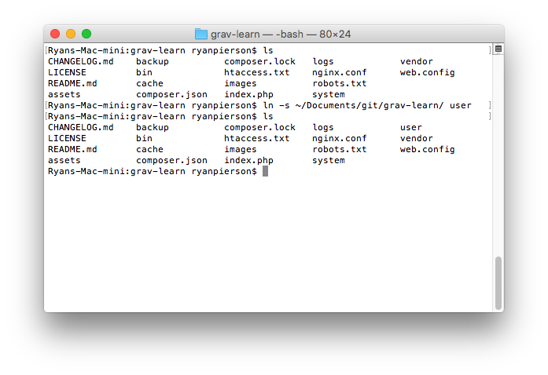

It's no secret that Grav was built with the command line in mind. While the Admin plugin is certainly making it easier to get more done without opening a Terminal (MacOS and Linux) or Command Prompt (Windows), there's a lot to be said about the speed and level of control that comes with working from the command line.

This is especially true for folks that are running their own development servers, or a remote server with which they have the ability to access the command line. The amount of tools at your disposal from the command line are incredible. You can control virtually all aspects of your site's hosting, Grav, and its plugins and themes with a handful of keystrokes.

In the end, it all comes down to personal preference. On this page, we will list some great resources out there to help you become familiar with the command line.

!! Not all operating systems are compatible with one another when it comes to commands. There are minor differences between MacOS and many Linux distros, with Windows' Command Prompt having a very different set of commands from the other two.

## MacOS

MacOS is based on Unix and is POSIX standards compliant. This means that most of the commands you may be familiar with on other Unix or Linux-based operating systems will work exactly as expected in MacOS. There are some exceptions to the rule, and it's for that reason that we recommend researching Terminal commands for the specific operating system you're working with.

Here are some great resources to help you become accustomed to using the Terminal in MacOS:

* [Michael Hogg's MacOS Terminal Commands Guide](http://michael-hogg.co.uk/os_x_terminal.php) - A practical resource for MacOS-friendly Terminal commands, what they do, and how to use them.
* [MacRumors Guide to Terminal](http://guides.macrumors.com/Terminal) - A useful resource for navigating and using the Terminal, including tips for using it with the GUI.
* [Envato Tuts+ Terminal Tips and Tricks](http://computers.tutsplus.com/tutorials/40-terminal-tips-and-tricks-you-never-thought-you-needed--mac-51192) - 40 clever tips and tricks for mastering the Terminal. Includes commands you won't find in many basic introductions.
* [Envato Tuts+ Taming the Terminal](http://computers.tutsplus.com/articles/new-mactuts-session-taming-the-terminal--mac-45471) - A multi-part, detailed course in using the Terminal. Includes videos, screenshots, and more.

## Linux

The vast majority of Linux (and Unix) distros out there have one big thing in common: the Bash command line interface (Terminal). Whether you are running a GUI such as Gnome, Unity, or KDE or not, there is a good chance that if you're running a Linux distro on your desktop or laptop you have visited the command line.

After all, it's powerful. You can do pretty much anything you could with the GUI directly into the command line, often with more control over how the commands are carried out. Here are some excellent resources to help you get familiar with the Terminal in Linux:

* [TechSpot's Beginner's Guide to the Linux Command Line](http://www.techspot.com/guides/835-linux-command-line-basics/) - An excellent beginner's guide to the command line.
* [MakeUseOf's Quick Guide to Getting Started with the Linux Command Line](http://www.makeuseof.com/tag/a-quick-guide-to-get-started-with-the-linux-command-line/) - Another great resource for learning about the Terminal.
* [O'Reilly Linux DevCenter Directory of Linux Commands](http://www.linuxdevcenter.com/cmd/) - An index of commands available in the Terminal.
* [Ryan's Tutorials Linux Tutorial](http://ryanstutorials.net/linuxtutorial/) - An excellent all-in-one guide to Linux and the Bash command line interface (Terminal).

## Windows

Windows sits apart from the pack for a number of reasons. Many of the commands in the command line for Windows are reminiscent of its DOS roots. Common commands such as `ls` for a directory listing doesn't work here. Instead, you would type `dir`. Here are a handful of resources to help you get the hang of the Windows Command Prompt:

* [MakeUseOf's Beginner's Guide to the Windows Command Line](http://www.makeuseof.com/tag/a-beginners-guide-to-the-windows-command-line/) - A well-written introduction to the command line for Windows.
* [DOSPrompt.info](http://dosprompt.info/) - An entire site devoted to familiarizing users with the Command Prompt.

!! All of Grav's CLI commands rely on PHP, but this is not immediately available in Windows. You can find out whether it is installed by opening a console and typing `php -v` to check. If `'php' is not recognized as an internal or external command ...` returns, it is not.

If you want to add PHP to your Windows system, you need to find your "Environment Variables", either by searching for it in the Start-Menu or going to Control Panel -> Advanced System Settings -> Click the "Environment Variables"-button.

Under "System Variables", find "Path" and click edit. Copy the "variable value" into notepad, and add a semicolon at the end - to separate variables. Then find the path to your installation of PHP ([from scratch](http://windows.php.net/) or using a current installation that came with your development environment), and add it to the end of this long list of variables. You want the folder-path, not including `php.exe`.

When that is done, open a new console (or restart your current one) so the new path is applied. Then try `php -v` again, you should get an output like: `PHP 7.0.7 (cli) ...`. When you run Grav's commands, you will need to prepend `php` to them, for instance `php grav/gpm index`.

## Grav-specific Commands

One of the coolest things about Grav is that you have a host of powerful commands at your disposal to do everything from installing additional plugins and themes to adding users to the Admin. In this section, we will list many of the most commonly used commands.

All of the commands listed below are compatible with <strong>any operating system.</strong>

[version=15]
[div class="table table-keycol"]
| Command                           | Description                                                                                                                        |
| :----------------                 | :--------------------------------------                                                                                            |
| `bin/grav list`                   | Lists all commands available in Grav (excluding the GPM).                                                                          |
| `bin/grav help <command>`         | Gives you help on a specific command.                                                                                              |
| `bin/grav new-project <location>` | Used to create a new, clean Grav instance in a different folder. Can be run from an existing Grav install.                         |
| `bin/grav install`                | This command installs any dependencies needed to run your current Grav install.                                                    |
| `bin/grav clear-cache`            | This command clears the cache of your Grav install. Options include: `--all`, `--assets-only`, `--images-only`, and `--cache-only` |
| `bin/grav backup`                 | Creates a zip backup of your current Grav site.                                                                                    |
| `bin/grav composer`               | Updates manually-installed composer-based vendor packages.                                                                         |
| `bin/gpm list`                    | Lists all commands available via Grav's GPM (Grav Package Manager)                                                                 |
| `bin/gpm help <command>`          | Gives you help on a specific command.                                                                                              |
| `bin/gpm index`                   | Shows a list of all the available resources in the Grav repository, organized by themes and plugins.                               |
| `bin/gpm info`                    | Displays the details of the desired package, such as description, author, homepage, etc.                                           |
| `bin/gpm install`                 | Installs a resource from the repository to your current Grav instance with a simple command.                                       |
| `bin/gpm update`                  | Checks installed plugins and themes for available updates and lists them.                                                          |
| `bin/gpm uninstall`               | Removes an installed theme or plugin and clears the cache.                                                                         |
| `bin/gpm self-upgrade`            | Enables you to update Grav to the latest version.                                                                                  |
| `bin/gpm security`                | Runs through the configured XSS security checks on all Grav pages                                                                  |
[/div]
[/version]

[version=16]
[div class="table table-keycol"]
| Command                           | Description                                                                                                                        |
| :----------------                 | :--------------------------------------                                                                                            |
| `bin/grav list`                   | Lists all commands available in Grav (excluding the GPM).                                                                          |
| `bin/grav help <command>`         | Gives you help on a specific command.                                                                                              |
| `bin/grav new-project <location>` | Used to create a new, clean Grav instance in a different folder. Can be run from an existing Grav install.                         |
| `bin/grav install`                | This command installs any dependencies needed to run your current Grav install.                                                    |
| `bin/grav cache`                  | This command clears the cache of your Grav install. Options include: `--all`, `--assets-only`, `--images-only`, and `--cache-only` |
| `bin/grav backup`                 | Creates a zip backup of your current Grav site.                                                                                    |
| `bin/grav composer`               | Updates manually-installed composer-based vendor packages.                                                                         |
| `bin/gpm list`                    | Lists all commands available via Grav's GPM (Grav Package Manager)                                                                 |
| `bin/gpm help <command>`          | Gives you help on a specific command.                                                                                              |
| `bin/gpm index`                   | Shows a list of all the available resources in the Grav repository, organized by themes and plugins.                               |
| `bin/gpm info`                    | Displays the details of the desired package, such as description, author, homepage, etc.                                           |
| `bin/gpm install`                 | Installs a resource from the repository to your current Grav instance with a simple command.                                       |
| `bin/gpm update`                  | Checks installed plugins and themes for available updates and lists them.                                                          |
| `bin/gpm uninstall`               | Removes an installed theme or plugin and clears the cache.                                                                         |
| `bin/gpm self-upgrade`            | Enables you to update Grav to the latest version.                                                                                  |
| `bin/gpm security`                | Runs through the configured XSS security checks on all Grav pages                                                                  |
| `bin/gpm logviewer`               | Easily view Grav logs with configuration options to pick log file, number of lines, and verbosity                                  |
| `bin/gpm scheduler`               | Manage the scheduled jobs and manually run the scheduler process if required                                                       |
[/div]
[/version]

!! These commands are explained in greater detail within the [Grav CLI](../grav-cli) and [Grav GPM](../grav-cli-gpm) documentation.

The commands listed below, are compatible with <strong>mac or unix systems.</strong>

[div class="table table-keycol"]
| Command                                  | Description                                                                                                               |
| :----------------                        | :--------------------------------------                                                                                   |
|  `bin/gpm index \| grep '\| installed'`  | Lists all plugins and themes you currently have installed. |
[/div]

## Symbolic Links

Symbolic Links (also known as symlinks) are incredibly useful and easy to perform within the command line. What it does it create a virtual copy (clone) of a given folder or its contents and puts it wherever you'd like it to go. Unlike a true copy, it is simply a tunnel to the original so everything you see and change is reflected in multiple places at once.

Another great benefit of doing this is that it takes up virtually zero additional disk space since you don't have multiple copies of the same files.

Where Grav is concerned, symlinks are a great way to add plugins, themes, and content to multiple instances and doing so in a way that makes it infinitely easier to update and modify. You make a change once, and it appears everywhere the file(s) are symlinked.

The process for performing a symlink is pretty straightforward, with minor differences between operating systems.

### Symbolic Links in MacOS and Linux

The command follows a common pattern of `ln -s <original file, directory, or its contents> <put virtual copies here>`.

The commands that initiate a symlink differ between operating systems. For MacOS and the majority of Unix and Linux distros, `ln -s` is the command. The `ln` part tells the system you want to create a link. The `-s` switch sets the link as symbolic.

### Symbolic Links in Windows

The basic structure of the command in Windows is `mklink <type> <put virtual copies here> <original file, directory, or its contents>`. Unlike MacOS or Linux, you will need to set the argument for the type of file you're symbolically linking. The source and destination are also flipped in this case, where the new symbolic link comes before the file you're linking to. There are three arguments you can use here:

* `/j` - This is the most commonly used argument. It creates a symlink of a directory.
* `/h` - This creates a symbolic link for a specific file.
* `/d` - This creates a soft link, or a shortcut. It's not likely to be used for the purposes outlined here.

### Example Commands

Basically, you state the command that initiates the symlink, what you're symbolically linking, and where you're putting the virtual copies. Below, we've detailed examples of these commands:

##### Link Contents of One Folder to Another

[div class="table"]
| MacOS and Linux             | Windows                           |
| :-----                      | :-----                            |
| `ln -s ~/folder1 ~/folder2` | `mklink /J C:\folder2 C:\folder1` |
[/div]

This command creates a symlink that takes contents originally placed in **folder1** and puts a symbolically linked copy of them in **folder2**. If **folder2** does not already exist, it is created with this command.

##### Link Entire Folders from One Place to Another

[div class="table"]
| MacOS and Linux              | Windows                            |
| :-----                       | :-----                             |
| `ln -s ~/folder1 ~/folder2/` | `mklink /J C:\folder2\ C:\folder1` |
[/div]

This command copies the entire **folder1** directory and places it in the target location (in this case **folder2**). In this case, **folder2** would need to already exist as it will not be created with this command.

##### Link Individual File(s) from One Place to Another

[div class="table"]
| MacOS and Linux                      | Windows                                     |
| :-----                               | :-----                                      |
| `ln -s ~/folder1/file.jpg ~/folder2` | `mklink /H C:\folder2\ C:\folder1\file.jpg` |
[/div]

This is a useful command for symbolically linking individual files. This is especially useful if you have files that are shared between multiple directories and you want to have them update everywhere at the same time. Keep in mind that the original file is the only actual copy, so it must remain where it is for all of the symbolic links to work.
