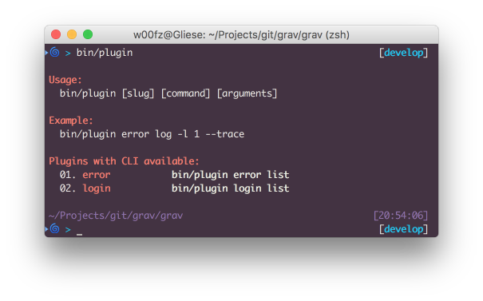
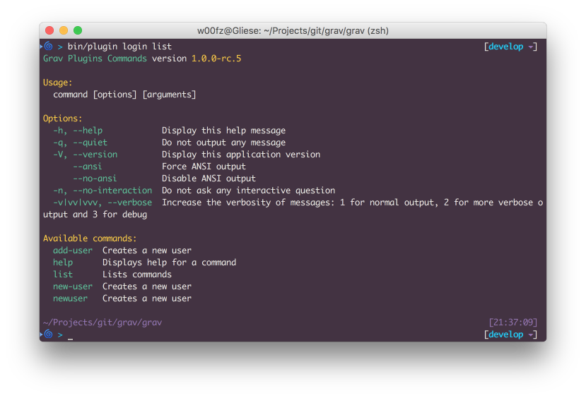

Plugins can integrate to Grav's CLI `bin/plugin` and enhance the plugin functionalities via Terminal by executing specific tasks.

As explained in the [Grav CLI](../grav-cli) section, you need to use a **terminal** in order to be able to execute commands.

When running the command `bin/plugin`, all the plugins who provide CLI integration will be listed.

The first option passed in to `bin/plugin` is always the plugin slug (ie, _error_, _login_, etc). The second option is the actual _command_ that the plugin provides.

Based on the plugin implementation there could be other following options and you can learn more about each of them by running the `bin/plugin [slug] list` command.

## Reserved Commands and Options

There are some reserved _commands_ and _options_ that are always available from any plugin. These are also particularly important to keep in mind if you are a developer and want to implement your own tasks, because you won't be able to use any of the reserved commands and options.

[div class="table table-keycol"]
| **Commands** |                             |
|--------------|-----------------------------|
| `help`       | Displays help for a command |
| `list`       | Lists commands              |
[/div]

[div class="table table-keycol"]
| **Options**                |                                                                                                    |
|----------------------------|----------------------------------------------------------------------------------------------------|
| `-h`, `--help`             | Display help message                                                                               |
| `-q`, `--quiet`            | Do not output any message                                                                          |
| `-v`, `--version`          | Display application version                                                                        |
| `--ansi`                   | Force ANSI output                                                                                  |
| `--no-ansi`                | Disable ANSI output                                                                                |
| `-n`, `--no-interaction`   | Do not ask any interactive question                                                                |
| `-v|vv|vvv`, `--verbose`   | Increase the verbosity of messages: 1 for normal output, 2 for more verbose output and 3 for debug |
[/div]

## How to Use the CLI for Plugins

The **list** and **help** commands are very useful when you don't know yet how to use a certain plugin CLI.

With **list** you can access all the available commands and view a quick description of what each of them do.

Here is an example with the **login** plugin when we run the command `bin/plugin login list`.

! Not specifying any command after the plugin slug defaults automatically to `list`. This means that both `bin/plugin [slug] list` and `bin/plugin [slug]` are equivalents.

As you can see, most of the options and commands correspond to the [reserved list](#reserved-commands-and-options). The actual commands offered by the login plugin are `add-user`, `new-user` and `newuser`.

As you can notice the help description of all 3 commands is identical. This is because, by choice, the 3 commands are exactly the same. **add-user** and **newuser** are in fact aliases for **new-user**, which allows to easily guess the command without knowing or remembering it.

Now that we know the login plugin comes with a `new-user` command, we only need to learn how to use it. This is where the reserved **help** command comes in place. Let's run `bin/plugin login help new-user`.

Now we have a complete understanding of the `new-user` command and we know how to use it.
Let's try creating a new user. Because all the options are optional by definition, we will omit the password on purpose (we will be asked about it in a prompt later).

[prism classes="language-bash command-line" cl-output="2-7"]
bin/plugin login newuser -u joeuser -e joeuser@grav.org -P b -N "Joe User" -t "Site Administrator"
Creating new user

Enter a password: *********
Repeat the password: *********

Success! User joeuser created.
[/prism]

## Developers: Integrate the CLI in Plugin

As a Developer, you might want to create CLI commands for admins or users to run. It is extremely easy to add such functionality in a Plugin.

The first thing you want to do is to create a subfolder `cli/` at the root of your plugin. This folder will be processed by `bin/plugin` and scanned for commands classes.

Grav's CLI is based on the great [Symfony Console Component](http://symfony.com/doc/current/components/console/introduction.html) and you can pretty much follow their documentation for a complete reference, there are just a few important things you should consider.

1. The name of the class file is standard. It should start with a capital letter and end with **Command.php**.
    * `Hello.php`: WRONG
    * `helloworldCommand.php`: WRONG
    * `HelloworldCommand.php`: CORRECT
    * `HelloWorldCommand.php`: CORRECT
2. You should always extend `ConsoleCommand`, this will offer you some Grav extras such as formatted colors, direct access to the Grav instance and other utilities ([more details](https://github.com/getgrav/grav/blob/develop/system/src/Grav/Console/ConsoleTrait.php)).
3. Symfony Console requires an `execute` method. When extending **ConsoleCommand** this becomes `serve`.

Below is a simple example to get you started. You can test it, as is, by saving it as `HelloCommand.php` and by placing it under your plugin's root `cli/` folder (**user/plugins/my_plugin/cli/HelloCommand.php**).

[prism classes="language-php line-numbers"]
<?php
namespace Grav\Plugin\Console;

use Grav\Console\ConsoleCommand;
use Symfony\Component\Console\Input\InputArgument;
use Symfony\Component\Console\Input\InputOption;

/**
 * Class HelloCommand
 *
 * @package Grav\Plugin\Console
 */
class HelloCommand extends ConsoleCommand
{
    /**
     * @var array
     */
    protected $options = [];

    /**
     * Greets a person with or without yelling
     */
    protected function configure()
    {
        $this
            ->setName("hello")
            ->setDescription("Greets a person.")
            ->addArgument(
                'name',
                InputArgument::REQUIRED,
                'The name of the person that should be greeted'
            )
            ->addOption(
                'yell',
                'y',
                InputOption::VALUE_NONE,
                'Wheter the greetings should be yelled or quieter'
            )
            ->setHelp('The <info>hello</info> greets someone.')
        ;
    }

    /**
     * @return int|null|void
     */
    protected function serve()
    {
        // Collects the arguments and options as defined
        $this->options = [
            'name' => $this->input->getArgument('name'),
            'yell' => $this->input->getOption('yell')
        ];

        // Prepare the strings we want to output and wraps the name into a cyan color
        // More colors available at:
        // https://github.com/getgrav/grav/blob/develop/system/src/Grav/Console/ConsoleTrait.php
        $greetings = 'Greetings, dear <cyan>' . $this->options['name'] . '</cyan>!';

        // If the optional `--yell` or `-y` parameter are passed in, let's convert everything to uppercase
        if ($this->options['yell']) {
            $greetings = strtoupper($greetings);
        }

        // finally we write to the output the greetings
        $this->output->writeln($greetings);
    }
}
[/prism]

! Another good simple example can be found in the [Error Plugin (LogCommand.php)](https://github.com/getgrav/grav-plugin-error/blob/develop/cli/LogCommand.php), If you are looking for a more complex example, you should have a look at the [Login Plugin (NewUserCommand.php)](https://github.com/getgrav/grav-plugin-login/blob/develop/cli/NewUserCommand.php)
