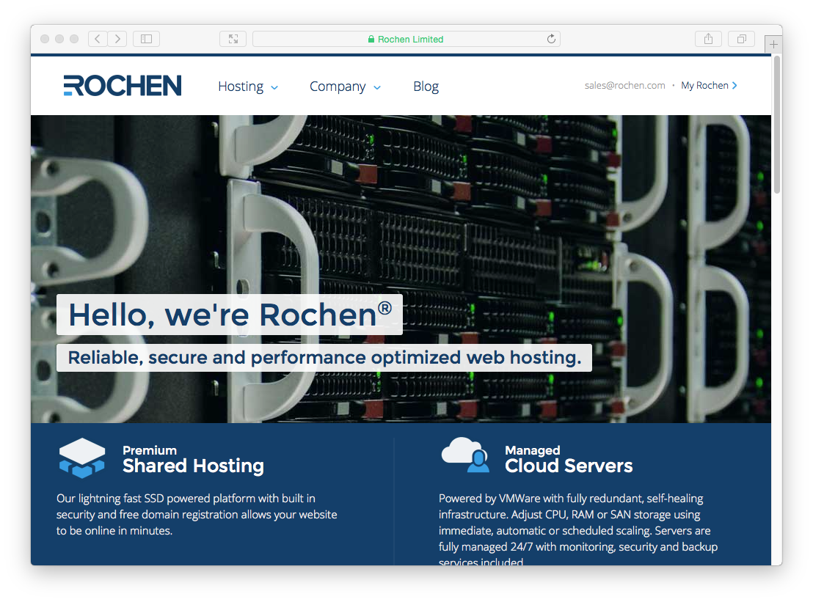
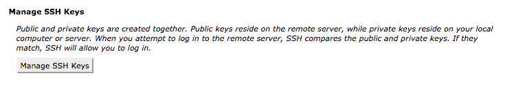
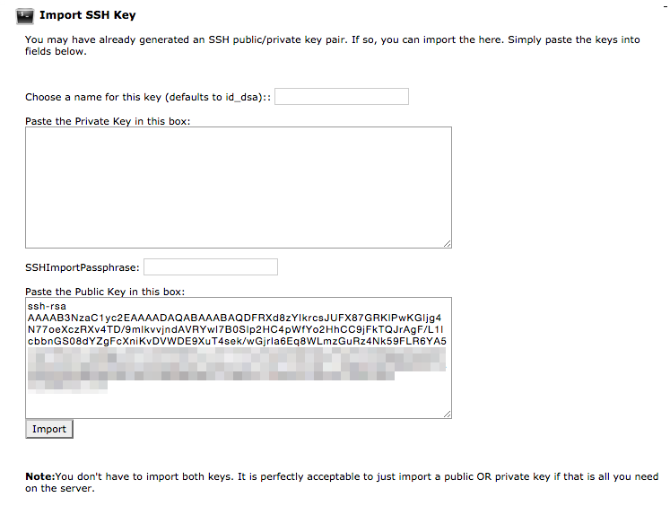
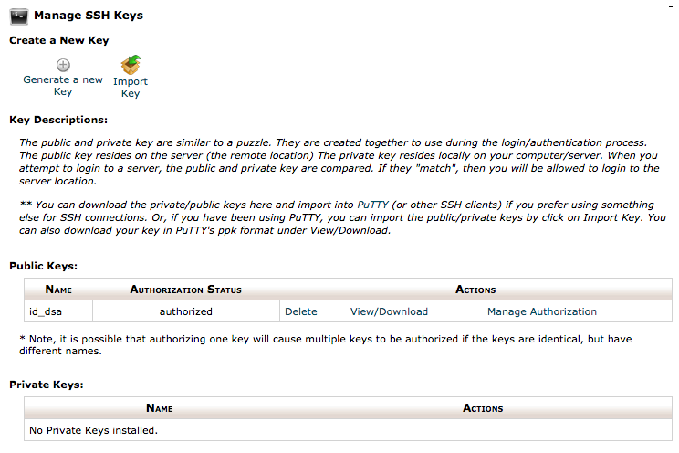
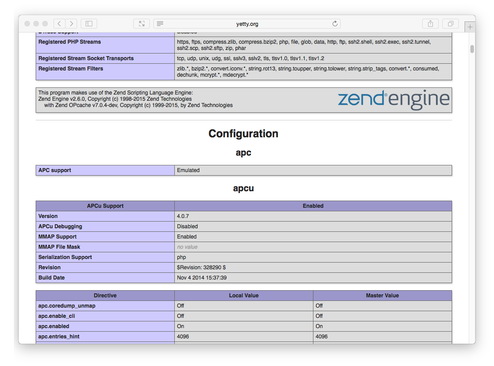




[Rochen Web Hosting](http://www.rochen.com/?utm_source=RocketTheme&utm_medium=Showcase&utm_campaign=Promotions) is the long-time hosting partner for both **GetGrav.org** and **RocketTheme.com**.  Rochen now has a new premium shared hosting offering that uses **SSD drives**, **Litespeed** web servers with the latest **Intel XEON processors** ensures that Grav performs optimally.  They also offer the choice of US or UK-based servers, so you can pick the best option for your users.



## Picking your Hosting Plan

[Rochen Web Hosting](http://www.rochen.com/?utm_source=RocketTheme&utm_medium=Showcase&utm_campaign=Promotions) has two options when it comes to hosting: **Shared** and **Burst** hosting.  Rochen recommends the Burst option for busier and more demanding sites.  For the sake of this guide, we'll use the basic Shared option.

Shared hosting ranges from $7.95/month $13.95/month depending on length of commitment.

## Enabling SSH

First, you will have to open the **Toggle SSH Access** option in the **Security** section of cPanel. On this SSH Access page, you should click the **Enable SSH Access** button.

Then from the **Security Section** again, click the **Manage SSH Keys** option.



There are two options at this point.  **Generate a New Key**, or **Import Key**. It's simpler to create your public/private key pair locally on your computer and then just import the DSA Public Key.

>>> Windows users will first need to install [Cygwin](https://www.cygwin.com/) to provide many useful GNU and open source tools that are available on Mac and Linux platforms. When prompted to choose packages, ensure you check the SSH option. After installation, launch the `Cygwin Terminal`

Fire up a terminal window and type:

```
$ ssh-keygen -t dsa
```

This key generation script will prompt you to fill in some values, or you can just hit `[return]` to accept the default values.  This will create an `id_dsa` (private key), and an `id_dsa.pub` (public key) in a folder called `.ssh/` in your home directory. It is important to ensure you **NEVER** give out your private key, nor upload it anywhere, **only your public key**.

Once generate you can paste the contents of your `id_dsa.pub` public key into the `Public Key` field in the **Import SSH key** section of the **SSH Access** page:



After uploading, you should see the key listed at the **Public Keys** section of the Manage SSH Keys page.  You then need to click **Manage** to ensure the key is authorized:



To **enable SSH** access for your account, simply navigate to the **Managed Services** section on the **my.rochen.com** portal, and click on your **Shared Hosting** account information.  Next to the **SSH** option, click the **Disabled** link, and confirm that you wish to enable SSH.

This means you are ready to test ssh'ing to your server.

```
$ ssh rochen_username@rochen_servername
```

Obviously, you will need to put in your Rochen-provided username for `rochen_username`, and the rochen-provided servername for `rochen_servername`.

## Configuring PHP & Caching

Rochen uses PHP **5.4** by default which is great for Grav, but you do have the option to use a newer **5.5** or **5.6** version.

The first thing to do is to change the default version of PHP your site runs with. So click the **Select PHP Version** link in the **Software and Services** Section.

You will see a page that shows the current version of PHP.  Below is a dropdown that let's you pick alternative versions.  Choose **5.6** and click `Set as current` button.


Rochen is a rare bread in the world of hosting providers, in that they provide some sophisticated caching extensions for PHP.  To take advantage of these, enable the `apcu` caching extension, and also the Zend `opcache` extension.  Then, click `Save` at the bottom of these options.

One optimization that you should make is to **disable** the `xdebug` extension which is enabled by default, but not needed in a production environment, in fact it only slows things down.

To test that you have the **correct version of PHP**, **Zend OPcache**, and **APCu** running, you can create a temporary file: `public_html/info.php` and put this in the contents:

```
<?php phpinfo();
```

Save the file and point your browser to this info.php file on your site, and you should be greeted with PHP information reflecting the version you selected earlier:


You should also be able to scroll down and see **Zend OPcache** listed in the **zend engine** block, and an **APCu** section below it:



## Install and Test Grav

Using your new found SSH capabilities, let's SSH to your Rochen server (if you are not already there) and download the latest version of Grav, unzip it and test it out!

We will extract Grav into a `/grav` subfolder, but you could unzip directly into the root of your `~/www/` folder to ensure Grav is accessible directly.

```
$ cd ~/www
[~/www]$ wget https://github.com/getgrav/grav/releases/download/{{ grav_version }}/grav-v{{ grav_version }}.zip
[~/www]$ unzip grav-v{{ grav_version }}.zip
 ```

You should now be able to point your browser to `http://myrochenserver.com/grav` using the appropriate URL of course.

Because you have followed these instructions diligently, you will also be able to use the [Grav CLI](../../advanced/grav-cli) and [Grav GPM](../../advanced/grav-gpm) commands such as:

```
$ cd ~/public_html/grav
$ bin/grav clear-cache

Clearing cache

Cleared:  cache/twig/*
Cleared:  cache/doctrine/*
Cleared:  cache/compiled/*
Cleared:  cache/validated-*
Cleared:  images/*
Cleared:  assets/*

Touched: /home/your_user/public_html/grav/user/config/system.yaml
```
