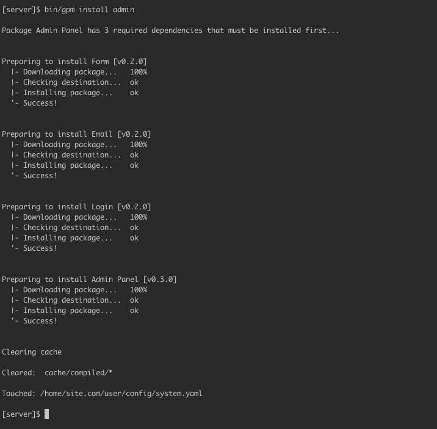




[Dreamhost](http://dreamhost.com) is a famous hosting provider that offers various levels of service ranging from SSD-powered shared hosting to dedicated servers.


Let’s focus on the lower end offer, shared hosting. It comes with a great admin panel, not the usual cPanel but a custom panel you can use to configure anything ranging from managing SSH users to choose the PHP version you run.

## Configuring PHP

You can set every (sub)domain to have its own PHP version. At the time of writing, the default PHP version for new sites is 5.4, which is ok for Grav. You can choose to use a later version (5.6 available), and we recommend doing so.


## Enabling SSH

Open the Users panel. Every Dreamhost user can have different access levels. Set your user to Shell User.

At the time of writing the default PHP CLI version is 5.4, so you don’t need to do anything to make the Grav CLI tools work properly.

## Install and Test Grav

When you add a new domain, Dreamhost creates a folder for it under your account folder.

Access the server using SSH and go into that folder, then download Grav into it:

`wget https://github.com/getgrav/grav/releases/download/{{ grav_version }}/grav-v{{ grav_version}}.zip`

(Please check on [](https://github.com/getgrav/grav/releases/) the latest version available)

Unzip with `unzip grav-v{{ grav_version }}.zip`. This will create a `grav` folder, so we need to move the files up to the current folder.
Just type:

`mv grav/* grav/.htaccess ./; rmdir grav`

You can now also delete the zip file:

`rm grav-v{{ grav_version }}.zip`

Grav has now been successfully installed. Try accessing the site from the browser, you should see a Grav welcome message.

You can now install plugins and themes, for example type this to install the Grav Admin plugin:

`bin/gpm install admin`



## Enable OPCache

OPCache is supported but not enabled by default. You need to manually activate it by creating a phprc file under your user folder, under `.php/5.6/phprc` (change the number according to your PHP version). In this file, put the following code:

```
zend_extension=opcache.so
```

You can further customize OPCache in that file according to your needs.
