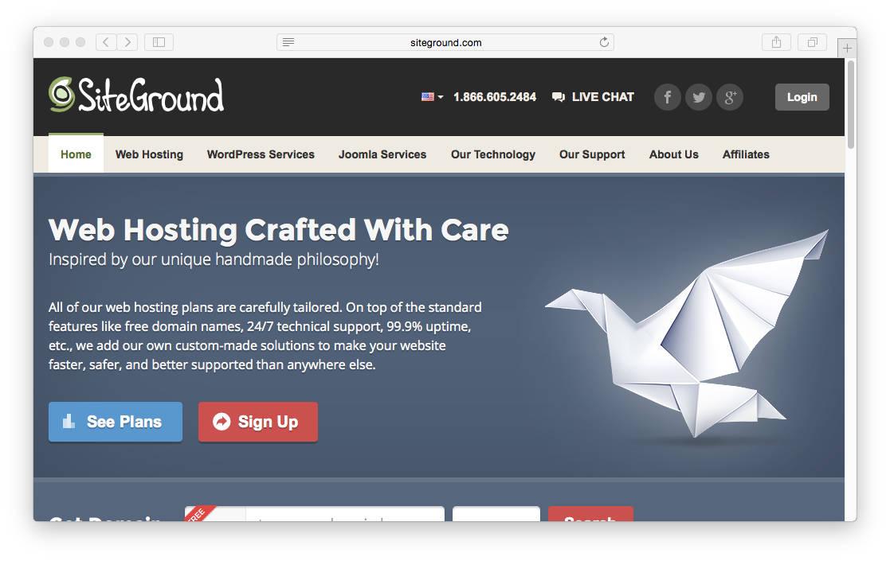
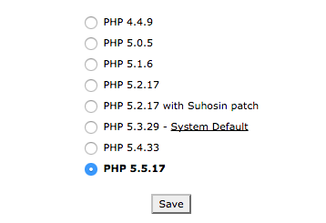
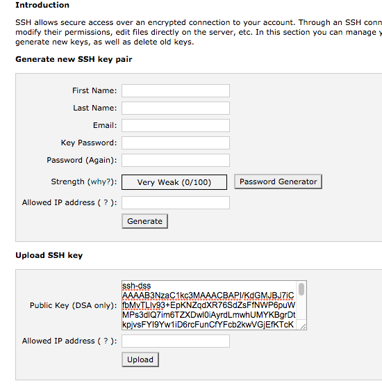
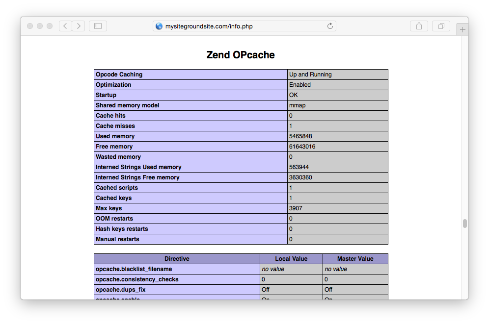




[SiteGround](http://www.siteground.com/)'s tag line is **Web Hosting Crafted With Care**, and it is for this reason it has proven a popular hosting solution for people in the Joomla and WordPress communities. It also makes a good option for hosting a Grav-based web site.



In this guide we will cover the essentials for configuring a pretty bog-standard SiteGround shared hosting account to work optimally with Grav.

## Picking your Hosting Plan

At the time of writing, SiteGround offers [three shared hosting options](http://www.siteground.com/web-hosting.htm) ranging from low-end $3.95/month to $14.95/month for what they call the **GoGeek** plan. We strongly suggest going with the higher-end but still very cheap **GoGeek** plan. This provides better server hardware and less _user crowding_ on the server.

## Configuring PHP

SiteGround provides a very full-featured **cPanel** control panel. This is directly accessible via the **My Accounts** tab.

The first thing to do is to change the default version of PHP your site runs with.


On the main cPanel Home page, there is a section called **1H Software**.  Here you will find the **PHP Version Manager**. When you click this, you will be confronted with a folder tree where you can set a specific folder, or set the version site-wide by clicking `public_html`. When you choose a folder, you can select the version of PHP.  We strongly suggest picking the latest **PHP 5.5** version available.



Click save for this to take effect.

## Enabling SSH

First, you will have to open the **SSH/Shell Access** option in the **ADVANCED** section of cPanel.

SiteGround provides a very thorough [tutorial for using SSH](http://www.siteground.com/tutorials/ssh/), however it's simpler to create your public/private key pair locally on your computer, and then just upload the DSA Public Key.

>>> Windows users will first need to install [Cygwin](https://www.cygwin.com/) to provide many useful GNU and open source tools that are available on Mac and Linux platforms. When prompted to choose packages, ensure you check the SSH option. After installation, launch the `Cygwin Terminal`.

Fire up a terminal window and type:

```
$ ssh-keygen -t dsa
```

This key generation script will prompt you to fill in some values, or you can just hit `[return]` to accept the default values.  This will create an `id_dsa` (private key), and an `id_dsa.pub` (public key) in a folder called `.ssh/` in your home directory. It is important to ensure you **NEVER** give out your private key, nor upload it anywhere, **only your public key**.

Once generate you can paste the contents of your `id_dsa.pub` public key into the `Public Key` field in the **Upload SSH key** section of the **SSH/Shell Access** page:



After uploading, you should see the key listed at the bottom of this page. This means you are ready to test SSH'ing to your server.

```
$ ssh siteground_username@siteground_servername -p18765
```

Obviously, you will need to put in your SiteGround-provided username for `siteground_username`, and the SiteGround-provided servername for `siteground_servername`.  The `-p18765` is important as this is the non-standard port that SiteGround runs SSH on.

## Setup CLI PHP

At the time of this writing, SiteGround's default PHP version is **5.3**.  Because Grav requires PHP **5.4+**, we need to ensure that Grav is using a newer version of PHP on the command line (CLI).  To accomplish this, you should use SSH to access your server and edit your `.bash_profile` file and change the path so that it references a new `~/bin/` folder before the regular path:

```
# .bash_profile

# Get the aliases and functions
if [ -f ~/.bashrc ]; then
        . ~/.bashrc
fi

# User specific environment and startup programs

PATH=~/bin/:$PATH:$HOME/bin

export PATH
```

Now you should create the `~/bin/` folder in your home directory and a symbolic link to the version of PHP you wish to use:

```
$ mkdir ~/bin
$ cd ~/bin
$ ln -s /usr/local/bin/php55 php
```

You will need to _source_ the profile: `$ source ~/.bash_profile` or log back in to your terminal for your path change to take effect. Aafter doing so, you should be able to type `php -v` and see:

```
$ php -v
PHP 5.5.17 (cli) (built: Sep 19 2014 09:49:54)
Copyright (c) 1997-2014 The PHP Group
Zend Engine v2.5.0, Copyright (c) 1998-2014 Zend Technologies
    with the ionCube PHP Loader v4.6.1, Copyright (c) 2002-2014, by ionCube Ltd.
```

## Enabling PHP OPcache

By default, SiteGround hosting comes with **support** for **Zend OPcache**, but it is **not enabled**.  You must manually enable it by creating a `php.ini` file in your `public_html/` folder with the contents:

```
zend_extension=opcache.so
```

To test you have the correct version of PHP and the Zend OPcache running, you can create a temporary file: `public_html/info.php` and put this in the contents:

```
<?php phpinfo();
```

Save the file and point your browser to this info.php file on your site and you should be greeted with a PHP information reflecting the version you selected earlier:


You should also be able to scroll down and see a section called **Zend OPcache**:



## Install and Test Grav

Using your new found SSH capabilities, let's SSH to your SiteGround server (if you are not already there) and download the latest version of Grav, unzip it and test it out!

We will extract Grav into a `/grav` subfolder, but you could unzip directly into the root of your `~/public_html/` folder to ensure Grav is accessible directly.

```
$ cd ~/public_html
[~/public_html]$ curl -L -O https://github.com/getgrav/grav/releases/download/{{ grav_version }}/grav-v{{ grav_version}}.zip
[~/public_html]$ unzip grav-v{{ grav_version}}.zip
 ```

You should now be able to point your browser to `http://mysiteground.com/grav` using the appropriate URL of course.

Because you have followed these instructions diligently, you will also be able to use the [Grav CLI](../../advanced/grav-cli) and [Grav GPM](../../advanced/grav-gpm) commands such as:

```
$ cd ~/public_html/grav
$ bin/grav clear-cache

Clearing cache

Cleared:  cache/twig/*
Cleared:  cache/doctrine/*
Cleared:  cache/compiled/*
Cleared:  cache/validated-*
Cleared:  images/*
Cleared:  assets/*

Touched: /home/your_user/public_html/grav/user/config/system.yaml
```
