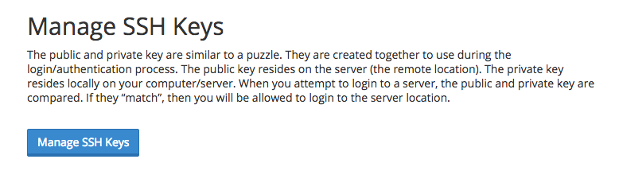
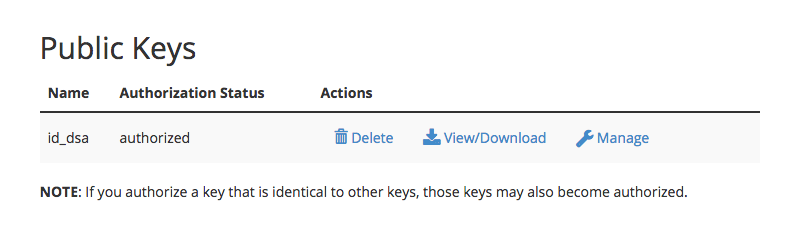




[WireNine](https://my.wirenine.com/aff.php?aff=023) is a fast, modern hosting provider that focuses on performance via their use of **100% SSD** storage, **Litespeed** web servers, the latest **Intel E5-based** processors with fast **DDR4 ram**. These features ensure their shared hosting offerings are a fantastic solution for Grav sites.


In this guide, we will cover the essentials for configuring a middle of the road shared hosting account to work optimally with Grav.

## Picking your Hosting Plan

[WireNine](https://my.wirenine.com/aff.php?aff=023) has three shared hosting plans that range from $9/month for a basic plan, to $18/month for their heavy traffic option.  Configuration for all of these plans are the same, but we recommend the middle **Plus** plan at $14/month because it provides a good compromise with 1 CPU and 1GB of memory.

## Enabling SSH

First, you will have to open the **SSH Access** option in the **Security** section of cPanel. On this SSH Access page, you should click the **Manage SSH Keys** button.



There are two options at this point.  **Generate a New Key**, or **Import Key**. It's simpler to create your public/private key pair locally on your computer and then just import the DSA Public Key.

>>> Windows users will first need to install [Cygwin](https://www.cygwin.com/) to provide many useful GNU and open source tools that are available on Mac and Linux platforms. When prompted to choose packages, ensure you check the SSH option. After installation, launch the `Cygwin Terminal`

Fire up a terminal window and type:

```
$ ssh-keygen -t dsa
```

This key generation script will prompt you to fill in some values, or you can just hit `[return]` to accept the default values.  This will create an `id_dsa` (private key), and an `id_dsa.pub` (public key) in a folder called `.ssh/` in your home directory. It is important to ensure you **NEVER** give out your private key, nor upload it anywhere, **only your public key**.

Once generate you can paste the contents of your `id_dsa.pub` public key into the `Public Key` field in the **Import SSH key** section of the **SSH Access** page:


After uploading, you should see the key listed at the **Public Keys** section of the Manage SSH Keys page.  You then need to click **Manage** to ensure the key is authorized:



>>> WireNine does not seem to enable **Shell Access** on their accounts by default.  You will need to open a support ticket, and request shell access to be enabled for your account.

This means you are ready to test ssh'ing to your server.

```
$ ssh wirenine_username@wirenine_servername -p2200
```

Obviously, you will need to put in your WireNine-provided username for `wirenine_username`, and the WireNine-provided servername for `wirenine_servername`.  The `-p2200` is important as this is the non-standard port that WireNine runs SSH on.

## 403 Forbidden Errors

It seems in some WireNine setups the default permissions on user created files are incorrect and will cause **403 Forbidden** errors due to security flags being triggered.  The issue is that the default **umask is incorrect** and files are created with `775` for folders and `664` for files.  These files need to be `755` and `644` respectively to work correctly.

This should be setup automatically but is not currently.  However, the fix is easy.  Just edit your `.bash_profile` file and add this line to the bottom of it.

```
umask 022
```

You will need to re-login to your terminal to get this change picked up.

## Configuring PHP & Caching

WireNine uses PHP **5.4** by default which is great for Grav, but you do have the option to use a newer **5.5** or **5.6** version.

WireNine provides a very full-featured **cPanel** control panel. This is directly accessible via the **My Accounts** tab.

The first thing to do is to change the default version of PHP your site runs with. So click the **Select PHP Version** link in the **Software** Section.

You will see a page that shows the current version of PHP.  Below is a dropdown that let's you pick alternative versions.  Choose **5.6** and click `Set as current` button.


You will first need to enable `mbstring` and `zip` extension.

WireNine is a rare bread in the world of hosting providers, in that they provide some sophisticated caching extensions for PHP.  To take advantage of these, enable the `apcu` caching extension, and also the Zend `opcache` extension.  Then, click `Save` at the bottom of these options.

To test that you have the **correct version of PHP**, **Zend OPcache**, and **APCu** running, you can create a temporary file: `public_html/info.php` and put this in the contents:

```
<?php phpinfo();
```

Save the file and point your browser to this info.php file on your site, and you should be greeted with PHP information reflecting the version you selected earlier:


You should also be able to scroll down and see **Zend OPcache** listed in the **zend engine** block, and an **APCu** section below it:


## Install and Test Grav

Using your new found SSH capabilities, let's SSH to your WireNine server (if you are not already there) and download the latest version of Grav, unzip it and test it out!

We will extract Grav into a `/grav` subfolder, but you could unzip directly into the root of your `~/public_html/` folder to ensure Grav is accessible directly.

```
$ cd ~/public_html
[~/public_html]$ wget https://github.com/getgrav/grav/releases/download/{{ grav_version }}/grav-v{{ grav_version }}.zip
[~/public_html]$ unzip grav-v{{ grav_version }}.zip
 ```

You should now be able to point your browser to `http://mywirenineserver.com/grav` using the appropriate URL of course.

Because you have followed these instructions diligently, you will also be able to use the [Grav CLI](../../advanced/grav-cli) and [Grav GPM](../../advanced/grav-gpm) commands such as:

```
$ cd ~/public_html/grav
$ bin/grav clear-cache

Clearing cache

Cleared:  cache/twig/*
Cleared:  cache/doctrine/*
Cleared:  cache/compiled/*
Cleared:  cache/validated-*
Cleared:  images/*
Cleared:  assets/*

Touched: /home/your_user/public_html/grav/user/config/system.yaml
```
