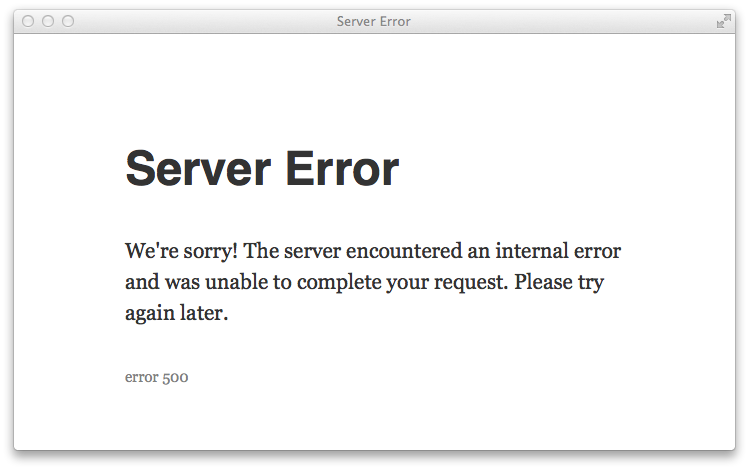

   {.center}

Server errors are almost always caused by misconfiguration of Grav. Something unexpected happened and because of that Grav is unable to recover and serve the page.

When you see this message it means your server is running in `Production` mode to hide potentially sensitive information from displaying to your users.  The error itself will be stored in the `logs/exception.log` file.  Please examine this file to determine the exact nature of the error.

Possible reasons include:

* Server errors are caused by out-of-date configuration
* Incorrect file permissions which prevents Grav from writing data
* Changes in the file-system that Grav is not yet aware about
* Errors in parsing configuration due to invalidly formatted configuration files


>>>>>> If you have the **Grav Administration** plugin installed, you can browse the Server Errors from there. By clicking the individual errors you can see the debug pages even if the debugger was turned off.

## Out-of-date configuration

The first thing you should do is flush the cache to ensure that the configuration is up to date:

```
bin/grav clear-cache
```

## Tracy says: Unable to log error.

> Tracy says: Unable to log error. Check if directory is writable and path is absolute.

This error means that something bad happened, and in addition, the system was unable to log it.

In order to solve this issue, you need to make the **system/logs** directory writable and try again. If you were successful, you should see a similar error message, but with different explanation under it.

>>> Before moving on, make sure that you do not have other file permission issues like this.

## Installation and configuration issues

- system requirements
- file permissions
- installation issues
- configuration issues

## Troubleshooting

Check `logs/` folder for the following file types:

```
error.log
exception.log
exception-2014-07-15-12-39-09-adb68ae49e04637b9a8ae517173a9bad.html
```

### error.log

Non-fatal errors, warnings and notices.

### exception.log

Fatal server errors.

### exception-2014-07-15-12-39-09-adb68ae49e04637b9a8ae517173a9bad.html

HTML representation of a single error, basically what you would have seen in the debug mode.
