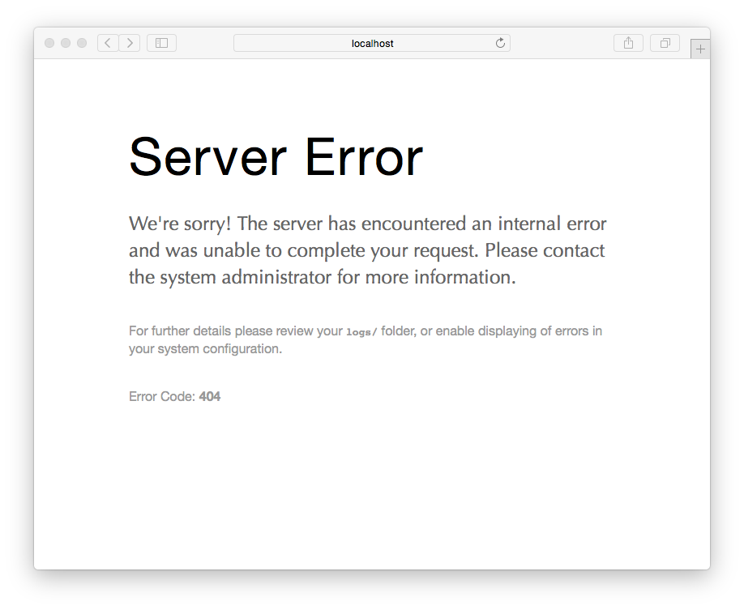

When developing themes and plugins, there is often a need to display **debugging** information. Grav has powerful debugging capabilities via a variety of features:

## Debug Bar

Grav comes with a great tool to make this effort easier called via a **Debug Bar**.  This feature is **disabled** by default, but can be turned on either globally or for your [development environment](../environment-config) only via the `system.yaml` configuration file:

[prism classes="language-yaml line-numbers"]
debugger:
  enabled: true                        # Enable Grav debugger and following settings
  shutdown:
    close_connection: true             # Close the connection before calling onShutdown(). false for debugging
[/prism]

!! The first time you enable it, the debug bar might appear as a little Grav icon in the bottom left of the page. Clicking that will show the full debug bar.

The PHP Debug Bar still provides an overall **processing time** as well as **memory usage**, but it now has several tabs that provide more detailed information.

The first tab is for **Messages** and you can use this to help debug your Grav development process by posting information to this tab from your code.

Along with **Request**, **Exceptions**, and **Configuration** information, you can also see a detailed breakdown of Grav timing in the **Timeline** panel:

### Dump Command for PHP

If you are trying to debug some PHP, for example a custom plugin you are developing, and wish to quickly examine some object or variable, you can use the powerful `dump()` command.  This accepts basically any valid PHP variable and will output the results in a nicely formatted and colorized display in your browser.

For example, you can easily dump a PHP variable or object:

[prism classes="language-php"]
dump($myvariable);
[/prism]

and see the results in your browser:

You can also dump variables into the **Messages** tab of the Debug Bar by using the syntax:

[prism classes="language-php"]
$this->grav['debugger']->addMessage($myvariable)
[/prism]

### Dump command for Twig

You can also display Twig variables from your Twig templates.  This is done in a similar fashion, but the results are displayed in the **Messages** panel of the Debug Bar. This feature is **disabled** by default, but can be turned on either globally or for your [development environment](../environment-config) only via the `system.yaml` configuration file:

[prism classes="language-yaml line-numbers"]
twig:
  debug: true                        # Enable Twig debugger
[/prism]

For example, you can easily dump a Twig variable or object:


[prism classes="language-twig line-numbers"]
{{ dump(page.header) }}
[/prism]


and see the results in the Debugbar:

## Error Display

Our new error display page provides detailed information, backtraces, and even relevant code blocks.  This helps to more quickly isolate, identify and resolve critical errors. By default in Grav 1.0+, these are turned off by default, so you will need to enable them to take advantage of this helpful error handling for development:

[prism classes="language-yaml line-numbers"]
errors:
  display: true
[/prism]

For production environments you can disable the detailed error page with something more subtle by configuring the errors options in your `user/config/system.yaml` file and rely on errors being logged to file:

[prism classes="language-yaml line-numbers"]
errors:
  display: false
  log: true
[/prism]

## Logging

The ability to log information is often useful, and once again, Grav provides us with a simple put powerful logging feature.  Use one of the following syntaxes:

[prism classes="language-twig line-numbers"]
$this->grav['log']->info('My informational message');
$this->grav['log']->notice('My notice message');
$this->grav['log']->debug('My debug message');
$this->grav['log']->warning('My warning message');
$this->grav['log']->error('My error message');
$this->grav['log']->critical('My critical message');
$this->grav['log']->alert('My alert message');
$this->grav['log']->emergency('Emergency, emergency, there is an emergency here!');

[/prism]

All your message will be appended to the `/logs/grav.log` file.
