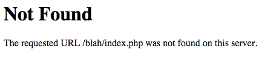

There are a couple of reasons you might receive a **Not Found** error, and they are each caused by different factors.

 		{.bordered}

>>> The examples below are for the Apache Web Server which is the most common server software used.

### Missing .htaccess File

The first thing to check is if you have the provided `.htaccess` file at the root of your Gav installation.  Because this is a **hidden** file, you won't normally see this in your explorer or finder windows.  If you have extracted Grav then **selected** and **moved** or **copied** the files, you may well have left this very important file behind.

It is **strongly advised** to unzip Grav and move the **entire folder** into place, then simply rename the folder. This will ensure all the files retain their proper positions.

### AllowOverride All

In order for the Grav-provided `.htaccess` to be able to set the rewrite rules required for routing to work properly, Apache needs to first read the file.  when your `<Directory>` or `<VirtualHost>` directive is setup with `AllowOverride None`, the `.htaccess` file is completely ignored.  The simplest solution is to change this to `AllowOverride All`

More details on `AllowOverride` and all the possible configuration options can be found in the [Apache Documentation](http://httpd.apache.org/docs/2.4/mod/core.html#allowoverride).

### RewriteBase Issue

If the homepage of your Grav site loads, but **any other page** displays this very rough _Apache-style_ error, then the most likely cause is that there is a problem with your `.htaccess` file.

The default `.htaccess` that comes bundled with Grav works fine out-of-the-box in most cases.  However, there are certain setups involving virtual hosts where the file system does not match the virtual hosting setup directly.  In these cases you must configure the `RewriteBase` option in the `.htaccess` to point to the correct path.

There is a short explanation of this in the `.htacces` file itself:

```
##
# If you are getting 404 errors on subpages, you may have to uncomment the RewriteBase entry
# You should change the '/' to your appropriate subfolder. For example if you have
# your Grav install at the root of your site '/' should work, else it might be something
# along the lines of: RewriteBase /<your_sub_folder>
##

# RewriteBase /
```

Simply remove the `#` before the `RewriteBase /` directive to uncomment it, and adjust the path to match your server environment.

### Missing Rewrite or Headers Modules

Some webserver packages (I'm looking at your EasyPHP and WAMP!) do not come with the Apache **rewrite** or **headers** modules enabled by default. They usually can be enabled from the configuration settings for Apache, or you can do so manually via the `httpd.conf` by uncommenting these lines (or something similar) so they are loaded by Apache:

```
#LoadModule rewrite_module modules/mod_rewrite.so
#LoadModule headers_module modules/mod_headers.so
```

Then restart your Apache server.

### Grav Error 404 Page

 		{.bordered}

If you receive a _Grav-style_ error saying **Error 404** then your `.htaccess` is functioning correctly, but your trying to reach a page that Grav cannot find.

The most common cause of this is simply that the page has been moved or renamed.  Another thing to check is if the page has a `slug` set in the page YAML headers.  This overrides the explicit folder name that is used by default to construct the URL.

Another cause could be your page is **not routable**.  The routable option for a page can be set in the [page headers](../../content/headers).


