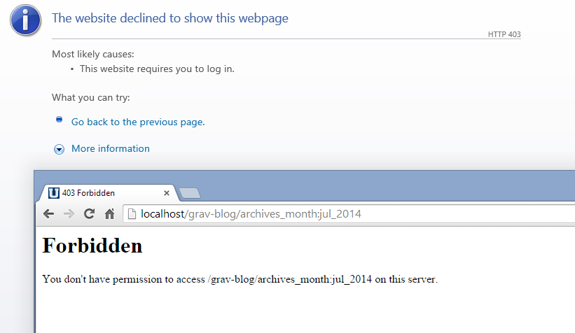

  {.border .shadow}

There is an obscure but persistent issue with **Apache** on **Windows** causing a 403 forbidden error.

Basically Apache won't allow the `:` in the URL that works on other systems due to a security concern based on the fact that windows paths can have colons in them: `C:\some\path`.

We have addressed this by providing a configurable option for the parameter separator that is defaulting to `:`

Simple edit your `user/config/system.yaml` and add this at the top:

```
param_sep: ';'
```

This will configure Grav to use a semicolon, rather than a colon for parameters such as `http://yoursite.com/blog/tag:something` will now be: `http://yoursite.com/blog/tag;something`.
