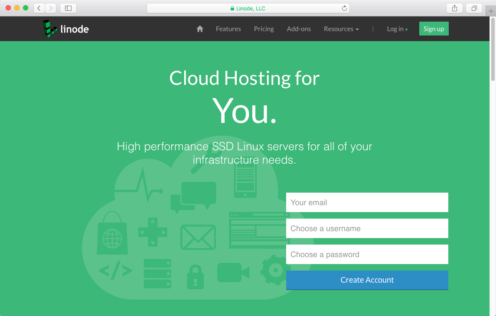
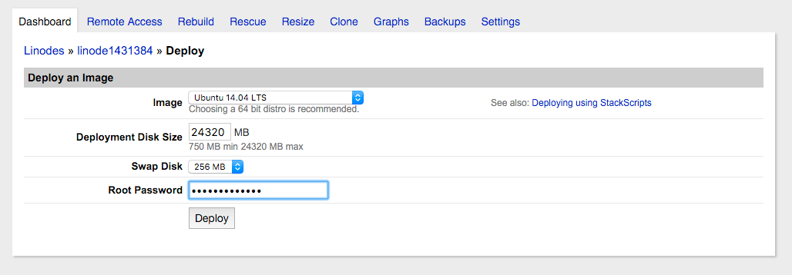
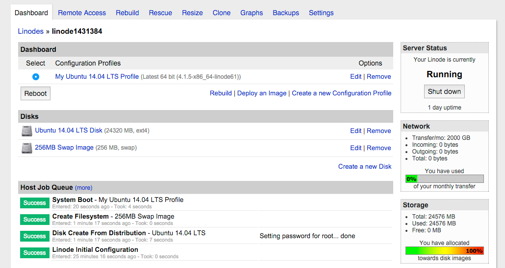

[Linode](https://www.linode.com/?r=300c424631b602daaa0ecef22912c1c26c81e3af) has been in the VPS game for quite some time and focus on providing **lightning-quick SSD equipped Linux servers** for developers.  There is a quick and easy process to getting a server up and running that involves: picking a **pricing plan**, picking a **Linux distribution**, and then choosing a **node location** that is best suited to your needs.

 {.center}

After creating an account and navigating to the **Linode Manager**, you first need to add a Linode. For this test, we will pick the smallest and cheapest option at $10/month for 1 CPU core and 24GB of SSD Disk space. There are plenty of scaling options here all the way up to 20 CPU cores and 2GB of disk space! Also remember to choose an appropriate location from the drop-down:

 {.center}

After the Linode has been created you will need to click the **Dashboard** link from the options column. This will take you to the page where you can now choose your distribution. From the Dashboard, choose **Deploy an Image**.

 {.center}

For the sake of compatibility and ease of use, I like to choose a stable distribution of Ubuntu.  So **Ubuntu 14.04 LTS** it is! Leave the rest as defaults and provide a **strong password**, then click deploy:

 {.center}

The creation of your server should take about 30 seconds, and after that you can click the **Boot** button to get it up and running:

 {.center}

You can click on the **Remote Access** tab in the Linode Manager to get relevant information about how to remotely connect to the VPS instance you have just setup.  You can can SSH via the command provided in this tab using the password you entered when you created the distribution instance. Public key authentication is recommended, and Linode has good [SSH public key authentication documentation](https://www.linode.com/docs/security/use-public-key-authentication-with-ssh?r=300c424631b602daaa0ecef22912c1c26c81e3af) that walks you through the steps required.

---

[plugin:content-inject](/hosting/vps/generic)

