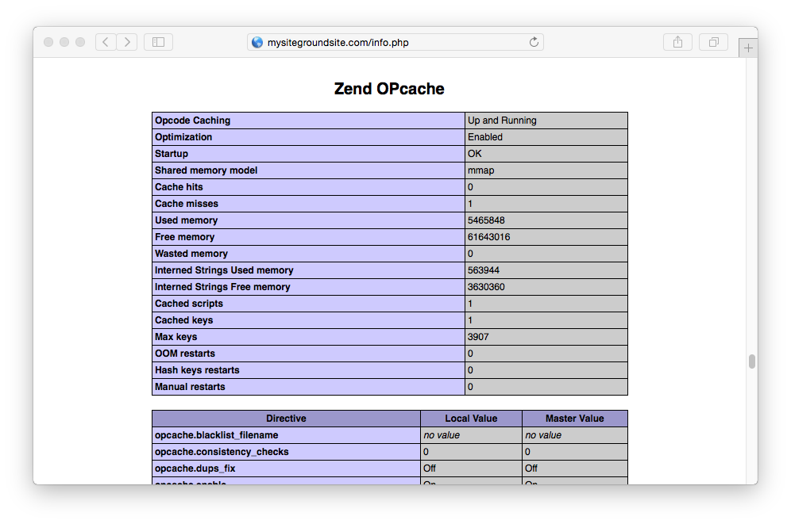

[SiteGround](http://www.siteground.com/)'s tag line is **Web Hosting Crafted With Care**, and it is for this reason it has proven a popular hosting solution for people in the Joomla and WordPress communities. It also makes a good option for hosting a Grav-based web site.

In this guide we will cover the essentials for configuring a pretty bog-standard SiteGround shared hosting account to work optimally with Grav.

## Picking your Hosting Plan

At the time of writing, SiteGround offers [three shared hosting options](http://www.siteground.com/web-hosting.htm) ranging from low-end $3.95/month to $14.95/month for what they call the **GoGeek** plan. We strongly suggest going with the higher-end but still very cheap **GoGeek** plan. This provides better server hardware and less _user crowding_ on the server.

## Configuring

SiteGround provides a very full-featured **cPanel** control panel. This is directly accessible via the **My Accounts** tab.

## Enabling SSH

First, you will have to open the **SSH/Shell Access** option in the **ADVANCED** section of cPanel.

SiteGround provides a very thorough [tutorial for using SSH](http://www.siteground.com/tutorials/ssh/), however it's simpler to create your public/private key pair locally on your computer, and then just upload the DSA Public Key.

!! Windows users will first need to install [Cygwin](https://www.cygwin.com/) to provide many useful GNU and open source tools that are available on Mac and Linux platforms. When prompted to choose packages, ensure you check the SSH option. After installation, launch the `Cygwin Terminal`.

Fire up a terminal window and type:

[prism classes="language-bash command-line"]
$ ssh-keygen -t dsa
[/prism]

This key generation script will prompt you to fill in some values, or you can just hit `[return]` to accept the default values.  This will create an `id_dsa` (private key), and an `id_dsa.pub` (public key) in a folder called `.ssh/` in your home directory. It is important to ensure you **NEVER** give out your private key, nor upload it anywhere, **only your public key**.

Once generate you can paste the contents of your `id_dsa.pub` public key into the `Public Key` field in the **Upload SSH key** section of the **SSH/Shell Access** page:

After uploading, you should see the key listed at the bottom of this page. This means you are ready to test SSH'ing to your server.

[prism classes="language-bash command-line"]
$ ssh siteground_username@siteground_servername -p18765
[/prism]

Obviously, you will need to put in your SiteGround-provided username for `siteground_username`, and the SiteGround-provided servername for `siteground_servername`.  The `-p18765` is important as this is the non-standard port that SiteGround runs SSH on.

## Enabling PHP OPcache

!!! Update [2016-03]: Siteground Support advised that OPCache is available from PHP7 and not 5.5. This then had OPCache enabled by default, and so no further configuration was required in this stage of the setup, so some of the below instructions may no longer be required.

By default, SiteGround hosting comes with **support** for **Zend OPcache**, but it is **not enabled**.  You must manually enable it by creating a `php.ini` file in your `public_html/` folder with the contents:

[prism classes="language-text"]
zend_extension=opcache.so
[/prism]

To test you have the correct version of PHP and the Zend OPcache running, you can create a temporary file: `public_html/info.php` and put this in the contents:

[prism classes="language-php"]
<?php phpinfo();
[/prism]

Save the file and point your browser to this info.php file on your site and you should be greeted with a PHP information reflecting the version you selected earlier:

You should also be able to scroll down and see a section called **Zend OPcache**:

## Install and Test Grav

Using your new found SSH capabilities, let's SSH to your SiteGround server (if you are not already there) and download the latest version of Grav, unzip it and test it out!

We will extract Grav into a `/grav` subfolder, but you could unzip directly into the root of your `~/public_html/` folder to ensure Grav is accessible directly.

[prism classes="language-bash command-line"]
$ cd ~/public_html
[~/public_html]$ curl -L -O https://github.com/getgrav/grav/releases/download/{{ grav_version }}/grav-v{{ grav_version}}.zip
[~/public_html]$ unzip grav-v{{ grav_version}}.zip
[/prism]

You should now be able to point your browser to `http://mysiteground.com/grav` using the appropriate URL of course.

!!! Update [2016-03]: The path to the CLI for PHP 7 on Siteground shared hosting at this time appears to be: `/usr/local/php70/bin/php-cli`, and so for command line use of gpm/grav you could make an alias and then reference the php-cli directly via terminal, e.g. `alias php-cli="/usr/local/php70/bin/php-cli"`. Then you can use it as: `$php-cli bin/grav list`

Because you have followed these instructions diligently, you will also be able to use the [Grav CLI](../../advanced/grav-cli) and [Grav GPM](../../advanced/grav-gpm) commands such as:

[prism classes="language-bash command-line" cl-output="3-13"]
$ cd ~/public_html/grav
$ bin/grav clear-cache

Clearing cache

Cleared:  cache/twig/*
Cleared:  cache/doctrine/*
Cleared:  cache/compiled/*
Cleared:  cache/validated-*
Cleared:  images/*
Cleared:  assets/*

Touched: /home/your_user/public_html/grav/user/config/system.yaml
[/prism]

In order to use the Grav package manager (gpm) you'll have to set it as an executable by running this command in your Grav folder

[prism classes="language-bash command-line"]
$ chmod +x bin/gpm
[/prism]
