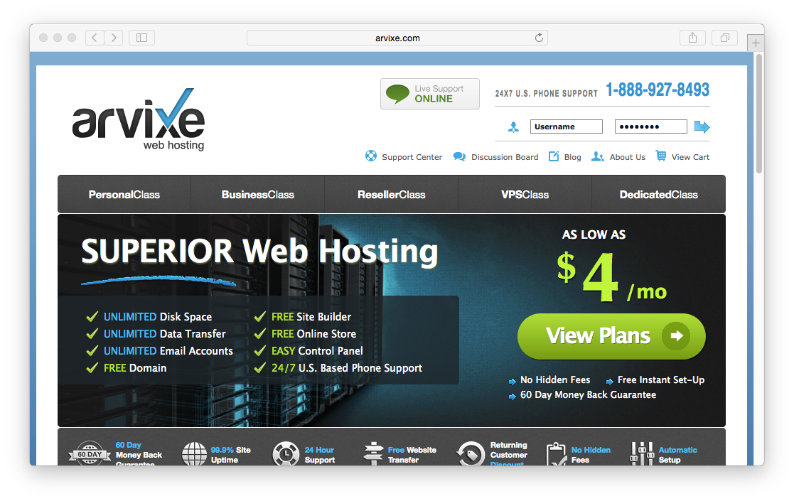
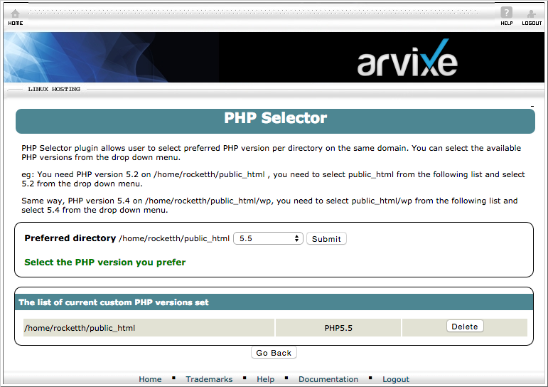
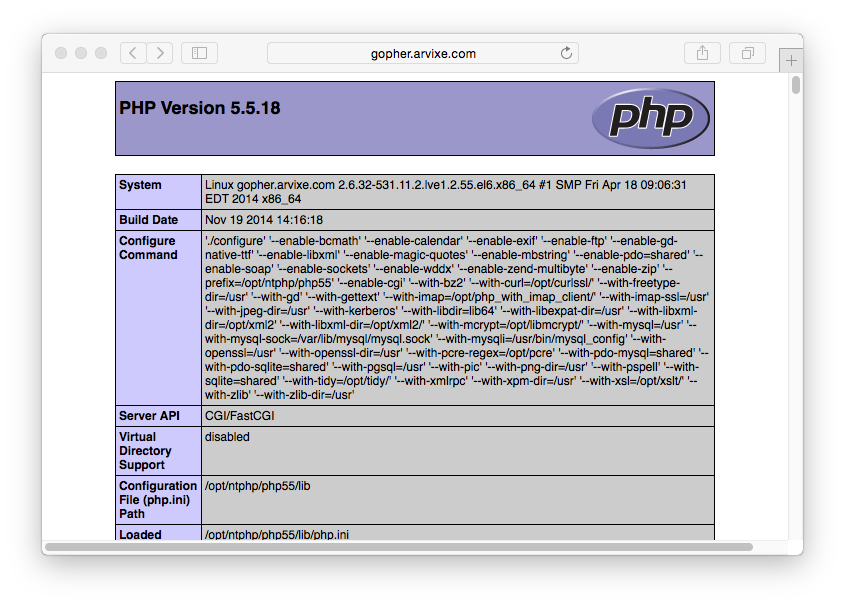

[Arvixe](http://www.arvixe.com) is an award winning hosting company that prides themselves on providing quality web hosting that is **affordable** and unmatched in **reliability**.  With great features, and a **developer-friendly** stance, Arvixe shared hosting is a great option for a Grav-based site.

In this guide: We will cover the essentials for configuring a pretty bog-standard Arvixe shared hosting account to work optimally with Grav.

## Picking your Hosting Plan

At the time of writing, Arvixe offers [two Linux-based shared hosting options](http://www.arvixe.com/linux_web_hosting) that cost $4.00/month for the **PersonalClass**, and $7.00 for the **PersonalClass Pro** plan. Both plans are almost identical, but the Pro plan offers unlimited concurrent domains. Either one will work well with Grav.

## Configuring PHP

Arvixe provides a very full featured **cPanel** control panel. The URL for this is provided with your welcome email.

Because Arvixe's default PHP version is **5.3**, The first thing to do is to change the default version of PHP your site runs with.

On the main cPanel Home page, there is a section called **Software/Services**.  Here you will find the **ntPHPSelector**. When you click this, you will be confronted with a folder tree where you can set a specific folder, or set the version site-wide by clicking `public_html`. When you choose a folder, you can select the version of PHP, just select **5.5**, and click submit.

Click **Save** for this to take effect.

You should be able to reach your site via your website URL with `phpinfo.php` appended to the end.  For example: `http://myarvixe.com/phpinfo.php`

You can ensure you are running the correct version of PHP.

!! Arvixe's PHP 5.5 already includes Zend OPcache enabled, so there is no extra step required to getting this setup.

## Enabling SSH

First, you will have to open the **SSH/Shell Access** option in the **Security** section of cPanel. On this SSH Access page, you should click the **Manage SSH Keys** button.

There are two options at this point.  **Generate a New Key**, or **Import Key**. It's simpler to create your public/private key pair locally on your computer and then just import the DSA Public Key.

!! Windows users will first need to install [Cygwin](https://www.cygwin.com/) to provide many useful GNU and open source tools that are available on Mac and Linux platforms. When prompted to choose packages, ensure you check the SSH option. After installation, launch the `Cygwin Terminal`

Fire up a terminal window and type:

[prism classes="language-bash command-line"]
$ ssh-keygen -t dsa
[/prism]

This key generation script will prompt you to fill in some values, or you can just hit `[return]` to accept the default values.  This will create an `id_dsa` (private key), and an `id_dsa.pub` (public key) in a folder called `.ssh/` in your home directory. It is important to ensure you **NEVER** give out your private key, nor upload it anywhere, **only your public key**.

Once generate you can paste the contents of your `id_dsa.pub` public key into the `Public Key` field in the **Import SSH key** section of the **SSH Access** page:

After uploading, you should see the key listed at the **Public Keys** section of the Manage SSH Keys page.  You then need to clikc **Manage** to ensure the key is authorized:

This means you are ready to test ssh'ing to your server.

[prism classes="language-bash command-line"]
$ ssh arvixe_username@arvixe_servername
[/prism]

Obviously, you will need to put in your Arvixe-provided username for `arvixe_username`, and the Arvixe-provided servername for `arvixe_servername`.

## Setup CLI PHP

At the time of this writing, Arvixe's default PHP version is **5.3**.  Because Grav requires PHP **5.5+**, we need to ensure that Grav is using a newer version of PHP on the command line (CLI).  To accomplish this, you should use SSH to access your server and edit your `.bash_profile` file and change the path so that it references the appropriate PHP path before the regular path:

[prism classes="language-bash"]
# .bash_profile

# Get the aliases and functions
if [ -f ~/.bashrc ]; then
        . ~/.bashrc
fi

# User specific environment and startup programs

PATH=/opt/ntphp/php55/bin:$PATH:$HOME/bin

export PATH
[/prism]

You will need _source_ the profile: `$ source ~/.bash_profile` or re-login to your terminal for you path change to take effect, but after doing so you should be able to type `php -v` and see:

[prism classes="language-bash command-line" cl-output="2-5"]
$ php -v
PHP 5.5.18 (cli) (built: Nov 19 2014 14:29:20)
Copyright (c) 1997-2014 The PHP Group
Zend Engine v2.5.0, Copyright (c) 1998-2014 Zend Technologies
    with Zend OPcache v7.0.4-dev, Copyright (c) 1999-2014, by Zend Technologies
[/prism]

## Install and Test Grav

Using your new found SSH capabilities, let's SSH to your Arvixe server (if you are not already there) and download the latest version of Grav, unzip it and test it out!

We will extract Grav into a `/grav` subfolder, but you could unzip directly into the root of your `~/public_html/` folder to ensure Grav is accessible directly.

[prism classes="language-bash command-line"]
$ cd ~/public_html
[~/public_html]$ curl -L -O https://github.com/getgrav/grav/releases/download/{{ grav_version }}/grav-v{{ grav_version}}.zip
[~/public_html]$ unzip grav-v{{ grav_version}}.zip
 [/prism]

You should now be able to point your browser to `http://myarvixe.com/grav` using the appropriate URL of course.

Because you have followed these instructions diligently, you will also be able to use the [Grav CLI](../../advanced/grav-cli) and [Grav GPM](../../advanced/grav-gpm) commands such as:

[prism classes="language-bash command-line" cl-output="2-15"]
$ cd ~/public_html/grav
$ bin/grav clear-cache

Clearing cache

Cleared:  cache/twig/*
Cleared:  cache/doctrine/*
Cleared:  cache/compiled/*
Cleared:  cache/validated-*
Cleared:  images/*
Cleared:  assets/*

Touched: /home/your_user/public_html/grav/user/config/system.yaml
[/prism]
