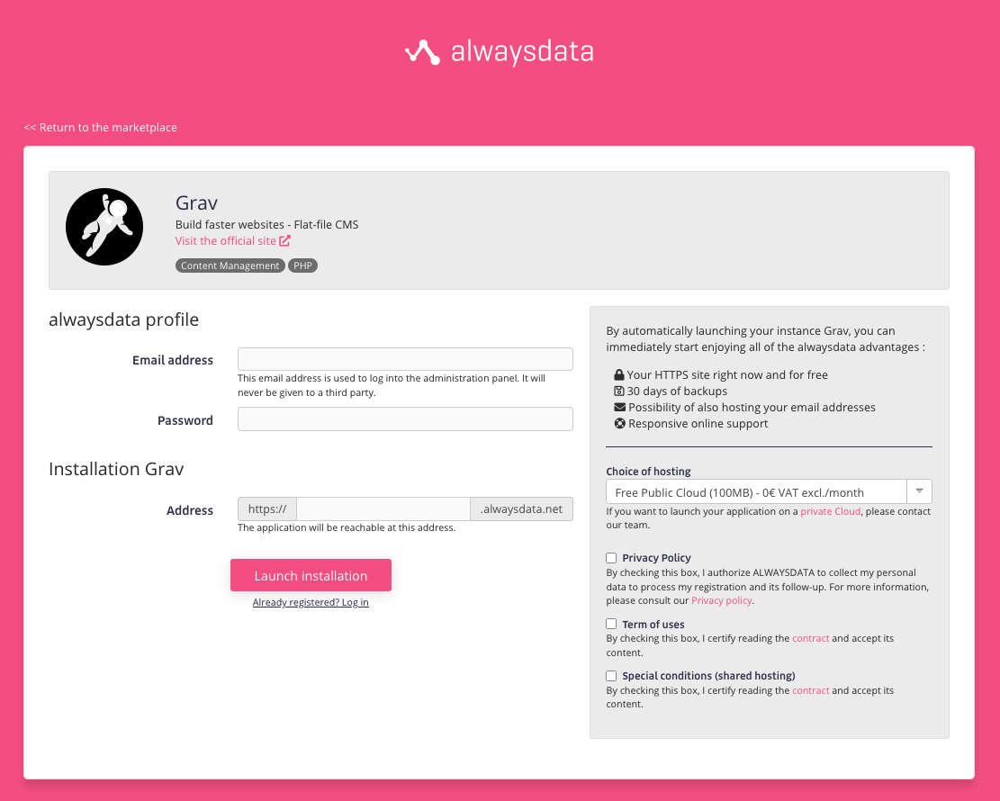
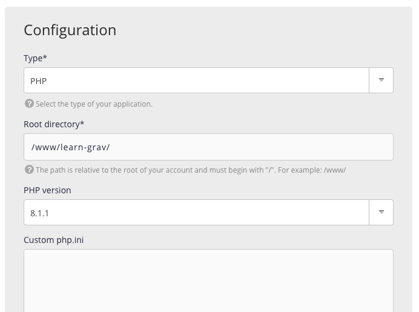

[alwaysdata](https://www.alwaysdata.com) is a European hosting provider that offers different plans on shared platform or dedicated managed servers. They include lots of cool features such as automatic backups, free SSL certificates, SSH access, etc.

A **free shared hosting plan** is available for sites below 100MB disk space. Otherwise, plans start at 8€/month.

## Install Grav from Marketplace

A public [Marketplace](https://www.alwaysdata.com/en/marketplace/) provides a lot of applications, including Grav. By providing very few information, your instance will be **instantly available** (HTTPS), on the **free plan**, with **included backups**.

## Customizing PHP

To configure PHP, the site instance can be personalized. Adjust the PHP version and *php.ini* on the custom panel provided by alwaysdata.

As seen on their documentation about [PHP extensions](https://help.alwaysdata.com/en/languages/php/extensions/), OPCache is enabled by default.

## Configure SSH access

To go further and access your space, you just need to [enable SSH access](https://help.alwaysdata.com/en/remote-access/ssh/) since it is disabled by default. Once again, action takes place on the panel.

