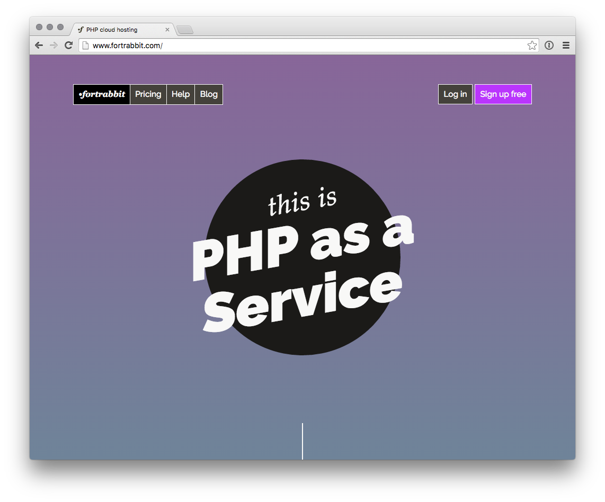

[Fortrabbit](http://www.fortrabbit.com) — secure like fort knox, fast like a rabbit — is a managed cloud hosting service dedicated for PHP. It supports a modern PHP development with micro-service oriented hosting infrastructure — perfect for Grav. Fortrabbit is a Platform as a Service — thus a bit different than traditional hosting.

## Sign up

To sign up to Fortrabbit you only need to verify your email address and set up password.

## Spin up an App

Choose a preset or configure single Component scalings on your own. Grav — without plugins — doesn't require huge amounts of RAM. Grav doesn't need a MySQL database — so deselected it. Start with the smallest plan and scale up when needed.

There is also **free trial** — which is feature complete but limited in time. Your App will be destroyed when the App is over. Then you can start a new trial. You can also ask to extend a trial.

## Install locally

First [download](https://getgrav.org/downloads) and unpack the latest Grav locally. It unpacks in the subfolder `grav`. You might configure your localhost to serve the grav site locally now.

## Deploy to Fortrabbit

Now you can push it. Change into the project folder and set it up with your Git remote on Fortrabbit:

[prism classes="language-bash command-line"]
$ cd grav
$ git init .
$ git remote add fortrabbit git@deploy.eu2.frbit.com:your-app.git
[/prism]

Before committing anything, you should exclude the `vendor/` and the `cache/` folder. Create the file `.gitignore` with the following contents:

[prism classes="language-text"]
vendor
cache/*
!cache/.gitkeep
[/prism]

Now you can add everything and push everything to your App:

[prism classes="language-bash command-line"]
$ git add -A
$ git commit -m 'Initial'
$ git push -u fortrabbit master
[/prism]

Done: The first deployment triggers a Composer install on remote which can take a few minutes. You can watch it build in the Git output stream. Now, your Grav site is online. Each App comes with an App URL (your-app.frb.io) which you can visit in the browser. 

Repeat: Craft your theme and contents locally and just push it to the Fortrabbit master branch to deploy. The second deploy will only take a few seconds.

### Further reading

That is just the basics visit the [Fortrabbit Grav install and tuning guide](http://help.fortrabbit.com/install-grav) to learn about themes, plugins and quirks.
