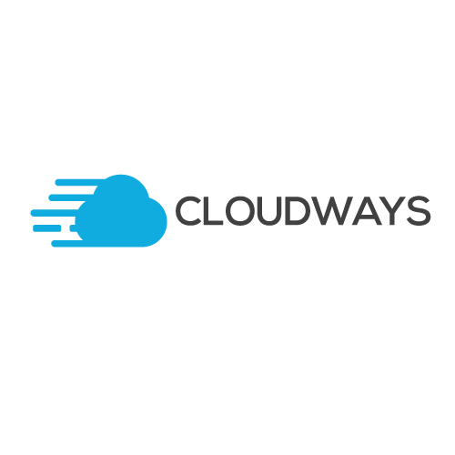

[Cloudways](http://www.cloudways.com) is a Managed Cloud Platform for PHP-based web apps. On Cloudways, you can choose your server from four cloud providers: DigitalOcean, Vultr, Google Cloud Engine (GCE) and Amazon Web Services (AWS) to run your PHP work on it. It allows user to launch cloud servers with minutes for PHP app development. Cloud server management is the job of Cloudways; you're only responsible for your Grav CMS application. 

Recently, Cloudways interviewed one of the [lead developer of Grav CMS Andy Miller](https://www.cloudways.com/blog/interview-andy-miller/).


## Signing Up On Cloudways
First [sign up for an account](https://platform.cloudways.com/signup) on Cloudways by using your GitHub account. If you do not want to use your Grav CMS credentials, you can create an account using a email address. After signing up on Cloudways and launching a PHP Stack application, follow these steps to install and run Grav CMS on your cloud server: 

## Installing And Running Grav On Cloudways
Login in SSH Terminal and move to your application public_html folder.

```bash
cd applications/<foldername>/public_html/
```

Go [Grav CMS download](https://getgrav.org/downloads) page and copy the download link. Now, go to the terminal and download it there by using the following command

```bash
wget https://github.com/getgrav/grav/releases/download/{{ grav_version }}/grav-admin-v{{ grav_version }}.zip
```

After downloading it, unzip the file.

```bash
unzip grav-admin-v{{ grav_version }}.zip
```

That’s it! Grav CMS is ready for your use on Cloudways PHP Hosting Platform. Head to your Application Staging URL and add /grav-admin at the end of the URL.