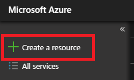
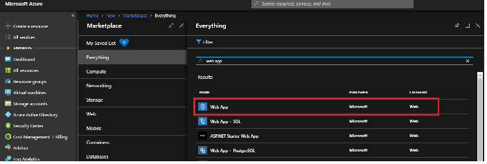
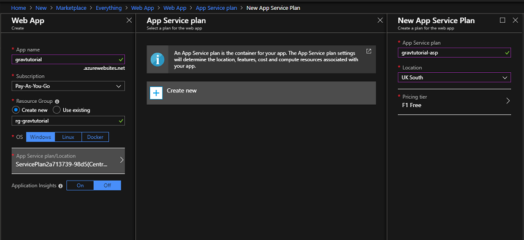
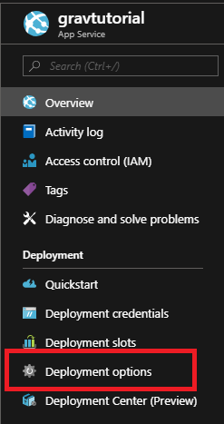

[Microsoft Azure](https://azure.microsoft.com) is an enterprise-grade cloud computing platform that is open and flexible.  There are multiple ways to deploy Grav within Azure however this tutorial will walk through using Azure's Web App (PaaS).

## Things you'll need

* An Azure Account
* Github Account
* A copy of Grav

## Signing Up On Azure
First [sign up for an account](https://azure.microsoft.com/en-gb/free/) on Azure, you will receive access to free services plus £150 (UK) in credit to use for the first 30 days. 

## Signing Up on GitHub
If you do not have a GitHub account set [please sign up for one](https://github.com/join?source=header-home), the free plan is sufficient. 

## Clone Grav Source Code
You need a copy of Grav in order to follow this tutorial, I would suggest downloading the basic Grav and Admin Plugin files, and creating a Github repository with those files 

You should now have all the necessary components to deploy a working copy of Grav within Azure. 

## Web.Config File

In addition to the Grav code you need a web.config file.  The web.config file is an XML file that sits in the root folder of the Web App and generally contains the main settings and configuration for Web App.  

An example web.config file is available [here](web.config).  This web.config file, covers off what the Web App should do with file formats such as *.woff* and *.woff2*, which are now part of the latest [Font Awesome packs](https://fontawesome.com).

Grav have also included examples of the web.config files in their source files, you can find them located in the *webserver-configs* folder. 

Once you have your web.config setup, you should upload this to your Grav GitHub repository, it needs to be at the root level. 

## Installing And Running Grav On Azure

### Setting Up Your Web App

+ The first step is to [login to the Azure Portal](https://portal.azure.com), click on *Create a Resource* on the left hand side menu. 

+ Search for *web app* and select the service

+ A new blade will open, describing the Web App service.  At the bottom of the page you will find a *create* button, when you initiate that another blade will open.  You will be asked several questions. 

    - The App Name will form part of the public URL your website will have when first created, 
    - The subscription is the plan your web app will be hosted within and where the payment for the service will come from
    - A resource group within Azure is a way of logically grouping your services, the name of this group is private and only you will see this
    - An Azure Web App can run on a Windows, Linux or Docker platform.  For Grav select Windows
    - The App Service Plan/Location determines which data centre your web app will reside in within Azure and the cost of it
    - Application Insights is the service on Azure that can help monitor your web app for issues and understand how your end users are interacting with it.  

My recommendation regarding the App Service Plan would be to select the Dev/Test F1 plan for testing purposes.  The plan has some limitations but it will give you the ability to deploy your first Grav site on Azure without incurring any costs.  In terms of the location I would select one that is close to your location.  Also in this example I would avoid deploying Application Insights as it needs coded in order to integrate with Grav. 

Your Web App should deploy within a few minutes. 

### Install Composer

Composer is a dependency manager for PHP. Composer will manage the dependencies you require on a project by project basis, meaning Composer will pull in all the required libraries, dependencies and for your application.  As Grav is a PHP application we need to ensure the Composer is installed on the Web App for Grav to run properly. 

In order to do this follow these steps:

    - Open up your Web App
    - Click on the Extensions setting
    - Click on Add
    - Select Composer
    - Click OK

Once Composer has installed on your Web App you are now ready to deploy your code. 

### Deploying Your Code

Now that your Web App is up and running and you have the code, it is time to deploy it.  To do that open up the Web App within the Azure Portal. 

+ Navigate to the *Deployment Options* blade 

+ Select GitHub as your source

+ You will be asked for credentials to your GitHub account and then presented with options about which repository and branch to pull from, select the options relevant for you

+ *Azure will now start to pull your code from GitHub, within a few minutes your site should be live*

## Additional Information 

### Custom Domain

If you wish to use your own website URL, please follow the [official documentation](https://docs.microsoft.com/en-gb/azure/app-service/app-service-web-tutorial-custom-domain).

### Always On

By default all Azure Web Apps are unloaded if they are idle for some period of time.  This is to help conserve resources. If you have selected a Basic or Standard plan you can enable the *Always On* mode, which will keep the app loaded all the time.  The Always On setting can be found within the *Application Settings* blade in your Web App. 

### Quotas

If you have selected one of the Free or Shared Web App Plans for your deployment you will be restricted in regards of storage space and compute resources you can use.  To monitor these settings you should monitor the *Quotas* blade. 
