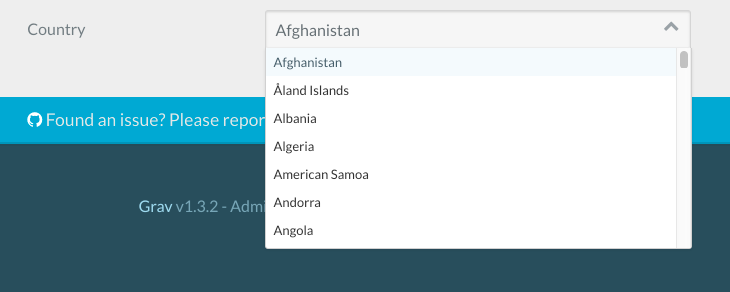

This page contains an assortment of problems and their respective solutions related to Grav Admin modifications.

## Add a custom YAML file

#### Problem:

You want to provide a site-wide group of user-editable company fields akin to `system.yaml` or `site.yaml`, but in its own dedicated file.

#### Solution:

As outlined in the [Basics / Configuration](/basics/grav-configuration#other-configuration-settings-and-files) section, the first step is to provide your new YAML data file, for example: `user/config/details.yaml`:

[prism classes="language-yaml line-numbers"]
name: 'ABC Company Limited'
address: '8732 North Cumbria Street, Golden, CO, 80401'
email:
  general: 'hello@abc-company.com'
  support: 'support@abc-company.com'
  sales: 'sales@abc-company.com'
phone:
  default: '555-123-1111'
[/prism]

Now you need to provide the appropriate blueprint file to define the form.  The blueprint can be provided by a plugin, but the simplest approach is to simply put the blueprint in a file: `user/blueprints/config/details.yaml`

If you wanted to provide the blueprint via a plugin, you would first need to add this code to your plugin right after the class definition:

[prism classes="language-twig line-numbers"]
class MyPlugin extends Plugin
{
    public $features = [
        'blueprints' => 1000,
    ];
    protected $version;
    ...
[/prism]

Then add this code to your `onPluginsInitialized()` method:

[prism classes="language-twig line-numbers"]
if ($this->isAdmin()) {
    // Store this version and prefer newer method
    if (method_exists($this, 'getBlueprint')) {
        $this->version = $this->getBlueprint()->version;
    } else {
        $this->version = $this->grav['plugins']->get('admin')->blueprints()->version;
    }
}
[/prism]

Then create a file called `user/plugins/myplugin/blueprints/config/details.yaml`

The actual blueprint file should contain a form definition that matches the configuration data:

[prism classes="language-yaml line-numbers"]
title: Company Details
form:
    validation: loose
    fields:

        content:
            type: section
            title: 'Details'
            underline: true
        name:
            type: text
            label: 'Company Name'
            size: medium
            placeholder: 'ACME Corp'

        address:
            type: textarea
            label: 'Address'
            placeholder: '555 Somestreet,\r\nNewville, TX, 77777'
            size: medium

        email:
            type: array
            label: 'Email Addresses'
            placeholder_key: Key
            placeholder_value: Email Address

        phone:
            type: array
            label: 'Phone Numbers'
            placeholder_key: Key
            placeholder_value: Phone Number
[/prism]

The use of the `array` field type will let you add arbitrary email and phone fields as you need them.

## Add a custom page creation modal

#### Problem:

You want to provide an easy way to create a new blog post or gallery image page. We will go with the blog post for this example. Assume you want to make a blog and easily create a blog post in the correct folder by clicking a button.

#### Solution:

First of all, create the form for our modal. Create a new file: `user/blueprints/admin/pages/new_post.yaml`.

[prism classes="language-twig line-numbers"]
form:
  validation: loose
  fields:
    section:
        type: section
        title: Add Post

    title:
      type: text
      label: Post Title
      validate:
        required: true

    folder:
      type: hidden
      default: '@slugify-title'

    route:
      type: hidden
      default: /posts

    name:
      type: hidden
      default: 'post'

    visible:
      type: hidden
      default: ''

    blueprint:
      type: blueprint
[/prism]

This form mimics the default `Add Page` modal's form. For the **folder** as you can see we have a special value: `@slugify-title`. This means that the **folder** will default to the slugified version of the **title** form input. **route** is `/posts` so it will put it into the `/posts` folder.

**name** is `post` so it will use the `post` page blueprint.

Second step is to edit the configuration of the Admin plugin. To add custom code to the configuration file `admin.yaml` of the Admin Plugin, create the file `user/config/plugins/admin.yaml`and add this snippet:

[prism classes="language-twig line-numbers"]
add_modals:
  -
    label: Add Post
    blueprint: admin/pages/new_post
    show_in: bar
[/prism]

Configuration keys/values available for `add_modals`:

- `label` - text to be shown in the button
- `show_in` (default: bar) (values: bar|dropdown) - whether to show the button in the **bar** or **dropdown**
- `blueprint` - blueprint used by the template
- `template` - template used by the modal (default: partials/blueprints-new.html.twig)
- `with` - data which is passed to the template
- `link_classes` - classes to add to the link element
- `modal_classes` - classes to add to the modal element

## Add a custom select field

#### Problem:

You want to add a select field with a large list of values. In this example, we will assume you want to display a list of countries.

#### Solution:

You can create a static function and call the array from within your blueprint. You can code this function either in your theme's php file, or in a custom plugin.

In this example, we will add the function to the Antimatter theme, we will thus edit the `antimatter.php` file which is in the `user/themes/antimatter` folder.

[prism classes="language-php line-numbers"]
<?php
namespace Grav\Theme;

use Grav\Common\Theme;

class Antimatter extends Theme
{
    public static function countryCodes()
    {
        return array (
            'AF' => 'Afghanistan',
            'AX' => 'Åland Islands',
            'AL' => 'Albania',
            'DZ' => 'Algeria',
            'AS' => 'American Samoa',
            'AD' => 'Andorra',
            'AO' => 'Angola',
            'AI' => 'Anguilla',
            'AQ' => 'Antarctica',
            'AG' => 'Antigua & Barbuda',
            'AR' => 'Argentina',
            'AM' => 'Armenia',
            'AW' => 'Aruba',
            'AC' => 'Ascension Island',
            'AU' => 'Australia',
            'AT' => 'Austria',
            'AZ' => 'Azerbaijan',
            'BS' => 'Bahamas',
            'BH' => 'Bahrain',
            'BD' => 'Bangladesh',
            'BB' => 'Barbados',
            'BY' => 'Belarus',
            'BE' => 'Belgium',
            'BZ' => 'Belize',
            'BJ' => 'Benin',
            'BM' => 'Bermuda',
            'BT' => 'Bhutan',
        );
    }
}
[/prism]

! This is a trimmed-down list for easy viewing but you can copy/paste the full country list from [<i class="fa fa-github"></i>umpirsky/count-list](https://github.com/umpirsky/country-list/blob/master/data/en_US/country.php)

Then, we call the function from a blueprint or a frontend form definition like this:

[prism classes="language-yaml line-numbers"]
country:
  type: select
  label: Country
  data-options@: '\Grav\Theme\Antimatter::countryCodes'
[/prism]

Here is how it will look in the admin

