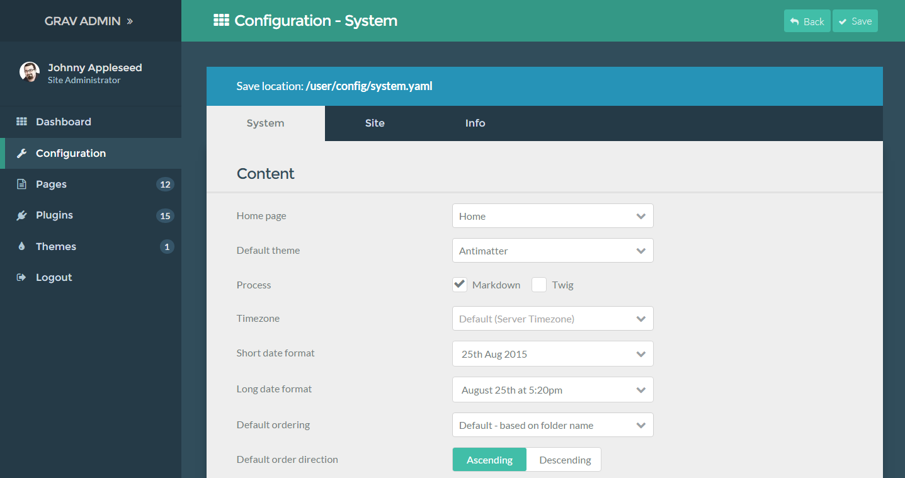
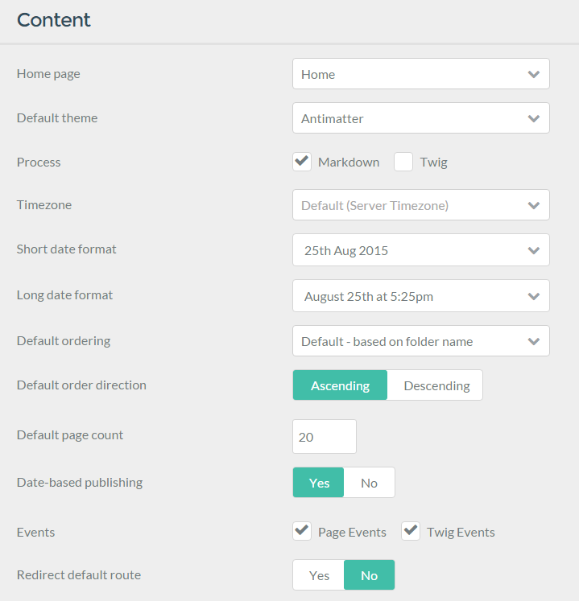
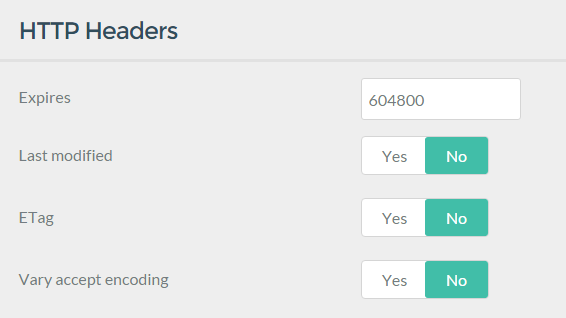
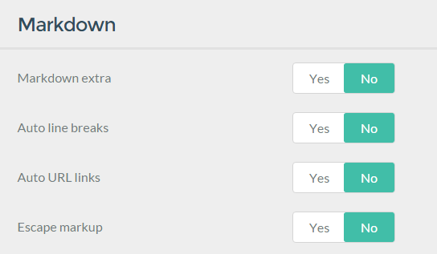
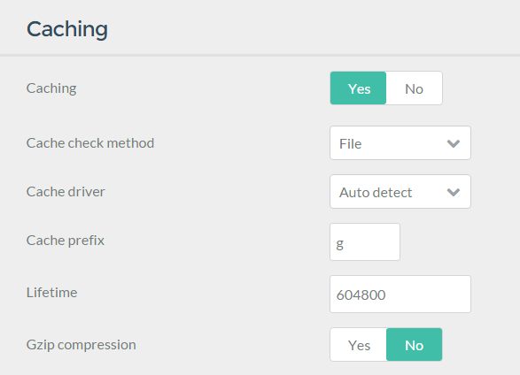
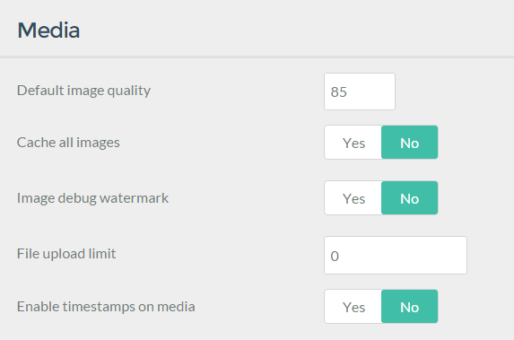
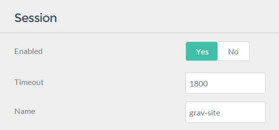

The **Configuration** page gives you access to your site's **System** and **Site** configuration settings. Additionally, you can view a breakdown of your server's properties in a number of areas including PHP, SQL, server environment, and other various components that determine how your site operates.

The **System** tab enables you to customize the settings found in the `/user/config/system.yaml` file. These settings affect how many of the primary system-related features of Grav operate. The site's home page, caching settings, and more can be configured here.

These settings are separated into several sections, each focusing on a specific aspect of Grav's operation.

Below is a breakdown of the different configuration sections that appear in the **System** tab.

## Content

This section is where you set the basic properties of content handling for your site. The home page, default theme, and various other content display options are set here.

| Option                  | Description                                                                |
| :-----                  | :-----                                                                     |
| Home Page               | Select the page you wish to have appear as the home page for your site.    |
| Default Theme           | Sets the primary default theme used in your site.                          |
| Process                 | Control how pages are processed. Can be set per-page rather than globally. |
| Timezone                | Override the default timezone the server.                                  |
| Short Date Format       | Set the short date format that can be used by themes.                      |
| Long Date Format        | Set the long date format that can be used by themes.                       |
| Default Ordering        | Pages in a list will render using this order unless it is overridden.      |
| Default Order Direction | The direction of pages in a list.                                          |
| Default Page Count      | Default maximum pages count in a list.                                     |
| Date-based Publishing   | Automatically (un)publish posts based on their date.                       |
| Events                  | Enable or Disable specific events.  Disabling these can break plugins.     |
| Redirect Default Route  | Automatically redirect to a page's default route.                          |

## Languages

Multilanguage features are set in this section.

| Option                         | Description                                                               |
| :-----                         | :-----                                                                    |
| Supported                      | Comma separated list of 2 letter language codes (for example 'en,fr,de'). |
| Translations Enabled           | Support translations in Grav, plugins and extensions.                     |
| Translations Fallback          | Fallback through supported translations if active language doesn't exist. |
| Active Language in Section     | Store the active language in the session.                                 |
| Home Redirect Include Language | Include language in home redirect (/en).                                  |
| Home Redirect Include Route    | Home redirect include route.                                              |

## HTTP Headers

HTTP header options can be set in this section. This is useful for browser-based caching and optimization.

| Option               | Description                                                                     |
| :-----               | :-----                                                                          |
| Expires              | Sets the expires header. The value is in seconds.                               |
| Last Modified        | Sets the last modified header that can help optimize proxy and browser caching. |
| ETag                 | Sets the etag header to help identify when a page has been modified.            |
| Vary Accept Encoding | Sets the *Vary: Accept Encoding* header to help with proxy and CDN caching.     |

## Markdown

Markdown makes up the bulk of Grav's page content. This section gives you options to enable Markdown Extra, as well as to set how Grav handles Markdown.

| Option           | Description                                                                                   |
| :-----           | :-----                                                                                        |
| Markdown Extra   | Enable default support for [Markdown Extra](https://michelf.ca/projects/php-markdown/extra/). |
| Auto Line Breaks | Enable support for automatic line breaks in markdown.                                         |
| Auto URL Links   | Enable automatic conversion of URLs into HTML hyperlinks.                                     |
| Escape Markup    | Escape markup tags into HTML entities.                                                        |

## Caching

Grav's integrated caching feature helps make it one of the fastest flat-file CMS options out there. You can configure your site's primary caching functions in this section.

| Option             | Description                                                                                 |
| :-----             | :-----                                                                                      |
| Caching            | Global ON/OFF switch to enable/disable Grav caching.                                        |
| Cache Check Method | Sets the cache check method. The options are **File**, **Folder**, and **None**.            |
| Cache Driver       | Choose which cache driver Grav should use. 'Auto Detect' attempts to find the best for you. |
| Cache Prefix       | An identifier for part of the Grav key.  Don't change unless you know what your doing.      |
| Lifetime           | Sets the cache lifetime in seconds. 0 = infinite.                                           |
| Gzip Compression   | Enable GZip compression of the Grav page for increased performance.                         |

## Twig Templating

This section focuses on Grav's Twig templating feature. You can set Twig caching, debug, and change detection settings here.

| Option               | Description                                                                                   |
| :-----               | :-----                                                                                        |
| Twig Caching         | Control the Twig caching mechanism. Leave this enabled for best performance.                  |
| Twig Debug           | Allows the option of not loading the Twig Debugger extension.                                 |
| Detect Changes       | Twig will automatically recompile the Twig cache if it detects any changes in Twig templates. |
| Autoescape Variables | Autoescapes all variables. This will break your site most likely.                             |

## Assets

This section deals with assets handling, including CSS and JavaScript assets.

| Option                      | Description                                                                     |
| :-----                      | :-----                                                                          |
| CSS Pipeline                | The CSS pipeline is the unification of multiple CSS resources into one file.    |
| CSS Minify                  | Minify the CSS during pipelining.                                               |
| CSS Minify Windows Override | Minify Override for Windows platforms. False by default due to ThreadStackSize. |
| CSS Rewrite                 | Rewrite any CSS relative URLs during pipelining.                                |
| JavaScript Pipeline         | The JS pipeline is the unification of multiple JS resources into one file.      |
| JavaScript Minify           | Minify the JS during pipelining.                                                |
| Enable Timestamps on Assets | Enable asset timestamps.                                                        |
| Collections                 | Add individual asset collections.                                               |

## Error Handler

You can set how Grav handles error reporting and display here. This is a useful tool to have during site development.

| Option        | Description                              |
| :-----        | :-----                                   |
| Display Error | Display full backtrace-style error page. |
| Log Errors    | Log errors to /logs folder.              |

## Debugger

Like error handling, Grav's integrated debugging tools give you the ability to locate and troubleshoot issues. This is especially useful during development.

| Option                    | Description                                                            |
| :-----                    | :-----                                                                 |
| Debugger                  | Enable Grav debugger and following settings.                           |
| Debug Twig                | Enable debugging of Twig templates.                                    |
| Shutdown Close Connection | Close the connection before calling onShutdown(). false for debugging. |

## Media

This section determines how Grav handles media content. Image quality, file upload size limits, and other media handling options are configured here.

| Option                     | Description                                                                                               |
| :-----                     | :-----                                                                                                    |
| Default Image Quality      | Default image quality to use when resampling or caching images (85%).                                     |
| Cache All Images           | Run all images through Grav's cache system even if they have no media manipulations.                      |
| Image Debug Watermark      | Show an overlay over images indicating the pixel depth of the image when working with retina for example. |
| File Upload Limit          | Set maximum upload size in bytes (0 is unlimited).                                                        |
| Enable Timestamps on Media | Appends a timestamp based on last modified date to each media item.                                       |

## Session

This section gives you the ability to enable session support, set timeout limits, and the name of the session cookie used to handle this information.

| Option  | Description                                                |
| :-----  | :-----                                                     |
| Enable  | Enable session support within Grav.                        |
| Timeout | Sets the session timeout in seconds.                       |
| Name    | An identifier used to form the name of the session cookie. |

## Advanced

This section contains advanced system options.

| Option              | Description                                                                |
| :-----              | :-----                                                                     |
| Absolute URLs       | Absolute or relative URLs for `base_url`.                                  |
| Parameter Separator | Separater for passed parameters that can be changed for Apache on Windows. |