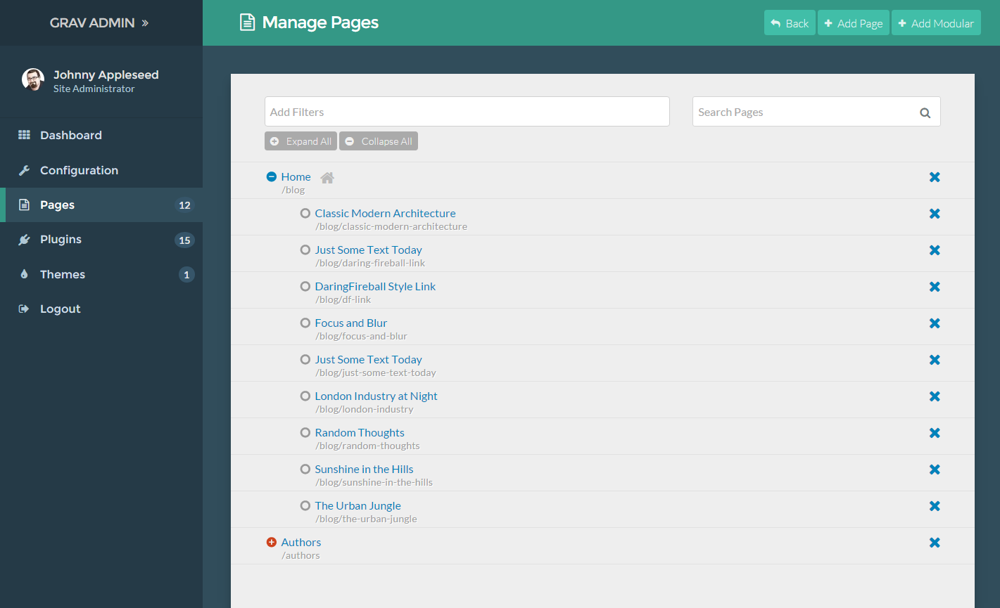
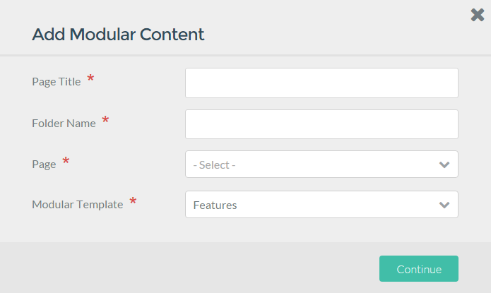
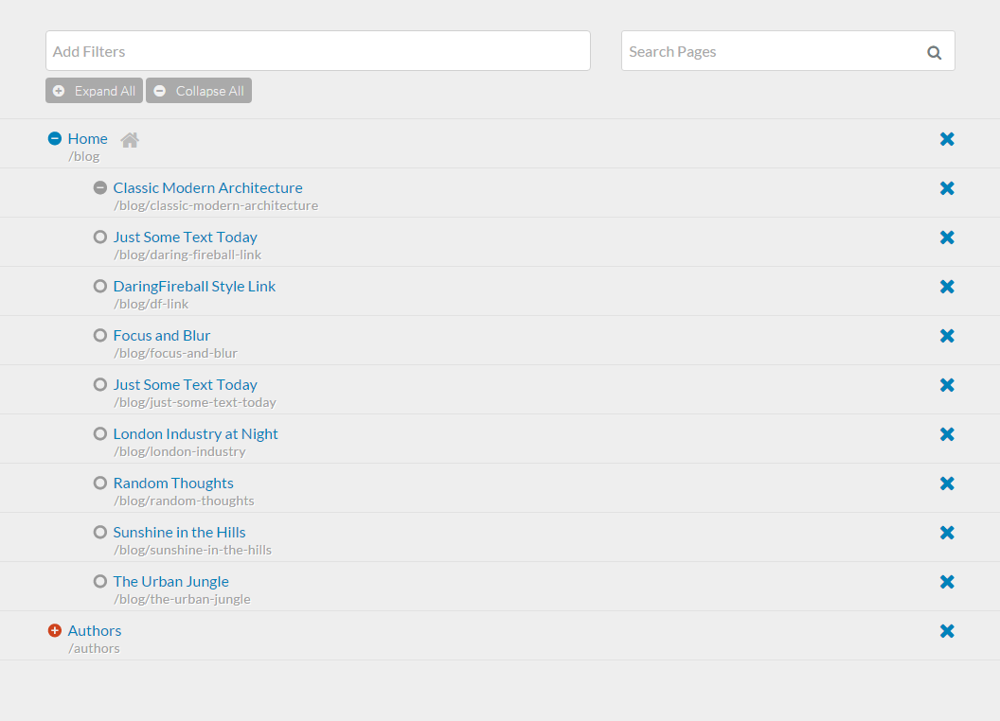

The **Pages** page gives you quick editorial access to your site's content. This is where you can access a page's editor, delete pages, create new pages, and find out if a page is visible at a glance.

If you frequently create or modify content on your site, this area of the admin will become very familiar to you.

## Adding New Pages

Three buttons line the top of the **Pages** administrative panel. The **Back** button sends you back to the **Dashboard**, while the **Add Page** and **Add Modular** buttons initiate the creation of new pages for your site.

Below, we break down the options available when you select these buttons.

### Add Page

The **Add Page** button creates a non-modular page for your site. Once selected, a popup will appear enabling you to enter a **Title** and **Folder Name**, assign a **Parent Page** and **Display Template**, as well as to set whether the page should be visible or hidden.

| Option           | Description                                                                                                                                                                                                                                                                             |
| :-----           | :-----                                                                                                                                                                                                                                                                                  |
| Page Title       | This is where you enter the title of the page you are creating.                                                                                                                                                                                                                         |
| Folder Name      | You can set a custom folder name for the page, or keep the automatically-generated one based on the title.                                                                                                                                                                              |
| Parent Page      | This sets the parent page for the new page. Can be a child of another page (such as home or blog) or set to the root of your site.                                                                                                                                                      |
| Display Template | You can choose which theme-provided template you wish to have applied to the page.                                                                                                                                                                                                      |
| Visible          | Sets whether or not you want the page to be visible in navigation. Can be set to **Auto** to have this be determined for you. In the auto setting, if there is another sibling page that uses a numeric prefix, it uses one and is therefore visible. Otherwise, it doesn't display it. |

Once you have filled out this information, selecting **Continue** will take you to the new page's editor. We will cover the Page Editor in more detail in [a following guide](../page-editor).

>>> Whether a page is visible or not in these settings only has an affect on navigation. A page's ability to be visited by a browser is determined in the page's 

### Add Modular Page

The second button along the top of the **Pages** area of the admin allows to to add a modular subpage to your site. Modular pages are different from regular pages because they are actually a collection of pages, arranged and displayed as one page. This button specifically gives you the ability to create subpages and assign them to a parent modular page.

Here is a breakdown of the fields and options that appear in the **Add Modular Page** button's popup.

| Option           | Description                                                                                                        |
| :-----           | :-----                                                                                                             |
| Page Title       | Sets a title for the modular page.                                                                                 |
| Folder Name      | You can set a custom folder name for the page, or keep the automatically-generated one based on the title.         |
| Page             | Sets the parent page for the new modular subpage. This is the page your new modular page's content will appear on. |
| Modular Template | Displays a list of templates provided by the theme for modular pages you can choose from for the new page.         |

Once you have filled out this information, selecting **Continue** will take you to the new page's editor. We will cover the Page Editor in more detail in [a following guide](../page-editor).

## Pages List

The pages list that appears in this area gives you quick access to all of your current pages, as well as an at-a-glance method for seeing whether or not the pages are visible.

Selecting the title of any page will take you directly to that page's editor. The big **X** icon to the right of each page enables you delete the page.

If you hover over the icon directly to the left of a page, it will tell you its current status. For example, it may say **Page • Routable • Visible** if a page is routable (visible via the URL) and visible (appears in navigation menus).

You can **filter** and **search** your pages to make it easy to find the exact page you're looking for. For example, using the **Add Filters** option, you can filter pages by type so that only **Modular**, **Visible**, and/or **Routable** pages appear in the list.

If you have a specific page title (or part of a title) in mind, you can use the search bar to quickly find the specific page you're looking for.