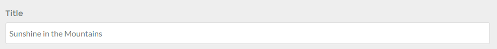
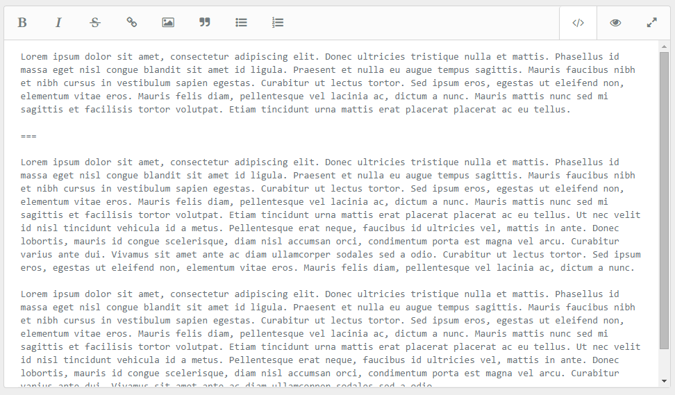

The **Page Editor** in the admin is a powerful text editor and page manager that enables you to create your page's content (including media files), its publishing and taxonomy options, settings, overrides, and theme-specific options.

It's essentially a one-stop-shop for managing a specific page.

Tabs that appear in the **Page Editor** are not universal. There are a default set of form fields that are commonly found in Grav themes, however these can vary between themes. The admin pulls form field information from a number of sources including the theme and the template used for the specific page.

>>> The tabs and options represented in this documentation are by default. Theme developers have the ability to add their own options to these tabs, or even to do away with these tabs and replace them with something entirely different. We are documenting a common-case scenario based on the Antimatter theme to serve as an example.

In this page, we will go over the features and functionality found in the **Content** tab of the **Page Editor**.

## Controls

Along the top of the page, you will find the administrative controls that enable you to save, delete, copy, and move your page. Additionally, you can hit the **Back** button to get back to the main **Pages** area of the admin.

The **Save** and **Delete** buttons are pretty self-explanatory. They save and delete the currently-accessed page, respectively. 

Selecting the **Move** button activates a popup that gives you the ability to assign a new parent to the page. You have the same option in the **Advanced** tab.

**Copy** creates a duplicate of your current page, appending a `-2` to the end of the folder name. You can change both the folder name and title as you see fit.

## Title

The title of a page is typically set during that page's correction, however you can edit it after the fact here. Note that changing the page's title here will not have a direct impact on the folder name (which is used for navigation purposes) but it will change what people see on the front end.

## Page Editor Content

This is the heart of the Page Editor. It is where your page's content body is written and edited. It features many powerful tools typically only found in premium browser-based text editors.

For example, you can switch between edit and preview views using the <i class="fa fa-code"></i> and <i class="fa fa-eye"></i> buttons located in the upper-right area of the editor. 

Because Grav's content is primarily based in markdown, the editing shortcuts automatically append markdown tags to your content. For example, highlighting a block of text and selecting the **B** icon surrounds the highlighted area with `**(selected area)**` bold tags.

Here is a breakdown of the tools found in the content editor:

| Tool                                      | Description                                       |
| :-----                                    | :-----                                            |
| <i class="fa fa-fw fa-bold"></i>          | Adds **Bold** tags to your content.               |
| <i class="fa fa-fw fa-italic"></i>        | Adds *Italic* tags to your content.               |
| <i class="fa fa-fw fa-strikethrough"></i> | Adds ~~Strikethrough~~ tags to your content.      |
| <i class="fa fa-fw fa-link"></i>          | Adds [links](http://getgrav.org) to your content. |
| <i class="fa fa-fw fa-picture-o"></i>     | Adds media to your content.                       |
| <i class="fa fa-fw fa-quote-right"></i>   | Adds quote tags to your content.                  |
| <i class="fa fa-fw fa-list-ul"></i>       | Creates an unordered list.                        |
| <i class="fa fa-fw fa-list-ol"></i>       | Creats an ordered list.                           |
| <i class="fa fa-fw fa-code"></i>          | Activates the edit view.                          |
| <i class="fa fa-fw fa-eye"></i>           | Activates the content preview.                    |
| <i class="fa fa-fw fa-expand"></i>        | Toggles to a full-page edit or preview view.      |

## Page Media

The **Page Media** section at the bottom of the **Content** tab is all about media files for your page. These files exist in the same folder as the page's markdown file. Uploading new media files is as simple as clicking (or tapping) in the white area of the section. This will bring up a file selector that enables you to pick files for upload.

Already have media files you'd like to insert into your page? Just move your mouse cursor over the image thumbnail and select **Insert**. This will insert the media directly into your page's content.

You can also delete media files by selecting **Delete**.