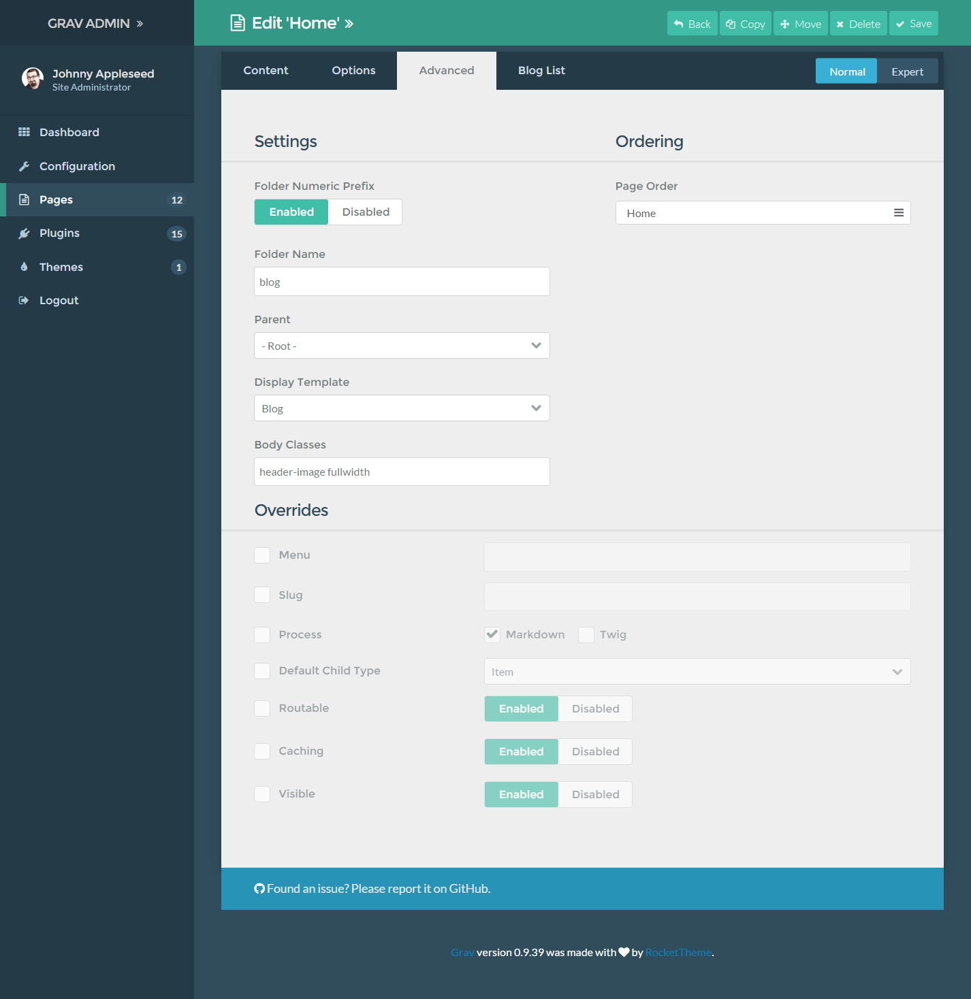

The **Page Editor** in the admin is a powerful text editor and page manager that enables you to create your page's content (including media files), its publishing and taxonomy options, settings, overrides, and theme-specific options.

It's essentially a one-stop-shop for managing a specific page.

In this page, we will go over the features and functionality found in the **Advanced** tab of the **Page Editor**. 

>>>>> You might notice the check boxes to the left of some of the options in this area of the admin. These boxes indicate that you would like to override the default values for this page. Leaving them unchecked reverts to blank or default states.

## Settings

The **Settings** area focuses on various critical options for your page. This is where you would go to change the name of the folder the page is stored in, its parent, and the template used when displaying the page. 

| Option                | Description                                                                                                                      |
| :-----                | :-----                                                                                                                           |
| Folder Numeric Prefix | Numeric prefix that provides manual ordering and implies visibility.                                                             |
| Folder Name           | Sets the name of the folder the page is contained in.                                                                            |
| Parent                | Sets the parent of the current page. This can be - Root- for top-level pages, or specific pages to have them appear as subpages. |
| Display Template      | Sets the template (provided by the theme) to be applied to the page. This has a direct affect on how the page looks.             |
| Body Classes          | Classes entered in this field are applied to the body of the page.                                                               |

## Ordering

The **Ordering** section gives you the ability to configuring page ordering of non-numbered folders.

| Option     | Description                                         |
| :-----     | :-----                                              |
| Page Order | Enables you to configure the ordering for the page. |

## Overrides

Overrides are those options that give your page extra functionality, set its slug to something different than the default one based on the folder name, caching settings, navigation visibility, and make a page unreachable via a direct URL.

You can also use this area to turn on and off various processes for the page, such as twig which enables you to inject twig into your page content and have it render.

| Options                | Description                                                                                                        |
| :-----                 | :-----                                                                                                             |
| Menu                   | The string to be used in a menu.  If not set, <b>Title</b> will be used.                                           |
| Slug                   | The slug variable allows you to specifically set the page's portion of the URL.                                    |
| Process                | Processes you would like to have run, and made available in the page's content.                                    |
| Default Child Template | Sets a default page type for child pages.                                                                          |
| Routable               | Sets whether or not this page is reachable by a URL. If disabled, the page will not be reachable on the front end. |
| Caching                | Enables or disables caching for the page.                                                                          |
| Visible                | Determines if a page is visible in the navigation.                                                                 |
