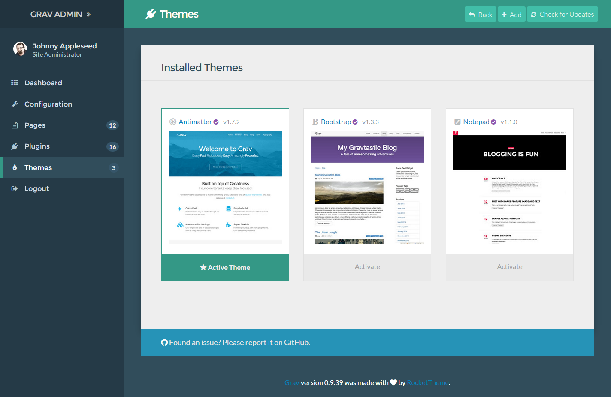
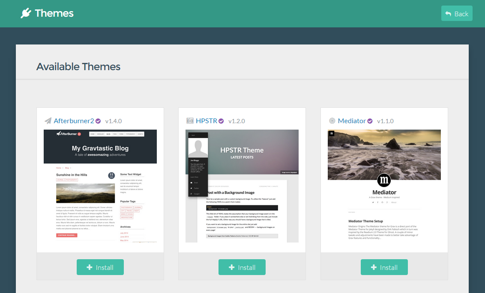

 

The **Themes** in the admin is where you can go to add and manage your site's themes.

In this page, we will explore how to manage existing themes, and add a new one to your site.

## Controls

Along the top of the **Themes** area of the admin, you will find the <i class="fa fa-reply"></i> **Back**, <i class="fa fa-plus"></i> **Add**, and <i class="fa fa-refresh"></i> **Check for Updates** buttons.

<i class="fa fa-reply"></i> **Back** simply takes you back to either the **Dashboard** or to the main **Themes** page if you are deeper into that area of the admin.

<i class="fa fa-refresh"></i> **Check for Updates** checks your presently-installed themes for any updates.

### Adding a New Theme

<i class="fa fa-plus"></i> **Add** pulls up a display of currently-available Grav themes you can add to your site. This is a quick and easy way to install a new theme. Simply select the <i class="fa fa-plus"></i> **Install** button to install the theme. 

Doing so will take you to the themes **Information** panel which contains more detailed information about the theme, as well as any options set in the theme's *blueprints* file. Once you are satisfied with any settings changes, simply select the <i class="fa fa-check"></i> **Save** button to save your changes.

You can also delete the theme from your site by selecting the red <i class="fa fa-fw fa-warning"></i> **Remove Theme** button in the bottom-right area of the panel.

## Installed Themes

The **Installed Themes** section displays your currently-installed themes. Selecting the thumbnail of a theme takes you to the information page for that theme, while the gray **Activate** button at the bottom of each thumbnail gives you the ability to set that theme as the active default theme for your site.

The currently-active theme is indicated by the <i class="fa fa-star"></i> **Active Theme** icon.

At the top of each thumbnail you will see the name and current version number of each theme. The purple <i class="fa fa-check-circle"></i> check icon indicates that a theme was created by the Grav theme. Themes without that icon are created and maintained by third-party developers.