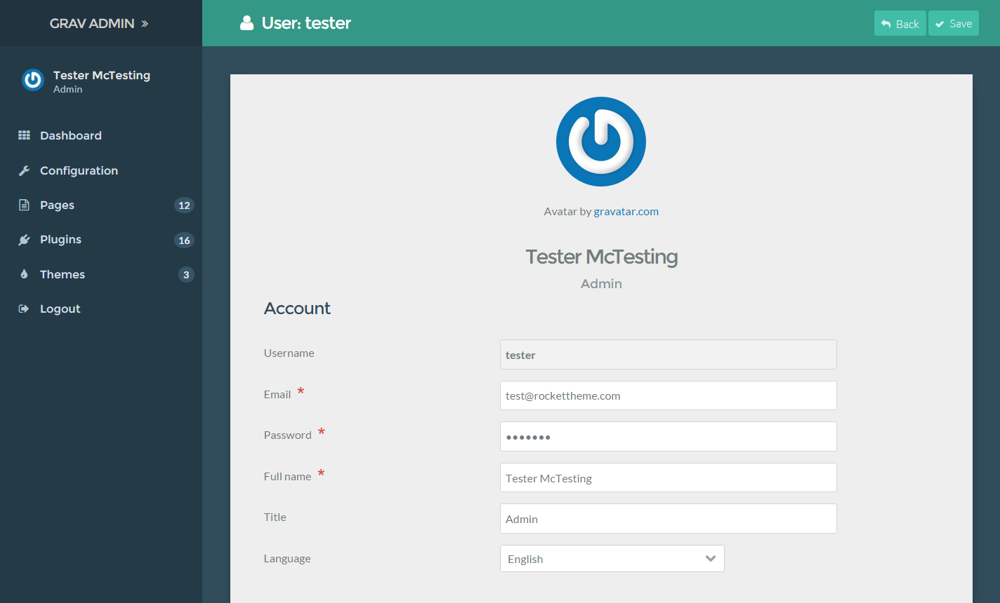

This FAQ is intended to provide useful tutorials, tips, and tricks to help you get the most out of the Grav Admin plugin.

## Adding and Managing Users

Adding new users to the Grav Admin is actually pretty simple, but it requires a bit of work in the terminal/command prompt to do. From your terminal, access the root of the Grav site you'd like to add users to, and type the following command:

```text
bin/grav newuser
```


This will initiate a series of prompts to guide you through the creation of a new user. These include creating a user name, password, email address, and setting the new user's permissions level.

>>>> You will need to have a user name consisting of between 3 and 16 characters which can include lowercase letters, numbers, underscores, and hyphens. Uppercase letters, spaces, and special characters are not allowed for the user name.

At one point during the creation process you will be asked to choose a set of permissions for the new user. There are currently three options:

| Role(s)        | Description                                                                                                       |
| :-----         | :-----                                                                                                            |
| Admin          | Gives the user access to the Grav Admin back end. This role does not include front end access to protected pages. |
| Site           | Gives user access to all pages in the front end. This is the equivalent of a logged-in user.                      |
| Admin and Site | Gives user access to the entire site, front and back end.                                                         |

User data is stored in `SITE_ROOT/users/accounts/` and each user is given a **YAML** file containing that users login information and other details. Here is an example of the data contained within a user account file:

```yaml
email: test@rockettheme.com
access:
  admin:
    login: true
    super: true
  site:
    login: true
fullname: 'Tester McTesting'
title: Admin
hashed_password: $2y$10$5RAUI6ZCISWR.4f0D6FILu3efYq3078ZX/.9vtAnZbjxS/4PXN/WW
```

You can edit this information directly to the user's YAML file, or by selecting your user avatar from the sidebar of the admin. This will take you to a page where you can easily manage user information.



>>> Avatar photos are automatically generated by [Gravatar](http://gravatar.com), based on the user's email address.

For security reasons, user passwords are stored as a hash. If you would like to change your password, we recommend doing so from within the admin.