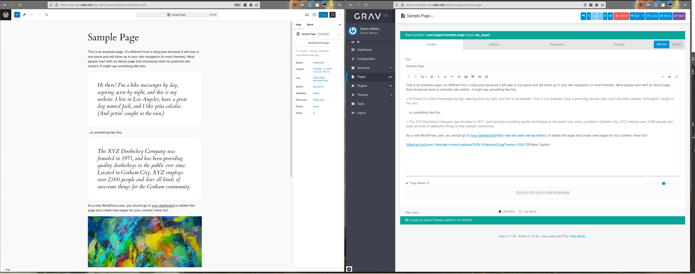
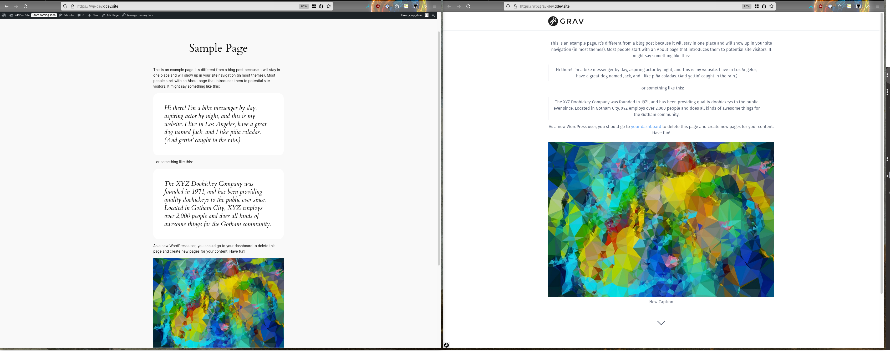

# Migrating from WordPress to Grav

## Requirements

* PHP v7.1 or above for the composer dependencies.
* [WP-CLI](https://wp-cli.org/) installed on the WordPress host
* Working WordPress site from which content will be exported.
* R/W access to `wp-content/uploads` on the WordPress site.
* [Composer](https://getcomposer.org/) installed on the Grav host.

## Installation

1. Download the latest release of the [wp2grav_exporter](https://github.com/jgonyea/wp2grav_exporter/releases) plugin and upload it to your WordPress's `wp-content/plugins` directory.
2. Run `composer install --no-dev` within the `wp2grav_exporter` directory to install dependencies.
3. Enable the new plugin:
   - Using wp-cli: `wp plugin activate wp2grav_exporter`, or - Via the admin GUI.
4. Run `wp wp2grav-all` to export all items.  See other options below.
5. Exported files are located at `WP_ROOT/wp-content/uploads/wp2grav-exports/DATE`
6. For Grav v1.6 sites, [https://github.com/david-szabo97/grav-plugin-admin-addon-user-manager](admin-addon-user-manager) is recommended to view and manage users.  This is not required for Grav 1.7+ sites.

## Notes

> Running `wp wp2grav-all` will run each of the following export steps at once.  Afterwards, follow each section below on how to import the new data to a Grav install.

## Exporting Users from WordPress

WordPress users on left exported to Grav on the right.

### Command

`wp wp2grav-users` will generate Grav user account files.

### Results

* User accounts in the export directory under `EXPORT/accounts/`.
  * Usernames will be padded to a minimum of 3 characters, maximum of 16.
  * If a username is truncated or padded, the username will also have the WordPress uid to avoid collisions.
  * Passwords in each account are randomly generated, and have no connection with the respective WordPress account.  The plaintext password automatically converts to a hashed_password once the account authenticates for the first time.

### Importing Users to Grav

Copy the `EXPORT/accounts` directory to your `user` directory (e.g. username.yaml files should be placed at `user/accounts`).

## Exporting User Roles from WordPress

WordPress users with roles on left exported to Grav groups on the right.

### Command

`wp wp2grav-roles` will generate a Grav groups.yaml file.

### Results

WordPress user roles export as Grav groups in a `groups.yaml` file at `config/groups.yaml`. Some notes about the role exporting:

* Each WordPress role is converted to the Grav group `wp_<ROLE_WITH_UNDERSCORES>` (e.g. `subscriber` becomes `wp_subscriber`).
* WordPress users with administrator roles receive the `wp_administrator` group.
* The `wp_administrator` group receives `admin.super` access along with `admin.login` access.  Accounts with these permissions are full admins on the site!
* A new Grav group called `wp_authenticated_user` group receives `admin.login` access.
* All accounts receive the "wp_authenticated_user" group.

### Importing User Roles

Copy the `EXPORT/config` directory to `users/config`.

## Exporting Post Types from WordPress

WordPress post types are converte to Grav page types, with a pre-pended "WP" in front of each type (highlighted in yellow here).

### Command

* `wp wp2grav-post-types` will generate a basic Grav plugin, along with page types that match the WordPress post types.

### Results

* A Grav plugin will be generated that will present basic field functionality within the Admin tool.

### Importing Post Types to Grav
* Copy the `EXPORT/plugins` directory to your `user` directory
* Navigate to the Grav plugin directory `user/plugins/wordpress-exporter-helper` and run `composer install`.

## Exporting Posts from WordPress

Admin view of WordPress "Sample Page" on left exported to Grav markdown on the right.

User view of WordPress "Sample Page" on left exported and rendered via Grav on the right.

### Command

* `wp wp2grav-posts` will export all posts.

### Results

* Each post/page will be exported to directories matching metadata from the post, typically the post/ page title.
* Library media will be copied to the `data/wp-content` and in-line content will (eventually) be included within the page's directory.

### Importing Posts to Grav

* Copy the `EXPORT/pages` directory to your `user` directory
* Copy the `EXPORT/data` directory to your `user` directory

## Exporting Site metadata from WordPress

Admin view of WordPress General Settings on left exported to Grav Site Config on the right.

### Command

* `wp wp2grav-site` will export site metadata.

### Results

* Grav site metadata is stored in `EXPORT/config/site.yaml`.

### Importing Site metadata to Grav

* Copy the `EXPORT/config/site.yaml` directory to Grav at `user/config/site.yaml`.
