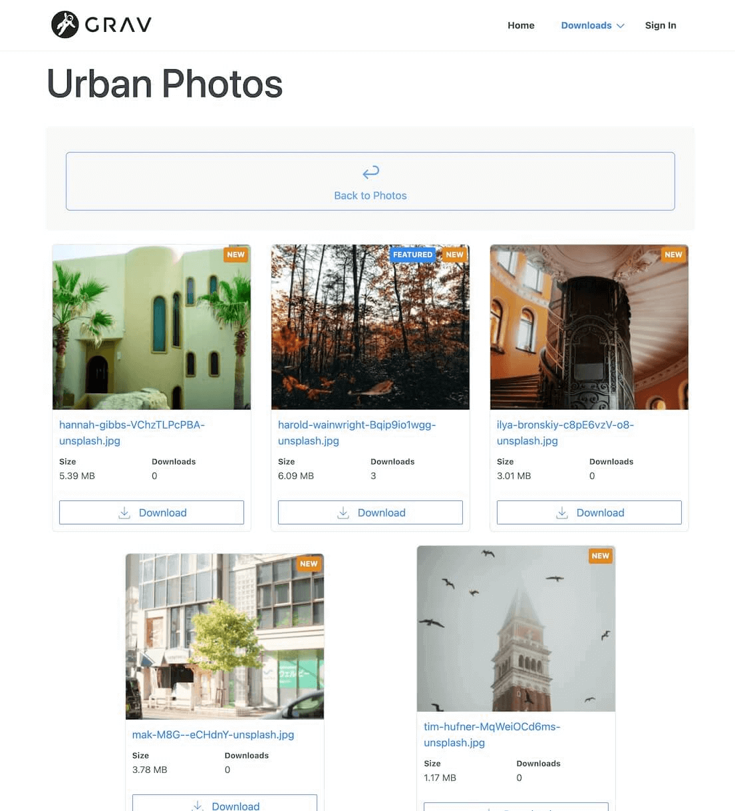
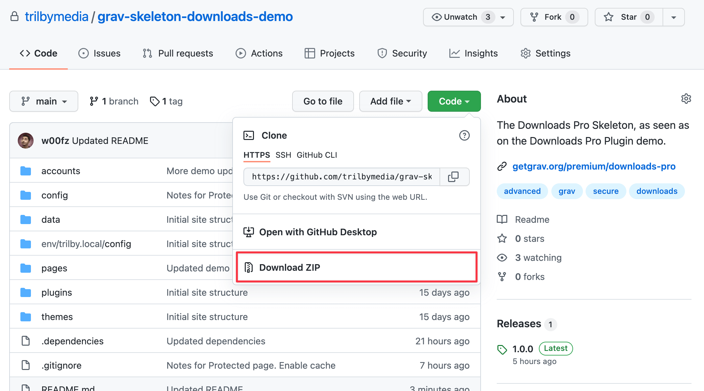

# Downloads Pro

> [!IMPORTANT]
> Premium products require the free [License Manager](../license-manager) plugin. Install it and add your product license before installing this product.

## Installation

First ensure you are running the latest version of **Grav 1.7** (`-f` forces a refresh of the GPM index).

```
$ bin/gpm selfupgrade -f
```

The Downloads Pro plugin does not have any dependencies, so installation is a simple process of running the command:

```
$ bin/gpm install downloads-pro
```

You can also install the plugin via the **Plugins** section in the admin plugin.

## Skeleton Package
Looking for Downloads Pro skeleton package to get you started? You can [download](https://github.com/trilbymedia/grav-skeleton-downloads-demo?target=_blank) the [demo](https://demo.getgrav.org/downloads-pro?target=_blank) skeleton directly from GitHub and follow the instructions in the `README.md` file.

[div class="premium__skeletons" style="width: 33%; margin: 0 auto;"]
[figure caption="Downloads Pro Demo Skeleton"]
[](https://github.com/trilbymedia/grav-skeleton-downloads-demo?target=_blank)
[/figure]
[/div]

The quickest way to download the files is to simply click the green **Code** button then click the **Download ZIP**.



## Configuration

Downloads Pro can be configured from the plugin settings. These settings will serve as global defaults for any page download page and can be later [overridden](#file-overrides) for further customization. 


* **Plugin status** → Will enable or disable the entire plugin.

* **Use built in CSS** → Downloads Pro ships with a minimal style that should work in most scenarios. However, you will most likely want to have your own style. This options allows you to disable the built-in CSS so that you can design your own.


* **Layout** → A list of layouts for rendering the downloads. Downloads Pro comes with a [variety](#layouts) of layouts, however you can also create your own. This option is where you would specify it.
* **Include all media** → Whether it should include all the assets available in a page, or limit it to only its overrides. [More about overrides](#file-overrides)
* **Files path** → The base path for the downloads files. You can use either regular relative pathing, `@` notation or even streams. This option implies you can create one downloads source for all of your files, while still being able to create multiple downloads pages. [More about "one downloads source"](#one-downloads-source).
* **Order by** → The default property to order by in layouts that allow it, like `list`. This can be a variety of options: _Overrides_ (for Drag & Drop custom order), _Modified Time_, _File Size_, _Downloads Count_, _Featured_, _Filename_, _File Type_, _File Mime Type_, _File Extension_, _File Version_.
* **Inherit Parent** → Whether to inherit the Parent configuration. This option becomes extremely useful when adopted in combination with the nested download folders support that Downloads Pro comes with.
* **Hot downloads** → The number of downloads a file should receive before triggering the `HOT` tag.
* **New days** → The number of elapsed days since a file was last modified, before hiding the `NEW` tag.
* **Order Direction** → In combination with `Order by`, this option sets the direction of the sorting.


* **Show icon** → Whether to display the icon/thumbnail of a file. This might have different meanings depending on the layout. When creating your own layout, you should be mindful of this option and display/hide accordingly any thumbnail/image/icon.
* **Show version** → Whether to display the file version
* **Show file size** → Whether to display the file size
* **Show last modified** → Whether to display the last modified date
* **Show download count** → Whether to display the downloads count
* **Show download button** → Whether to display the download button
* **Show hot tag** → Whether to display the HOT tag
* **Show new tag** → Whether to display the NEW tag
* **Show featured tag** → Whether to display the Featured tag

> [!TIP]
> Because these settings will be inherited globally by any downloads page, changing them at a later time might result in unexpected side effects. Always be mindful when changing the settings and remember that each of the global settings can be overridden individually per page.

## File Overrides

Anytime a page of type `downloads` is created, the page will inherit the default [configuration](#configuration) settings. Often times, however, this is not necessary what you need, which is why you will be presented with the option to override any of the fields from [configuration](#configuration).

Additionally, you will also have access to a **File Overrides** section where you can customize parameters for each individual file.


* **Media file** → A file from the list of uploaded assets of which the parameters will be overridden. This can only be picked once
* **Display name** → What should be the name displayed, by default this will fall back to the file name.
* **Download name** → The filename that will be served, upon download, to the user. This option is useful if you want to keep your original file name secure. By customizing both the display and download name, your users won't ever know what the original file was named.
* **Version** → Some type of download resources might require a version number associated to them. This option allows to specify that
* **Enabled** → When disabled, all settings will be preserved but the file won't be accessible for view or download
* **Featured** → Whether the resource should be marked as Featured. This can be handled in the layouts, usually is represented by a Featured tag
* **Access** → This represents the access level a user is required to have for being able to download the resource

> [!NOTE]
> When the option **Include all media** is disabled, only the files configured in this section will display on your site.
> When the option **Order by** is set to `Overrides`, it will follow the order of the File Overrides section, which can be reordered via Drag & Drop.

## Usage
There are two ways you can create a download page: as **Download Page Type**, as **Embed in other Page Types**.

#### As Download Page Type
Creating a page of type `downloads` is as simple as creating a new `downloads.md` file in a page folder or, if you use Admin, click `+ Add`, give your new page a title and select `Downloads` as _Page Template_.


Once your page is created you can start by uploading all of your downloadable files and configure any [override](#file-overrides), if needed. It is important to realize that there is two ways you can display your assets, either by the File Overrides definition, where you pick every individual file that should be downloadable, or by including all media.

By default, only overrides will be displayed and if you haven't configured any, your list will show empty. If your intention is to display all the uploaded files as is, set the **Include all media** option to **Yes**.

#### As Embed In Other Page Types

To embed downloads to any other page type, you need to first **Enable Downloads**. You can enable the downloads via Admin in the Content tab of the page you just created, where at the bottom you will find the option:


This is also equivalent of doing it manually in frontmatter. Your `md` file would look something like this:

```yaml
title: Your Page
downloads:
    enabled: true
    include_all: true # if you wish to display all uploaded files
```

Additionally, you will need a shortcode for rendering the downloads into the page.

#### Custom Thumbnails
Downloads Pro is fully compatible with Grav's [thumbnail location lookup](https://learn.getgrav.org/17/content/media?target=_blank#thumbnail-location). You can personalize any of the assets thumbnails by creating a custom image and naming it as your file fullname, plus `.thumb.jpg`.

For example, if you want to customize the thumbnail for a file named `my_app.zip`, you can create a thumbnail and name it `my_app.zip.thumb.jpg`. Once uploaded at the same level of the asset file, Downloads Pro and Grav will properly display the custom thumbnail.

Se a live example on our [demo](https://demo.getgrav.org/downloads-pro/downloads/software?target=_blank).

### Shortcodes
Downloads Pro has integration with Shortcodes which makes it as simple as it can possibly get to render downloads anywhere on your site. There are also a variety of layouts that can be used for rendering, with the option to create your own.

> [!NOTE]
> If you haven't already, this is the time to install the `shortcode-core` plugin, either via Admin or via CLI `bin/gpm install shortcode-core`

There are two types of shortcodes supported, plural `[downloads /]` and singular `[download /]` which, as their name hint, can display either one file or a list of files.

#### Render Downloads Table


The `[downloads /]` shortcode can take different attributes:

* `route`: Default attribute. The route of the download page type (ie, `/downloads`)
* `layout`: The layout to use when rendering the shortcode (default: `list`) [More details](#layout-types)
* `access`: The access level permissions (default: `site.download`). [More details](#override-acl).
* _`other attributes`_: You can also pass your own attributes to the shortcodes. Those will be available in the Twig layout template. [More details](#create-custom-layout)

All attributes can be omitted if the default behavior is what intended. 

> [!NOTE]
> Additionally, you can select your custom layout, those can be defined in the `templates/downloads/` folder. Please check the `templates/downloads.html.twig` and `templates/downloads/*.html.twig` files for reference.

##### Downloads Layout Types

While `list` is default, there are a number of layout options, or create your own [custom layout](#create-custom-layout) via a Twig template:

* `list`: A view of folders and list of files
* `list-files`: A list of files only
* `list-folders`: A view of folders only
* `grid`: A view of folders and grid of files
* `grid-files`: A grid view of files only

Examples of usage:

```bbcode
[downloads/]
[downloads="/downloads"/]
[downloads route="/downloads" layout="grid"/]
```

### Download a single file

There are two default types provided for single downloads (or create your own [custom layout](#create-custom-layout)):

* `button`: A download button only
* `card`: A single card view of a single download

#### Render a Download Button


The `[download /]` shortcode can take different attributes:

* `filename`: Default attribute, _required_. The file to be downloaded. It can also include the route which would skip the `route` attribute (ie, `file.zip` or `/downloads/archives/file.zip`)
* `route`: The route of the download page type (ie, `/downloads`)
* `layout`: The layout to use when rendering the shortcode (default: `button`). 
* `access`: The access level permissions (default: `site.download`). [More details](#override-acl).
* _`other attributes`_: You can also pass your own attributes to the shortcodes. Those will be available in the Twig layout template. [More details](#create-custom-layout)

Example of usage:

```bbcode
[download="/downloads/photos/nature.jpg" title="Download Nature Photo" /]
[download filename="urban.jpg" route="/downloads/photos/" title="Download Urban Photo" /]
[download filename="/downloads/photos/people.jpg" title="Download People Photo" layout="card" /]
```

#### Render a Download Card


The card layout can be used with the `[download layout="card" /]` shortcode. It displays card representation of the downloadable file, that can be displayed inline with your content.

Taking advantage of the [**custom attributes**](#create-custom-layout), the Card layout supports a `width` and `height` attributes to define the sizes of the thumbnails (defaults to `250x250`).

```html
[download filename="image1.png" layout="card" width="300" height="150" /]
```

#### Render a Table Manually

You can combine shortcodes to create your own HTML output. For example, if you wanted total control over your table element wrappers, for classes purposes and whatnot, you could either [create your own custom layout](#create-custom-layout), or you could tailor your markdown like:

```md
<table class="table">
    <thead>
		  [download layout="table-head"/]
    </thead>
    <tbody>
		  [download filename="image1.png" layout="table-row"/]
		  [download filename="image2.png" layout="table-row"/]
    </tbody>
</table>
```

#### Override ACL

Both shortcodes allow the ACL to be overridden for better fine-tuned control over the access to specific lists or files. You can set the ACL via the `access` attribute 

For example, to ensure your downloads table or downloadable file are only visible and accessible to logged-in users, you would write: 
```bbcode
[downloads="/downloads" access="site.login" /]
[download="/downloads/file.zip" access="site.login" /]
```

> [!NOTE]
> Note that you cannot override the download ACL from the shortcode. This feature can only be used to stop rendering the shortcode in the current page, if the user doesn't have the access.

### Create Custom Layout

Creating your own custom layout is as simple as adding a new twig file under your theme templates folder `user/themes/<your-theme>/templates/downloads/my-layout.html.twig`. From now on you will be able to reference the custom layout as **my-layout** (`[download="file.zip" layout="my-layout" /]`).

You can also pass **custom attributes** to the shortcodes which will then become available in your twig file. For example, the ["Download Button"](#render-download-button) template, allows the user to customize the `title`.

The best way to learn how to create a custom layout is to take a look at the layouts Downloads Pro comes with. However, there are a set of useful objects and methods available to the twig that we will be covering below.

##### Default Downloads Template
The default downloads template, used by the `[downloads /]` shortcode and to render a **downloads** page type, looks like this:

```twig




  {{ content|raw }}

  
  
    
  


```

This little snippet has the power to automatically detect whether you are using downloads shortcodes in the page. If you aren't, it  falls back to the default rendering of the `list` layout.

In the snippet we can spot two useful methods:

1. `downloads.getPage()`: Gets the downloads object for a specific page or route
   ```twig
   
   
   
   ```
2. `downloads.isRenderedIn(content)`: Determines whether `downloads` has already being rendered within `content`, if not you can execute your own fall back code. For example, you can render a `list` layout with custom parameters.
   ```twig
   
     
   
   ```

##### ACL integration and tips

Downloads are protected with ACL. It is important to check these permissions in your custom layout and decide how to handle what the user should see.

Here a good starting point to handle all cases:
```twig

  
  
    
      Download link to media
    
  
    User cannot see any downloads
  
    Page has no downloads
  

  User has no access

```

Alternatively, you might prefer to display everything to the end-user but **block** them from downloading, if unauthorized:

```twig

  
    
        
        
          Download link to media
        
          User has no access
        
          Login required
        
    
  
    Page has no downloads
  

  Page is not a download page (or has been disabled)

```

##### Handle nested download folders
Downloads Pro supports nested download folders out of the box and with the "Inherit Parent" option, you can easily configure downloads once at the parent level and have the children inherit the same settings.

At the twig level, here is a bare-bone look at how you can handle nested folders:

```twig


  
  

  <ul>
    
    
      <li>
        <a href="{{ pages.url(folder.page.route) }}">
          Go Back
        </a>
      </li>
    
    
      <li>
        <a href="{{ pages.url(folder.page.route) }}">
          {{ folder.page.menu ?? folder.page.title }}
        </a>
      </li>
  
  </ul>


```

##### Other useful methods
Finally, here is a list of useful methods to navigate around the `downloads` object.

```twig
# The Route URL of the downloads object


# The Page Object associated to the downloads object


# The hash string associated to a file


# Different ways of retrieving a download object






# Different ways of retrieving a protected URL for a specific file



{# this also works if `downloads` has been defined in the twig template #}


```
