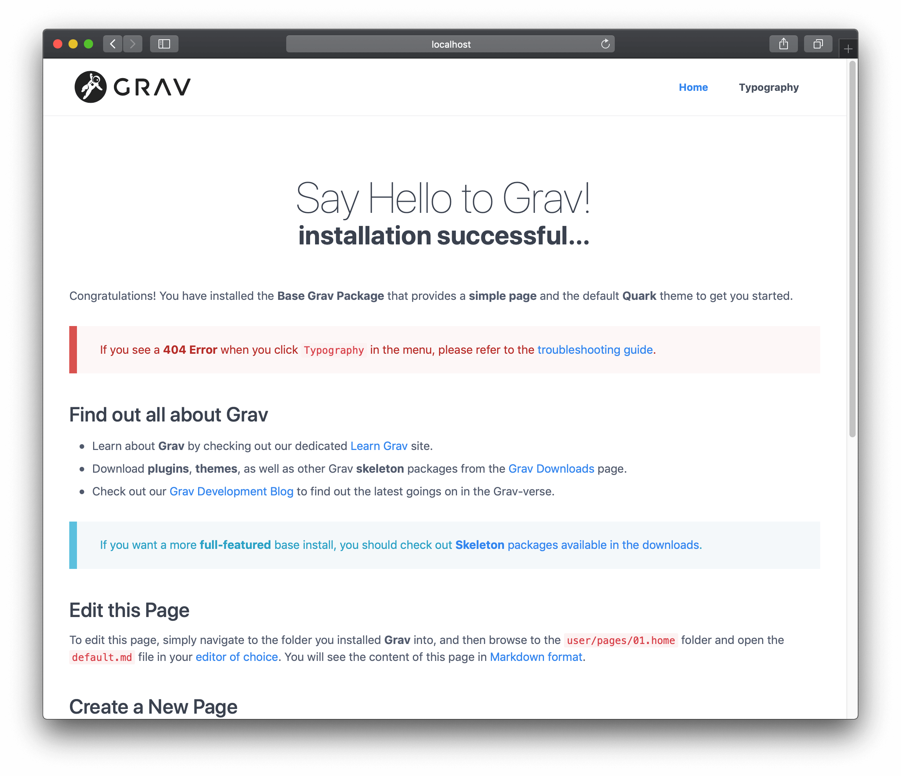
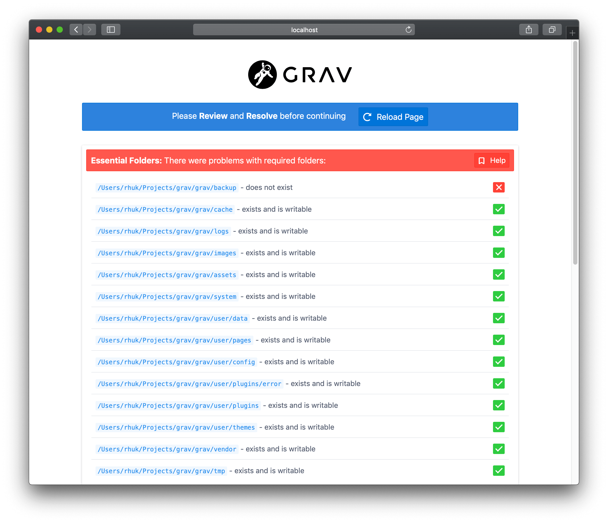

# Installation

Installation of Grav is a trivial process. In fact, there is no real installation. You have several options for installing Grav. The first – and simplest – way is to download the **zip** archive, and extract it. The second way is to install with **Composer**. The third way is to clone the source project directly from **GitHub**, and then run an included script command to install needed dependencies. There are [more ways](#further-options) that involve running bundled scripts.

## Check for PHP version

Grav is incredibly easy to set up and get running. Grav 2.0 requires **PHP 8.3.11 or higher**. Check what you have by going to the terminal and typing `php -v`:

[codesh=bash]
php -v
PHP 8.3.11 (cli) (built: Aug 29 2024 00:00:00) (NTS)
Copyright (c) The PHP Group
Zend Engine v4.3.11, Copyright (c) Zend Technologies
    with Zend OPcache v8.3.11, Copyright (c), by Zend Technologies
[/codesh]

Grav also needs a handful of PHP extensions, and `zip` in particular is used by both Composer and GPM. See the [requirements](/20/basics/requirements) page for the full list before you go any further.

## Option 1: Install from ZIP package

The easiest way to install Grav is to download the ZIP package and extract it:

1. Download the latest-and-greatest **[Grav](https://getgrav.org/download/core/grav/latest)** or **[Grav + Admin](https://getgrav.org/download/core/grav-admin/latest)** package. **Grav + Admin** is core with the [API](/20/api) and [Admin Next](/20/admin-panel) plugins already bundled, so it gives you a working admin panel with nothing else to install.
2. Extract the ZIP file in the [webroot](https://www.wordnik.com/words/webroot) of your web server, e.g. `~/webroot/grav`

> [!NOTE]
> There are [Skeleton](https://getgrav.org/downloads/skeletons)-packages available, which include the core Grav system, sample pages, plugins, and configuration. They are a great way to get started; all you have to do is [download the Skeleton](https://getgrav.org/downloads/skeletons)-package you prefer, and follow the steps above.

You can also download any pre-packaged installation of a [tagged release](https://github.com/getgrav/grav/tags) from getgrav.org. Use the format `https://getgrav.org/download/TYPE/PACKAGE/VERSION`.

- [getgrav.org/download/core/grav/2.0.22](https://getgrav.org/download/core/grav/2.0.22) downloads Grav Core v2.0.22
- [getgrav.org/download/core/grav-admin/2.0.22](https://getgrav.org/download/core/grav-admin/2.0.22) downloads Grav Core v2.0.22 with the API and Admin Next plugins bundled
- [getgrav.org/download/core/grav-update/2.0.22](https://getgrav.org/download/core/grav-update/2.0.22) downloads the update package for Grav Core
- [getgrav.org/download/plugins/admin2/latest](https://getgrav.org/download/plugins/admin2/latest) downloads the latest Admin Next plugin
- [getgrav.org/download/themes/quark/latest](https://getgrav.org/download/themes/quark/latest) downloads the latest Quark theme

> [!TIP]
> If you downloaded the ZIP file and then plan to move it to your webroot, please move the **ENTIRE FOLDER** because it contains several hidden files (such as .htaccess) that will not be selected by default. The omission of these hidden files can cause problems when running Grav.

## Option 2: Install with composer

The alternative method is to install Grav with [composer](https://getcomposer.org/doc/00-intro.md#installation-linux-unix-osx). Always pin the major version, so Composer fails loudly if your PHP environment cannot satisfy Grav 2.0:

[codesh=bash]
composer create-project getgrav/grav ~/webroot/grav "^2.0"
[/codesh]

> [!WARNING]
> If you leave the `"^2.0"` off and your PHP is missing an extension Grav needs, most commonly `zip`, Composer does not stop. It prints one easy-to-miss line saying it cannot use the latest version, then walks backwards until it finds a release your environment does satisfy, which can be a Grav from many years ago. The failure you eventually see will be an unrelated-looking complaint about an old dependency needing PHP 5.5. Pinning the constraint turns that into a hard error naming the extension. Install it (`sudo apt install php8.3-zip`, `brew install php`, or uncomment `extension=zip.so` in your `php.ini`) and run the command again.

If you want to check out the bleeding edge version of Grav, add `2.x-dev` as an additional parameter:

[codesh=bash]
composer create-project getgrav/grav ~/webroot/grav 2.x-dev
[/codesh]

Composer installs Grav core only. See [Install the Admin Panel](#install-the-admin-panel) below to add the admin UI.

## Option 3: Install from GitHub

Another method is to clone Grav from the GitHub repository, and then run a simple dependency installation script:

1. Clone the Grav repository from [GitHub](https://github.com/getgrav/grav) to a folder in the webroot of your server, e.g. `~/webroot/grav`. Launch a **terminal** or **console** and navigate to the webroot folder:

   [codesh=bash]
   cd ~/webroot
   git clone -b master https://github.com/getgrav/grav.git
   [/codesh]

2. Install **vendor dependencies** via [composer](https://getcomposer.org/doc/00-intro.md#installation-linux-unix-osx):

   [codesh=bash]
   cd ~/webroot/grav
   composer install --no-dev -o
   [/codesh]

3. Install the **plugin** and **theme dependencies** by using the [Grav CLI application](/20/advanced/grav-cli) `bin/grav`:

   [codesh=bash]
   cd ~/webroot/grav
   bin/grav install
   [/codesh]

   This will automatically **clone** the required dependencies from GitHub directly into this Grav installation.

## Install the Admin Panel

If you installed the **Grav + Admin** ZIP package, the admin panel is already there and you can skip this section.

Otherwise, install [Admin Next](/20/admin-panel) with a single GPM command from the root of your Grav install:

[codesh=bash]
cd ~/webroot/grav
bin/gpm install admin2
[/codesh]

Admin Next depends on the [API plugin](/20/api), which in turn depends on Login, Form, Email, and Shortcode Core. GPM resolves that whole chain for you and prompts once to install the dependencies, so `bin/gpm install admin2` is all you need to type.

> [!WARNING]
> Do **not** run `bin/gpm install admin`. That is the classic Grav 1.x admin plugin and it does not work on Grav 2.0. The Grav 2.0 admin is the `admin2` package.

Once it finishes, open your site in a browser and go to `/admin`. Admin Next serves at the same `/admin` route the classic admin used, and on a site with no user accounts yet it walks you through creating the first administrator.

[codesh=bash]
https://yoursite.local/admin
[/codesh]

## Further options

### Install with Docker

[Docker](https://en.wikipedia.org/wiki/Docker_(software)) is an extremely efficient way to bootstrap platforms and services on both servers and local environments. If you are setting up several environments that need to be the same, or working collaboratively, it offers a simple way to ensure consistency between installations. If you are developing several Grav sites, you can streamline setting them up using Docker.

Stable Docker images are available that use [Apache](https://github.com/getgrav/docker-grav) (the official image), [Nginx](https://github.com/dsavell/docker-grav), and [Caddy](https://github.com/hughbris/grav-daddy) webservers. If you search, you will find more that you can try. With any image, make sure you create volumes to persist Grav's `user`, `backups`, and `logs` folders. (Backups and logs are optional if you don't need to keep that data.)

### Install on Cloudron

Cloudron is a complete solution for running apps on your server and keeping them up-to-date and secure. On your Cloudron you can install Grav with a few clicks. If you host multiple sites, you can install them completely isolated from one another on the same server.

[](https://cloudron.io/store/org.getgrav.cloudronapp.html)

The source code for the package can be found [here](https://git.cloudron.io/cloudron/grav-app).

### Install through Linode Marketplace

If you use Linode servers, there is an [easy, documented method using Linode Marketplace](https://www.linode.com/docs/marketplace-docs/guides/grav/). This will set up a new Grav site on a new dedicated Linode virtual server. The virtual server will incur a periodic charge.

## Webservers

#### Apache/IIS/Nginx

Using Grav with a web server such as Apache, IIS, or Nginx is as simple as extracting Grav into a folder under the [webroot](https://www.wordnik.com/words/webroot). All it requires to function is PHP 8.3.11 or higher, so you should make sure that your server instance meets that requirement. More information about Grav requirements can be found in the [requirements](/20/basics/requirements) chapter of this guide.

If your web root is, for example, `~/public_html` then you could extract it into this folder and reach it via `http://localhost`. If you extracted it into `~/public_html/grav` you would reach it via `http://localhost/grav`.

> [!NOTE]
> Every web server must be configured. Grav ships with .htaccess by default, for Apache, and comes with some [default server configuration files](https://github.com/getgrav/grav/tree/master/webserver-configs), for `nginx`, `caddy server`, `iis`, and `lighttpd`. Use them accordingly when needed.

#### Running Grav with the Built-in PHP Webserver

You can run Grav using a simple command from Terminal / Command Prompt using the built-in PHP server available as long as you have PHP installed.

All you need to do is navigate to the root of your Grav install using the Terminal or Command Prompt and enter `bin/grav server`.

> [!CAUTION]
> While technically all you need is PHP installed, if you install the [Symfony CLI application](https://symfony.com/download) the server will provide an SSL certificate so you can use `https://` and make use of PHP-FPM for better performance.

Entering this command will present you with output similar to the following:

[codesh=bash]
➜ bin/grav server

Grav Web Server
===============

Tailing Web Server log file (/Users/joeblow/.symfony/log/96e710135f52930318e745e901e4010d0907cec3.log)
Tailing PHP-FPM log file (/Users/joeblow/.symfony/log/96e710135f52930318e745e901e4010d0907cec3/53fb8ec204547646acb3461995e4da5a54cc7575.log)
Tailing PHP-FPM log file (/Users/joeblow/.symfony/log/96e710135f52930318e745e901e4010d0907cec3/53fb8ec204547646acb3461995e4da5a54cc7575.log)

[OK] Web server listening
The Web server is using PHP FPM 8.0.8
https://127.0.0.1:8000

[Web Server ] Jul 30 14:54:53 |DEBUG  | PHP    Reloading PHP versions
[Web Server ] Jul 30 14:54:54 |DEBUG  | PHP    Using PHP version 8.0.8 (from default version in $PATH)
[PHP-FPM    ] Jul  6 14:40:17 |NOTICE | FPM    fpm is running, pid 64992
[PHP-FPM    ] Jul  6 14:40:17 |NOTICE | FPM    ready to handle connections
[PHP-FPM    ] Jul  6 14:40:17 |NOTICE | FPM    fpm is running, pid 64992
[PHP-FPM    ] Jul  6 14:40:17 |NOTICE | FPM    ready to handle connections
[Web Server ] Jul 30 14:54:54 |INFO   | PHP    listening path="/usr/local/Cellar/php/8.0.8_2/sbin/php-fpm" php="8.0.8" port=65140
[PHP-FPM    ] Jul 30 14:54:54 |NOTICE | FPM    fpm is running, pid 73709
[PHP-FPM    ] Jul 30 14:54:54 |NOTICE | FPM    ready to handle connections
[PHP-FPM    ] Jul 30 14:54:54 |NOTICE | FPM    fpm is running, pid 73709
[PHP-FPM    ] Jul 30 14:54:54 |NOTICE | FPM    ready to handle connections
[/codesh]

Your terminal will also give you real-time updates of any activity on this ad hoc-style server. You can copy the URL provided in the `[OK] Web server listening` line and paste that into your browser of choice to access your site, including the administrator.

```
https://127.0.0.1:8000
```

> [!TIP]
> This is a useful tool for quick development, and should **not** be used in place of a dedicated web server such as Apache or Nginx.

## Successful Installation

The first time it loads, Grav pre-compiles some files. If you now refresh your browser, you will get a faster, cached version.



> [!CAUTION]
> In the previous examples, **$** represents the command prompt. This may look different on various platforms.

By default, Grav comes with some sample pages to give you something to get started with. Your site is already fully functional and you can configure it, add content, extend it, or customize it as much as you like.

## Installation & Setup Problems

If any issues are discovered during the initial page load (or after a cache-flush event) you may see an error page:



Please consult the [Troubleshooting](/20/troubleshooting) section for help regarding specific issues.

> [!WARNING]
> If you have issues with file permissions, please check the [Permissions Troubleshooting documentation](/20/troubleshooting/permissions). Also, you could look at the [Hosting Guides documentation](/20/webservers-hosting) that has specific instructions for various hosting environments

## Grav Updates

To keep your site up to date, please read [Updating Grav & Plugins](/20/basics/updates).
