# The Grav 2.0 Administration Panel

Grav 2.0 replaces the classic Twig-rendered admin with **Admin Next**: a clean-slate, single-page application (SPA) written in **SvelteKit 5**, served as static assets by your webserver, and powered entirely by the first-party [Grav API plugin](/20/api). It is the default admin in Grav 2.0, it is free, and it installs at the same `/admin` route the classic admin used.

===

> [!NOTE]
> This page is an overview of Admin Next while the full Grav 2.0 admin documentation is being written. It covers what the interface is and what each area does. The classic admin reference under the [Grav 1.7 docs](/17/admin-panel) still describes the older interface and does not apply to Grav 2.0.

> [!IMPORTANT]
> A note on names. **Admin Next** is the SvelteKit application itself. **Admin2** is the Grav plugin that ships Admin Next and serves it over a Grav route (default `/admin`). So Admin Next is the experience, and Admin2 is the plugin you install to get it. **Admin Classic** is the name for the original Grav 1.x admin plugin, used here only to contrast the two.

## Why a New Admin

Classic admin was tightly coupled to Twig rendering and the public-site request lifecycle. Every page in the admin was a server-rendered template, and every interaction round-tripped through PHP. Extending it meant writing more Twig and PHP or grafting jQuery on top of existing templates, and theming was constrained by the same templates that rendered everything from configuration to pages.

Admin Next takes a different approach. The admin is an SPA, the data layer is the API plugin, and every part of the interface (sidebar, dashboard, page editor, configuration forms, plugin pages) is a component that plugins can extend through well-defined hooks. The result is an admin that is fast, responsive, and built to be extended consistently. For the developer side of that extensibility, see the [API documentation](/20/api) and the [Developer Upgrade Guide](/20/migration/developer-upgrade-guide).

## The Shell

The shell is fixed framing around a single scrolling region: the sidebar lives on one edge, the topbar across the top, and the content area is the only part that scrolls.

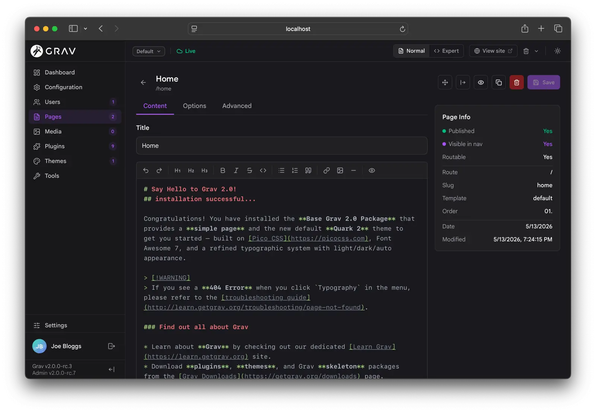

Admin Next ships with full light and dark mode support, along with a customizable accent color, logo, fonts, and font sizes.

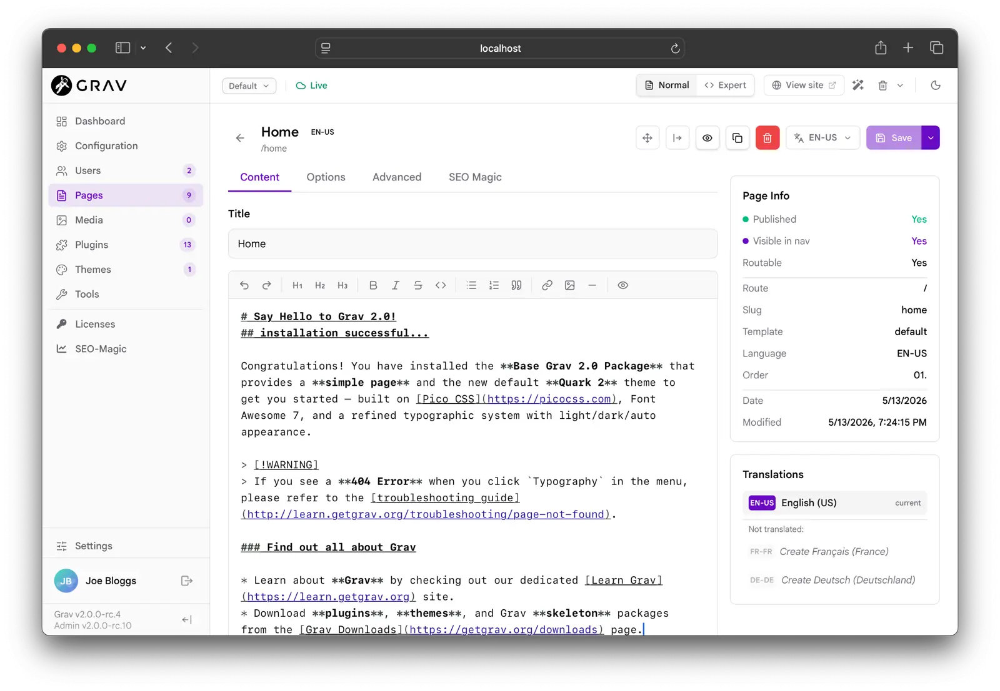

A few details worth knowing about the shell:

- The **environment selector** in the topbar switches between `Default` and any `user/env/*` configuration target without leaving the admin. Saving a config writes to the selected environment via a differential save (only the keys that differ from the effective base). You can also create a fresh environment from the dropdown.
- The **presence cluster** shows live avatars of every other admin currently editing alongside you, with a colored dot indicating their sync state. This requires the optional **sync** plugin.
- The **sidebar version labels** show your running `Grav` and `Admin` versions and refresh automatically after a self-update.
- The interface is responsive down to phone widths: the sidebar slides off on mobile, toolbars collapse to icons, and page lists drop their secondary columns.

## The Dashboard

The dashboard is a fully customizable, multi-widget grid that each user can rearrange. Super-admins can save a site-wide layout so everyone starts from the same place.

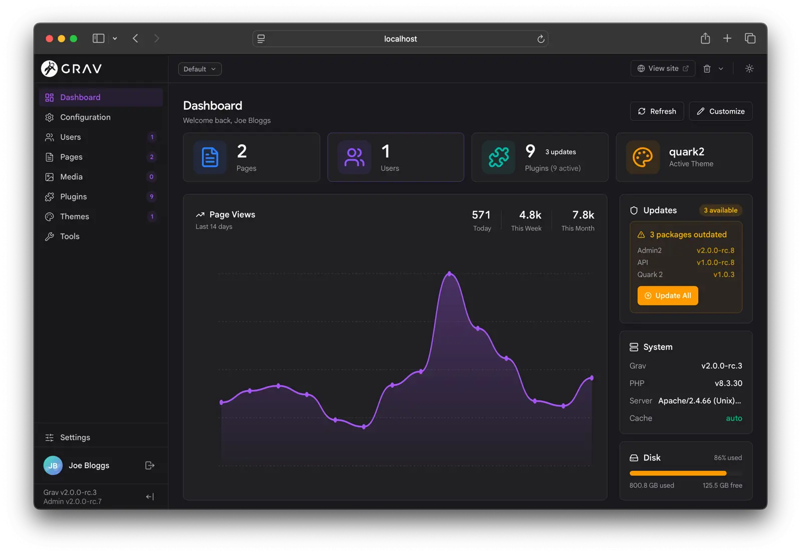

Click the **Customize** pencil in the header to enter edit mode. Each widget gains a toolbar with a drag handle, a size picker (`SM` / `MD` / `LG` / `XL`, where supported), and a hide toggle. An "Add a widget" tile brings back anything you have hidden. Three presets are available from the customize toolbar: **Default**, **Minimal** (stats plus recent pages), and **Compact** (every widget at its smallest size). Super-admins also get **Save as site default**.

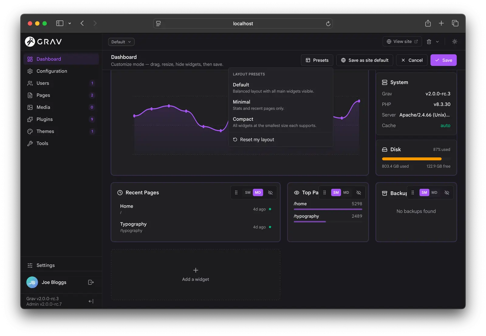

The grid uses a 4-column responsive layout. A few of the standard widgets:

- **Updates** is front-and-center: a Grav-core callout (`current → available` with an Upgrade button) above a package panel with per-row version chips and an Update All button.
- **Notifications** renders promo cards, info, notices, and warnings with icons, markdown messages, and relative dates.
- **System Health** tracks PHP and Grav versions, available updates, scheduler status, and cache state.
- **Page Views**, **Top Pages**, **Recent Pages**, and **Backups** round out the standard set.

Plugins can contribute their own widgets through the API, and they appear in the picker and size selector automatically.

## Pages

The pages view ships three first-class views: **Tree**, **List**, and **Columns** (Miller).

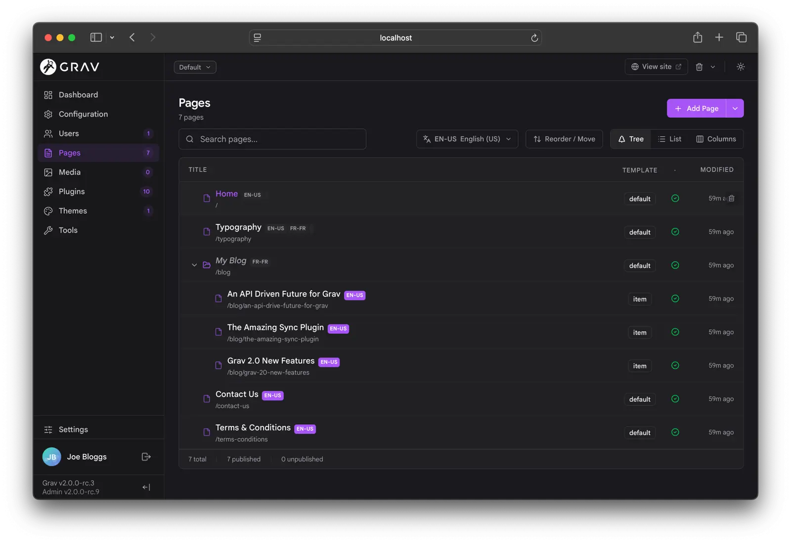

A toolbar is shared across all three views: a view-mode picker, a search input that performs full-site search via the API (debounced, capped at 500 results), a language picker for multi-language sites, a reorder toggle, and the **Add Page** button.

The **Add Page** button is a three-way split: the main button adds a regular page, and the chevron opens a menu with **Add Folder** (a routing or grouping folder with no `.md` file) and **Add Module** (a modular sub-page, whose folder name is automatically prefixed with `_` per Grav's modular convention).

A few things worth flagging across the views:

- **Page visibility** is shown with a two-tone icon: visible pages use the accent color, non-visible pages drop to muted grey.
- **Drafts** carry an amber `Draft` pill.
- **Translation badges** sit inline next to the title and highlight the active language.
- **Symlink indicators** appear on plugins, themes, and pages installed via symlink.
- **Background refreshes are silent.** When another tab saves a page, the affected row updates in place without flipping a skeleton.

The **Columns view** gives you a finder-style drill-down with an inline preview pane on wider screens.

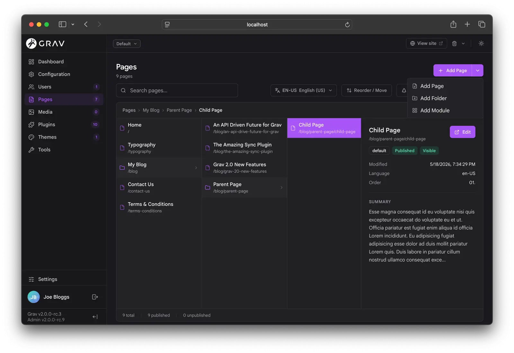

Multi-language support is a major focus of this version: it is easier to see what language you are in, to save as another supported language, and to check translation status in the right sidebar. You can also re-sync a page from the default language.

## The Page Editor

The page editor renders its form straight from the page's blueprint. Every standard field type (text, textarea, toggle, select, list, array, file, media, color picker, date picker, code editor, markdown editor) is a native Svelte component with keyboard support, ARIA hooks, and live validation against the blueprint's `validate:` block. Custom field types from plugins load on demand as web components.

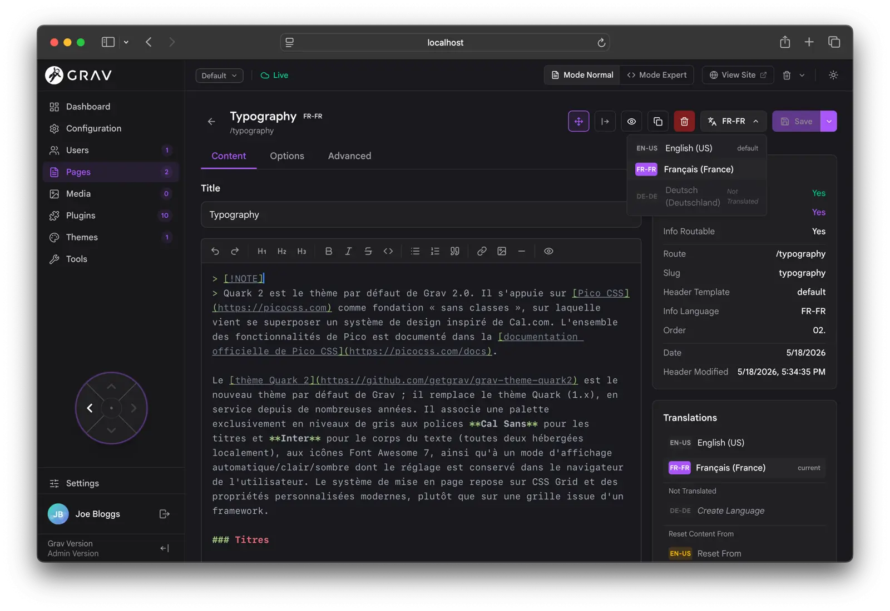

A few of the headline changes:

- The **Normal/Expert** toggle (between the blueprint-driven form and raw frontmatter editing) lives in the global topbar, next to View Site.
- **Presence avatars** for the page sit in the topbar. Click them to see who else is editing.
- The **right rail** (Page Info, Translations, Page Media) is collapsible, and the state persists per browser.
- The **Page Navigator d-pad** is a small floating control that jumps to the parent, the previous or next sibling, or the first child.
- **Copy page** is back, alongside Save, Preview, Delete, and a per-language Save-as split.

Expert mode exposes the raw frontmatter and advanced page settings for when you need to edit them directly.

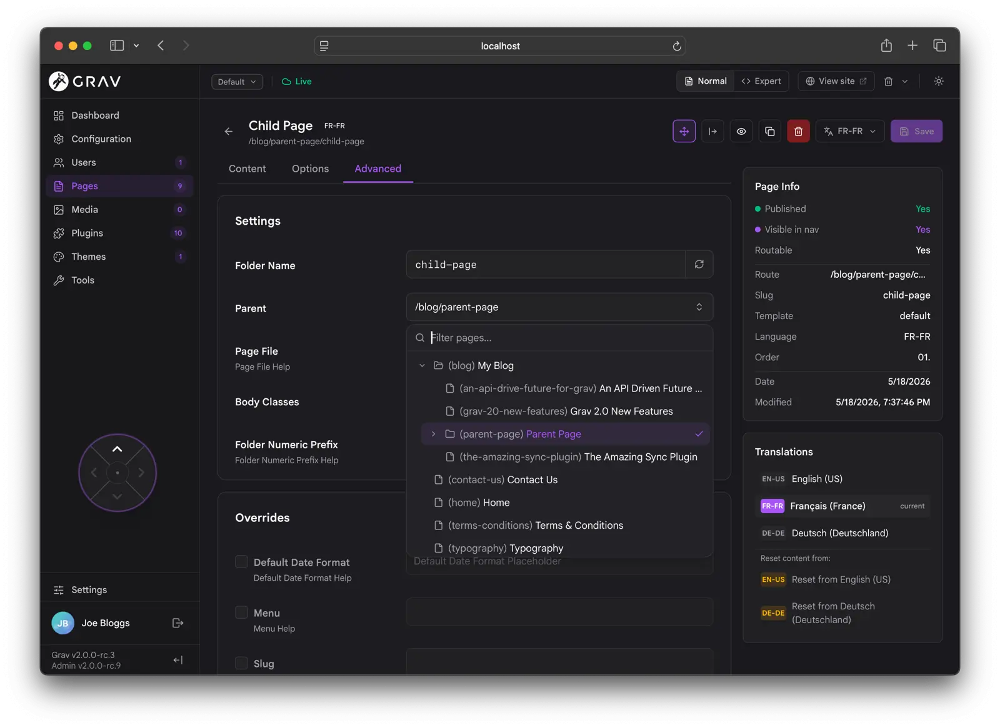

### Real-Time Collaborative Editing

The page editor supports **real-time collaborative editing**, opt-in via **Settings → Editing → Real-time Collaboration**. Multiple users can edit the same page at once and see each other's changes character by character, with named cursors in the content editor and live presence avatars in the topbar.

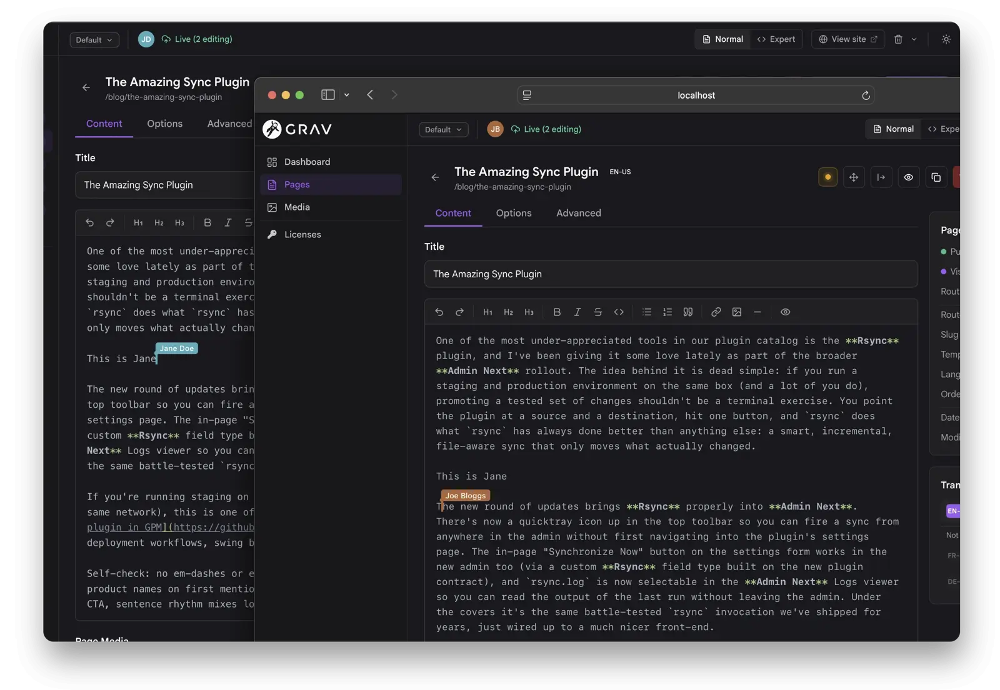

Under the hood the whole blueprint is mirrored into a shared **Yjs** document, not just the markdown body. Long-form text fields use character-level CRDT, toggles and selects use last-write-wins, and list/array fields merge concurrent additions instead of clobbering. The transport is short-polling by default; installing the `sync-mercure` plugin upgrades it to **Mercure** Server-Sent Events for sub-50ms updates.

## Configuration

The configuration page covers System, Site, Media, Security, Info, Plugins, and Themes. It has a single shared **filter input** that searches across every visible panel and tab, expanding sections that contain matches and highlighting the matched text.

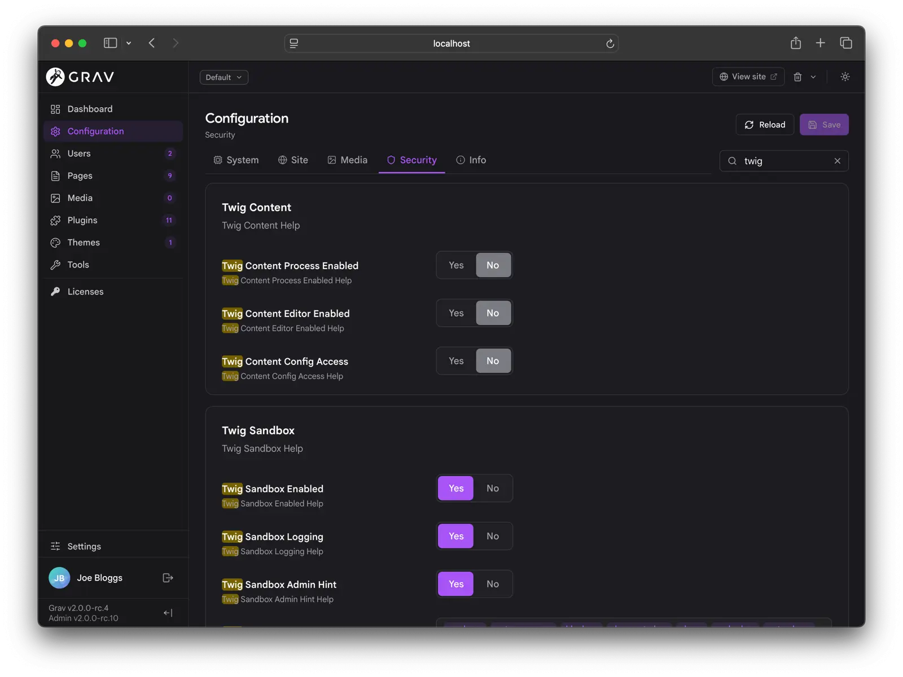

A couple of things worth knowing:

- **Twig in Content** is a security panel that gates editor-authored Twig in page content, exposing the global toggle, the editor-permission toggle, and the `config` access toggle in one place. See [Twig in Content](/20/content/twig-in-content) for the full feature.
- **Blueprint help and section bodies render HTML.** Inline `<code>`, `<strong>`, and similar tags work as they did in classic admin. The trust model is the same: blueprint YAML is server-controlled, not user-submitted.
- **Override-only saves** are standard: when saving a configuration or plugin config, only the values that differ from the defaults are written, so you can always tell what has actually changed.

## Plugins, Themes, and Users

The plugin and theme list pages share a layout: a filterable list on the left, a preview pane on the right on wider screens, and a top toolbar with batch actions like **Update All**.

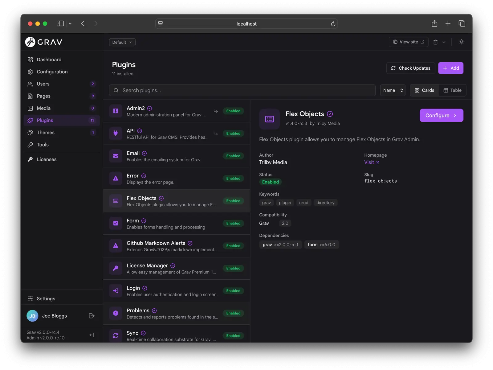

Update All shows failure reasons inline (Grav too old, PHP too old, conflicting version) instead of just a list of slugs. Installing a plugin pulls in missing blueprint dependencies automatically, and confirmation modals gate every update, upgrade, and uninstall.

User management lists users on the left with detail on the right, and a Permissions section that lays out the full ACL tree as a recursive tri-state picker (Allowed / Denied / Not-set).

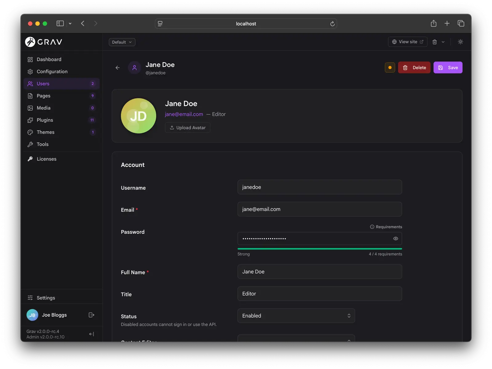

A few details:

- The **State** field (Enabled / Disabled) is exposed in the form. Admin Next injects it into the account blueprint at request time, gated to managers, so you can disable a user without hand-editing YAML.
- The **password fields** ship with a live strength meter and a requirements hint. The rules come from `system.pwd_regex` (or the new `system.pwd_rules` list of labeled rules), so what the user sees matches what the server enforces.
- **2FA enrollment** is built in: enable it, scan the QR with an authenticator app, and confirm with the six-digit code. Recovery codes are issued at setup and can be re-issued.

## Settings, Personalization, and Site Defaults

Settings is the personal-preferences home. Every user can set their **Appearance** (color mode, accent color, font, font size), **Pages defaults** (default view mode and items per page), **Editor** preferences, and **Admin language**.

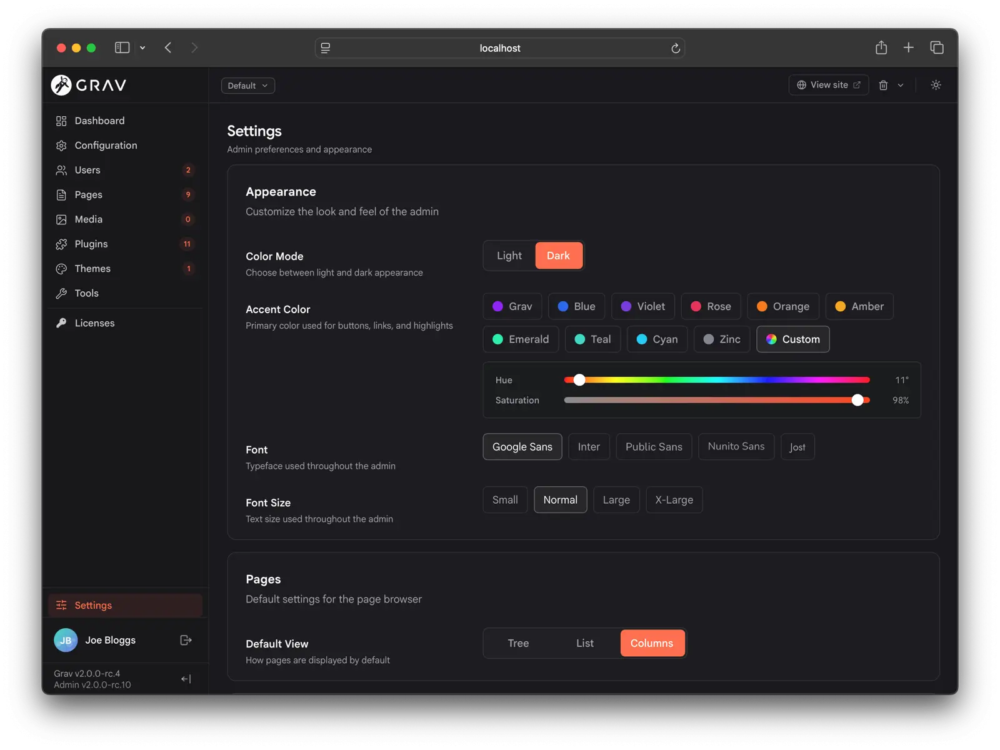

Personalization persists per user via the API, so logging in on another browser or device picks up your customizations automatically. Changes propagate across open tabs, and the background poll doubles as a session keep-alive.

Super-admins get a separate **Site Defaults** section for **site branding** (light/dark logo and brand text), **baseline appearance and editor preferences** for every user (which users can still override), **site-wide editing behavior** (auto-save, real-time collaboration), and **menubar links** shown in the top toolbar for everyone.

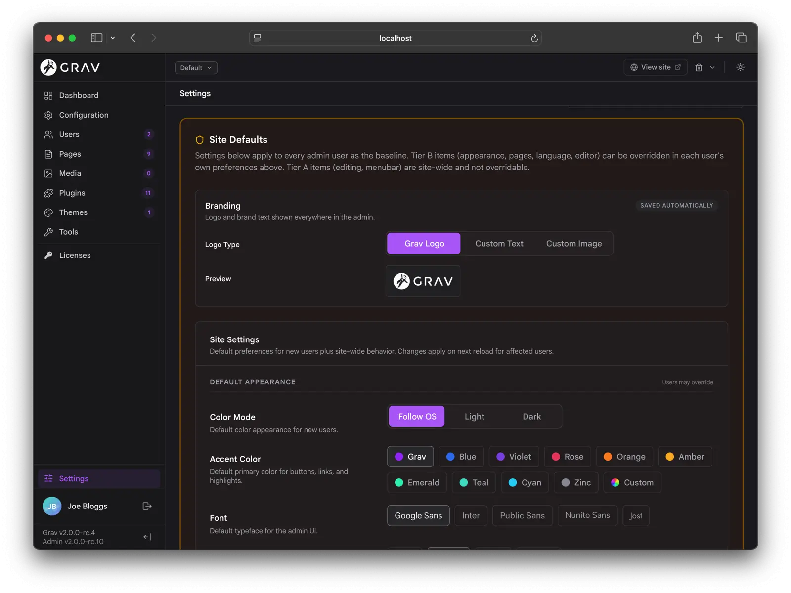

## Languages and Direction

Admin Next has a full **ICU MessageFormat** translation layer, with placeholders, plurals, select cases, and CLDR-aware plural categories applied per locale. Every translation key is looked up first as `ICU.<key>` (passed through ICU MessageFormat) and then as `<key>` (returned raw). A plugin can ship a single language file that works on both Grav 1 / classic admin and Grav 2 / Admin Next. See [Admin Translations](/20/plugins/admin-translations) for the details.

The admin ships with a complete `en.yaml` covering every toast, button title, aria-label, placeholder, and inline label. Picking a locale that Grav flags as right-to-left (Arabic, Hebrew, Persian, Urdu, and others) flips the entire admin to **RTL**.

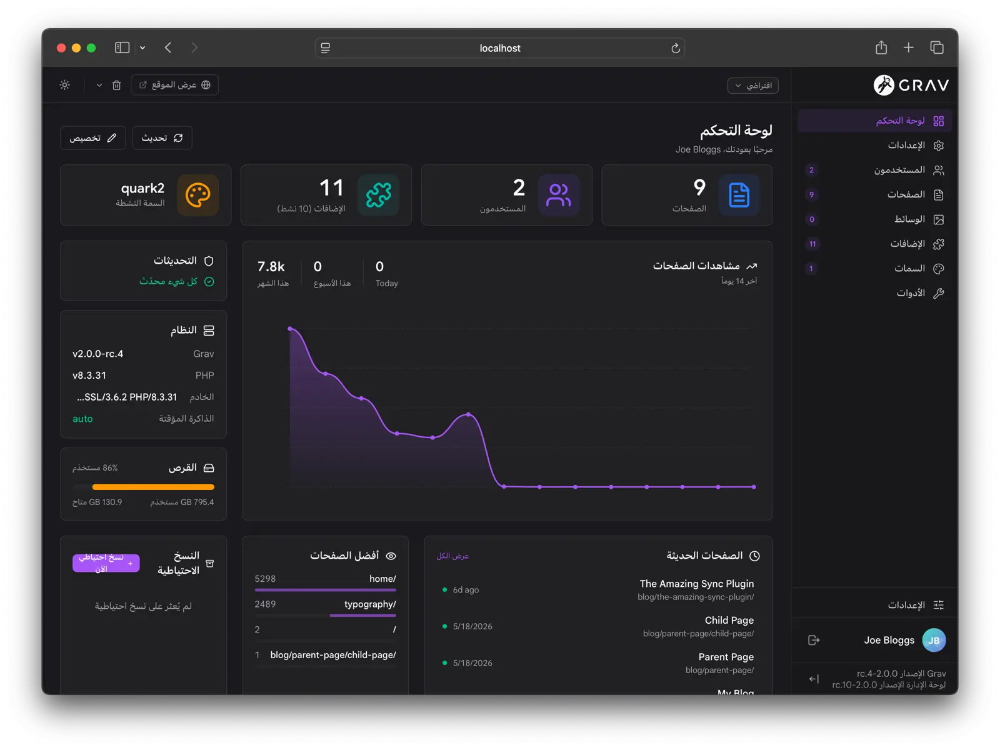

The RTL pass is more than a CSS direction flip: the sidebar and panels dock and animate from the correct edges, directional icons flip with the language, and the Page Navigator d-pad swaps its sibling semantics so a "next" arrow always points the way reading flows. Code editors stay left-to-right because code itself does not reverse.

## Tools

The **Tools** section gathers admin utilities that do not fit elsewhere: the **Logs** viewer, the **Reports** page, the **Scheduler** view, the **Cache** controls, and the **Backups** manager.

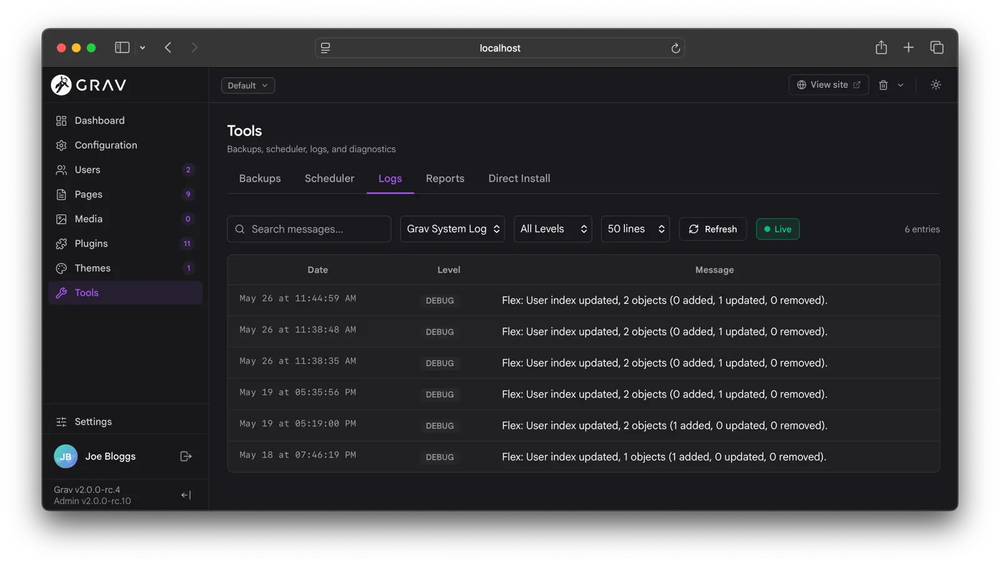

The **Logs** viewer lists `grav.log`, `email.log`, `scheduler.log`, and any log file a plugin contributes. On default installs where only the core logs exist, the file selector is hidden.

The **Reports** page is plugin-extensible. Built-in reports cover security configuration and YAML lint, and one of them is the [Twig in Content](/20/content/twig-in-content) report that lists pages whose content would leak raw Twig. Plugins can contribute their own diagnostic cards.

## Translations

The **Translations** section, in the sidebar between Themes and Tools, lets you reword any string your site displays, in any language, without editing a plugin or theme's own files. Changes are stored as overrides in `user/languages/<lang>.yaml`, so a plugin or theme update can never wipe them.

The starting point is the source tree on the left: Grav core, then every installed plugin and theme, each expandable into the namespaces it contributes. That is the answer to "I just installed this theme and want to reword five things", where you have no search term yet and simply need to see what is changeable.

Once you do know what you are after, search matches both the key and the current wording. You almost never know that the word "Search" in your sidebar lives at `THEME_TYPHOON.SIDEBAR.SIMPLE_SEARCH.HEADLINE`, so typing `Search` finds it just as well as typing the key.

Open as many languages as you like from the **Languages** picker and each one becomes a line inside every row, with the source language first and the rest below it. Each value is editable in place and shows where it came from, which is the part that makes this a diagnostic tool rather than a text box:

| State | Meaning |
| ----- | ------- |
| **Shipped** | The value comes from the plugin's or theme's own language file. Untouched by your site. |
| **Overridden** | You changed it here. The original wording is kept, and one click reverts to it. |
| **Missing** | There is no value in this language, so visitors are really seeing the fallback language. |

Filter to *Missing* in a language and you have a translation to-do list. Filter to *Overridden* and you have a review of everything your site has customized. The *Unknown* filter catches the opposite problem: overrides naming a key that nothing on the site provides, usually a typo or a leftover from a plugin you have since removed.

> [!NOTE]
> An override that matches what the plugin or theme already ships is not stored. Keeping it would silently stop tracking the source's future wording changes, so it is treated as a revert instead.

**Edit as YAML** swaps the grid for a text view of the same filter, for pasting or reviewing many strings at once. If you have a source selected, the save is scoped to that namespace and leaves the rest of the file alone.

With the **AI Translate** plugin installed and configured, the translate button on any value fills in that one string, the same button on the source value fills in every open language for that row, and **Translate missing** does the whole visible page. Suggestions are staged for review and nothing is written until you accept it. Placeholders such as `%1$s` and `{count}` are shielded from the translation engine and verified afterwards, and a suggestion that lost or mangled one is refused rather than saved. ICU plural and select messages are always left for a person, because the number of plural categories a language needs is not something a translation engine can derive.

### Moving from the Translation Strings plugin

The [Translation Strings](https://github.com/trilbymedia/grav-plugin-translation-strings) plugin did this job on Grav 1.7, keeping each language's overrides as a YAML snippet inside its own plugin config. Grav 2.0 has the feature built in, so that plugin is now a 1.7-only plugin.

If a site still has overrides stored in it, the Translations screen says so and offers to import them. Before you commit, it breaks the import down per language: how many strings are new, how many disagree with something already in `user/languages`, how many are already there, how many match what the plugin or theme ships anyway, and how many name keys nothing on the site provides. `bin/plugin api i18n:migrate --dry-run` prints the same report from the command line.

Where both stores name the same key with different wording, the plugin's value wins, because that is what your site is currently rendering. Overrides you wrote by hand and the plugin knows nothing about are left untouched.

> [!IMPORTANT]
> Import first, then disable the plugin, and never the other way round. Translation Strings merges its strings *after* the built-in editor does, so while it is enabled it overrides anything you change here. Disabling it before importing would drop every override off the site in between. The screen enforces that order, and only offers the **Disable the plugin** button once there is nothing left to import.

Nothing is deleted: the plugin's own config keeps its snippets, so switching back is a matter of re-enabling it.

## A Unified Plugin Experience

Admin Next is built so that complex plugins feel like part of the admin rather than a separate interface bolted on. The same plumbing that powers the core admin (the API, the blueprint system, the web-component contract, and the sidebar, menubar, widget, panel, and report registries) is the plumbing every plugin uses. When a plugin ships its own admin section it appears as a first-class sidebar entry, opens with the same chrome as Pages or Users, renders forms with the same field components, and respects the same permissions, dark mode, accent color, and language.

The integration points cover what a complex plugin tends to need:

- **Full plugin pages** with their own sidebar entry, in either *blueprint mode* (ship a YAML form, admin renders it) or *component mode* (ship a web component, admin mounts it).
- **Custom blueprint field types** as web components, loaded on demand.
- **Settings panels** for configuration that belongs alongside system settings.
- **Menubar items** for one-click actions in the top toolbar.
- **Floating widgets** for persistent UI that lives across page navigation.
- **Context panels** that slide in from the edge of editors for editor-scoped tooling.
- **Custom reports** and **custom dashboard widgets**.

Each follows the same recipe: a small PHP event hook in the plugin, an optional JavaScript web component under `admin-next/{kind}/{slug}.js`, and any custom REST endpoints the UI needs. The full developer reference lives in the [API documentation](/20/api) and the [Developer Upgrade Guide](/20/migration/developer-upgrade-guide).

## How to Try It

Admin Next ships as the default admin in Grav 2.0. Stand up a fresh Grav 2.0 install on **PHP 8.3+**, complete the first-user wizard, and you are in. If you are coming from Grav 1.7, the [Migration](/20/migration) section walks through the side-by-side staged install: a clean 2.0 site is created next to your existing one, the migration wizard imports your content and configuration, and you promote it when you are happy.

The classic admin plugin remains available on the 1.7 line for sites that need it, but Admin Next is the path forward, and everything new lands there first.
