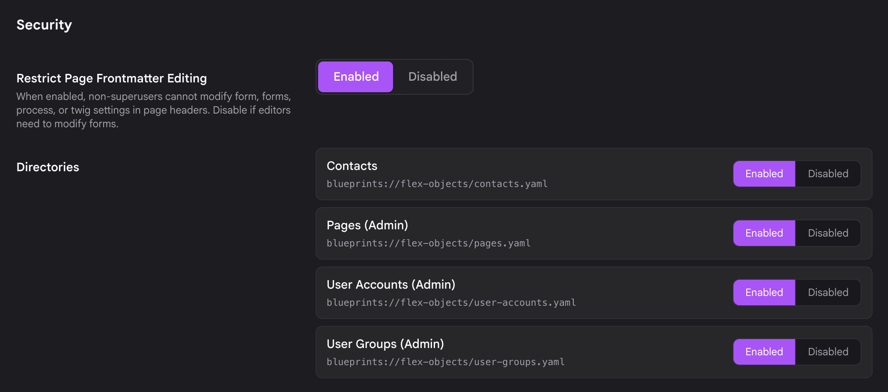
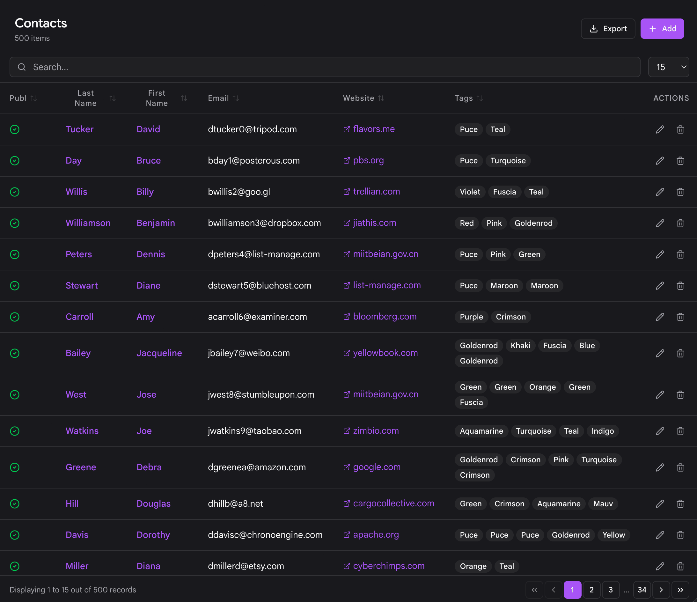
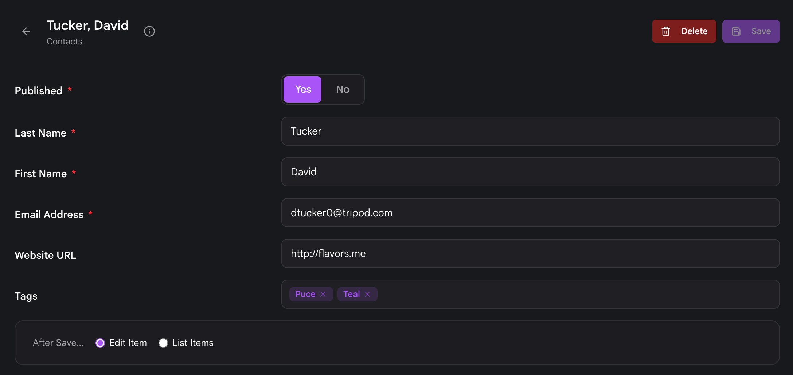

# Managing Flex in Admin Next

The **[Flex Objects](/20/advanced/flex)** plugin gives every Flex directory a full management UI inside **Admin Next**, the SvelteKit single page admin that talks to the **[API Plugin](/20/api)**. You get an auto generated sidebar entry, a searchable and sortable list view, an object editor built from the directory blueprint, and media uploads for directories that store their objects in folders. None of it requires you to write UI code: you declare a blueprint, enable the directory, and Admin Next builds the screens from your `config.admin` settings.

This page walks through the whole lifecycle, from turning a directory on to editing individual objects.

!!! The classic Vue admin for Flex was removed in flex-objects **1.4.2**. Flex Objects is Admin Next only now, so if you are coming from an older Grav install some of the screens described here will look different from what you remember.

## Enabling a directory

A Flex directory is invisible until you enable it. Go to **Plugins** > **Flex Objects** and find the **Directories** field. It lists every Flex directory Grav has detected, whether it ships with the plugin, with another plugin or theme, or lives in your own `user/blueprints/flex-objects/` folder.

Select the directories you want to manage, make sure each one is toggled on, and click **Save**. Enabling a directory here appends its blueprint path to the plugin config, which is what activates it across Admin Next, the REST API, the `[flex-objects]` shortcode, and frontend routing.

!!! The **Flex Objects** plugin itself must be enabled before any custom directory will work. If the plugin is off, none of the directories in this list do anything.

After you save, the enabled directory appears in the Admin Next sidebar on the next load. For a full walkthrough of building a directory from scratch, see **[Defining a Flex Type](/20/advanced/flex/custom-types/blueprint-reference)**.

## The sidebar entry

Each enabled directory gets its own entry in the Admin Next sidebar, automatically. There is no umbrella menu to drill into: the directory sits directly in the navigation, and clicking it opens that directory's list view.

The entry carries a **count badge** showing how many objects the directory currently holds, so you can see the size of a collection at a glance without opening it. In the screenshots below, the **Contacts** entry shows a badge of 500.

How the entry looks and where it sits is driven by the `admin.menu` block in the directory blueprint:

[codesh=yaml]
config:
  admin:
    menu:
      list:
        title: Contacts
        icon: fa-address-book
        priority: 5
[/codesh]

- **title** and **icon** name the sidebar entry. If you omit `admin.menu` entirely, Admin Next falls back to the directory's own `title` and `icon` (or a generic database icon), so a directory with no menu block still appears rather than vanishing.
- **priority** orders the entry against the other sidebar items. Higher priority floats it up.

### Hiding a directory from the sidebar

Sometimes a plugin already registers its own Admin Next sidebar item for a directory and does not want the generic auto generated one duplicated next to it. Set `hidden_in_admin_next` on the menu entry to opt out of the automatic registration:

[codesh=yaml]
config:
  admin:
    menu:
      list:
        title: Contacts
        hidden_in_admin_next: true
[/codesh]

The directory stays fully enabled (the API, shortcode, and frontend all keep working), it just no longer adds its own row to the sidebar.

!!! A directory is also skipped in the sidebar if the current user lacks list permission for it, or if `config.admin.disabled` is set. Permissions matter here: since flex-objects **1.4.3** a directory whose blueprint declares no permissions block is denied to every non super admin. See **[Flex Permissions](/20/advanced/flex/custom-types/blueprint-reference#permissions)** for how to grant access.

### Directories with dedicated pages

Three built in types are Flex directories under the hood but do **not** use the generic Flex UI, because they have their own purpose built Admin Next screens:

- **Pages**
- **User Accounts**
- **User Groups**

These are deliberately excluded from the auto generated Flex sidebar so you manage them through their dedicated pages instead. Everything on this page applies to your own custom directories and to bundled example directories like Contacts.

## The list view

Clicking a directory in the sidebar opens its **list view**: a paginated table of the objects in that directory. The columns come from `config.admin.list.fields`, so each directory shows the fields that make sense for it.

[codesh=yaml]
config:
  admin:
    list:
      fields:
        name:
          link: edit
        email:
        phone:
      options:
        per_page: 20
        order:
          by: name
          dir: asc
[/codesh]

The list view gives you:

- **Search**: a text box that filters the objects as you type.
- **Sort**: click a column header to sort by that field, ascending or descending.
- **Pagination**: page through large collections. The page size and default sort come from `admin.list.options` (`per_page` and `order.by` / `order.dir`).
- **Export**: an export button that downloads the collection (for example to CSV), controlled by `config.admin.export`.
- **Row actions**: each row has actions such as **Edit** and **Delete**.

Use the **Add** control to create a new object, which opens the editor with an empty form.

### Nested detail rows

If a directory defines `config.admin.list.detail`, each row can expand to reveal related objects from another directory inline, a lightweight master detail view. This is handy when one object owns a set of children (say a company and its contacts) and you want to see them without leaving the list.

[codesh=yaml]
config:
  admin:
    list:
      detail:
        enabled: true
        label: Contacts
        icon: fa-address-book
        relation:
          type: contacts
          local_key: id
          foreign_key: company_id
        actions: true
[/codesh]

The `relation` block ties the parent object to the related directory by key. When `actions` is enabled, the nested rows can offer Edit and Delete too, but only if the current user has `update` / `delete` permission on the related directory and that directory has an Admin Next edit route. The nested columns default to the related directory's own list fields; you can override them under `detail.fields`.

## The object editor

Selecting a row (or clicking **Add**) opens the **object editor**. The form is built entirely from the directory blueprint's `form` section, so what you see is specific to the type you are editing.

- **Tabs and sections**: blueprints usually organize fields into tabs and sections to keep longer forms manageable. Admin Next renders those groupings as tabs.
- **Fields**: every standard Grav [form field](/20/forms/blueprints/fields-available) is available.
- **Media uploads**: directories that use **FolderStorage** (one folder per object) support per object media, so file and image fields let you upload directly to the object's folder. Directories using **SimpleStorage** (all objects in a single file) have no per object media, so media fields do not apply there. See **[Flex Storage](/20/advanced/flex/custom-types/blueprint-reference#storage)** for the differences.

When you click **Save**, Admin Next writes the object and returns you to the list view (a save and redirect), where the change is reflected immediately. **Delete** removes the object and likewise returns you to the list.

!!! Every edit here goes through the REST API. If you want to script the same create, update, and delete operations, the endpoints are documented at **[Flex Objects API](/20/api/endpoints/flex-objects)**.

## Where caching settings live

In older Flex, each directory had its own **Configuration** view inside the admin for editing directory wide settings like index, object, and render caching. That per directory Configuration screen has been **removed** from Admin Next.

Those settings now live on the **settings page of the plugin that owns the directory**. For directories bundled with the Flex Objects plugin, that means **Plugins** > **Flex Objects**. For a directory shipped by another plugin, open that plugin's own settings page. Caching behavior for a directory is still defined the same way in the blueprint (`config.data.*` and the caching options), you just adjust the exposed settings from the owning plugin rather than from a Configuration tab on the directory itself.

If a rendered template produces dynamic content that should never be render cached, you can still disable render caching from within the Twig template on a per block basis.

## Where to go next

- **[Defining a Flex Type](/20/advanced/flex/custom-types/blueprint-reference)**: build a directory blueprint from scratch.
- **[Flex Storage](/20/advanced/flex/custom-types/blueprint-reference#storage)**: choose SimpleStorage, FileStorage, or FolderStorage.
- **[Flex Permissions](/20/advanced/flex/custom-types/blueprint-reference#permissions)**: grant editors access to a directory.
- **[Flex Objects API](/20/api/endpoints/flex-objects)**: manage objects over REST.
